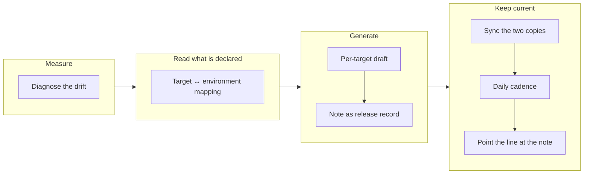

## 1. Overview

Issue #472 reported the release-note automation deviating from its intended per-target
design. The deviation traced to a documented decision rather than a slip — three
unit-less writer designs had been measured and refused — so this branch answers those
refusals rather than routing around them.

**Highlights:**

1. Per-target draft release notes, rendered from the base, idempotent and clock-free.
2. The draft lives in a GitHub draft release, so the self-reference goes to zero.
3. The existing repository tick keeps them current, still hourly, generating once a day.

## 2. Motivation

What shipped in August was a *reader*: `[Release Status]` posts one gated line and writes
nothing, because every unit-less writer design had failed its own measurement.

So the first ticket wrote no feature code — it measured. `paths:` is declared on **0 of 1**
targets, so a note commit is 100 % self-counted and a daily writer is +365 commits/year on
`main`, each invalidating the next. That number ruled both Open Decisions the mission
carried, and it is why "daily" alone was never the answer: a 24× smaller treadmill is
still a treadmill.

The same ticket found the reporter's plural pointed elsewhere. No `📦 Release status` line
has ever posted on any observable surface, so "fragmented notifications into each Slack
channel" names N *repositories* running one repository-scoped routine, not N posts.

## 3. Changes

The branch runs measure → read → generate → keep current. The diagnosis fixed the number
that every later decision was judged against; the mapping established what the records
declare and, crucially, what they default; the generator and the record structure built
the artifact; and the last three kept it current without a commit. Each of the two Open
Decisions was resolved against the diagnosis ticket's measurement rather than on
preference, and the second inherited its answer from the first.

### 3-1. Diagnose the release note automation drift ([f5a5ecb9](https://github.com/qmu/workaholic/commit/f5a5ecb9))

Captured the current behaviour verbatim, probed the Slack surface, marked each of §7's
three refusals still-binding or dissolved, and quantified the self-reference per target.

### 3-2. Derive the deploy target environment mapping ([86356e86](https://github.com/qmu/workaholic/commit/86356e86))

`read-deployments.sh --mapping` reports every field as `declared` or `defaulted` with
named gaps; `--scaffold` prints a blank record for a human. No path writes a populated
deployment record.

### 3-3. Draft per-target release notes from the base ([b9d8d276](https://github.com/qmu/workaholic/commit/b9d8d276))

A pure renderer over the unreleased set the existing reader already computes. Two runs
against an unchanged base are byte-identical; a target with nothing waiting renders an
explicit empty draft.

### 3-4. Structure the note as the release record ([a59d830d](https://github.com/qmu/workaholic/commit/a59d830d))

The note now quotes the target's procedure and required verification with the source
cited, regenerated so it cannot fork. Fixed a latent defect: evidence blocks were appended
to the file rather than to the section.

### 3-5. Sync the GitHub and workaholic note copies ([ce10c999](https://github.com/qmu/workaholic/commit/ce10c999))

Neither store is authoritative — the derivation is. The writer is a projection, never a
merge; divergences are named per target and section before anything is written; a
published release is never overwritten.

### 3-6. Implement the daily note generation cadence ([3b480739](https://github.com/qmu/workaholic/commit/3b480739))

The existing repository-scoped tick gained the generation and stayed hourly, bounded to
once per `Asia/Tokyo` day and refreshing whenever the release stage advances. A new
`verify-cadence` drill verb proves it in seconds.

### 3-7. Point the status line at the draft note ([b65e74d0](https://github.com/qmu/workaholic/commit/b65e74d0))

The one sanctioned post is kept with both gates intact and gains a `Draft note:` line.
Nothing was removed — the audit finds exactly one shape for this event, already correctly
gated.

## 4. Outcome

An operator can now open any target and find a current draft: what would ship, the
procedure quoted from the authored record, the verification required, and every attempt
that has run. The routine's `allowed_tools` still carries no `Write`/`Edit`, unchanged —
the clearest evidence that nothing about the tree's write contract moved.

## 5. Concerns

### The first live draft release has never been created

- **Severity:** moderate
- **Description:** The GitHub write path is proven against a `gh` test double, not against
  the real repository — no draft release exists on `qmu/workaholic` yet (see
  [ce10c999](https://github.com/qmu/workaholic/commit/ce10c999) in `plugins/workaholic/skills/ship/scripts/sync-release-note.sh`)
- **How to Fix:** Run `bash plugins/workaholic/skills/ship/scripts/run-note-cadence.sh` once
  under an operator's eye and confirm the draft release it creates reads correctly

### The Slack surface is unverifiable from a routine container

- **Severity:** moderate
- **Description:** No `dev-*` channel is visible and the fallback is tokenless, so the
  `📦 Release status` line's delivery has never been observed end to end — the gates are
  verified offline but a green drill does not mean a human saw a line (see
  [f5a5ecb9](https://github.com/qmu/workaholic/commit/f5a5ecb9) in `.workaholic/tickets/archive/work-20260817-163715/20260817114536-diagnose-the-release-note-automation-drift.md`)
- **How to Fix:** Confirm the connector's channel access and the fallback token from an
  operator session, then watch one tick that has something waiting

### The multi-repository fragmentation is recorded, not repaired

- **Severity:** low
- **Description:** N repositories running the repository-scoped routine still produce N
  hourly lines in N channels with no consolidated view; no notify-shape change can fix it
  (see [b65e74d0](https://github.com/qmu/workaholic/commit/b65e74d0) in `plugins/workaholic/skills/notify/reference/notifications.md`)
- **How to Fix:** Decide whether a cross-repository digest is wanted, as its own ask

## 6. Successful Development Patterns

- Driving a measurement ticket first paid for itself twice: the self-reference number
  ruled both Open Decisions, and the Slack probe collapsed the final ticket's scope.
- Building against a synthetic multi-target fixture caught a glob-expansion bug this
  single-target repository structurally cannot reach.
- When a pinning test failed because its claim had legitimately narrowed, re-pinning the
  narrower sentence *and adding* an assertion left the suite stricter than before.

## 8. Notes

The acceptance criterion asking for a separate daily cron minute was not implemented as
written — a cron field of its own means a fourth routine, the option the cadence ticket's
Open Decision ruled against. The daily property is delivered by a state-derived gate in a
stated timezone instead, and the deviation is recorded in that ticket's Final Report.
