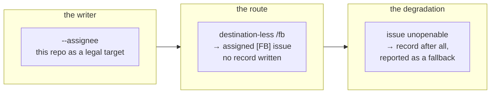

## 1. Overview

`/fb` had two shapes: a destination-less ask became a file, an ask naming another
repository became a GitHub issue. It now has one — every ask becomes an `[FB] `-marked
issue — so the Slack (Claude Tag) route and `/fb` produce the same artifact and the
caller need not remember which deliverable a destination buys.

**Highlights:**

1. A destination-less `/fb` opens an assigned `[FB] ` issue on this repository and writes no record — `/propose` registers it one seam later.
2. `open-issue.sh` gained `--assignee`, without which `[Propose]`'s discovery would ingest the issue for nobody.
3. The new network dependency has exactly one documented degradation, and it never applies to the crossing.

## 2. Motivation

The two entrances to the loop disagreed about what they produced. A Slack ask arrived as
an issue that `[Propose]` discovers on its next tick; the same ask typed as `/fb` arrived
as a file that discovery never reads. Whether the ask reached a routine therefore depended
on which door it came through, which is not a property anyone chose.

The two tickets after the first are what the unification costs. Filing in-repo needs an
**assignee**, because discovery lists only issues assigned to the running identity and
never unassigned ones. And the primary path is now a network call, so it fails in ways a
file write could not; `gh api user` returned HTTP 503 during this very drive.

## 3. Changes

The writer was widened first, so nothing observable changed until the route moved onto it.
The route then made the issue the only artifact a `/fb` produces, which is what made the
command depend on a network call for the first time. The fallback closes that exposure
last, deliberately narrow: it fires only in-repo, never on a successful filing, and never
on the crossing — where a refusal is another repository's own decision about its boundary.

### 3-1. Give the FB issue writer an assignee ([4e236e0c](https://github.com/qmu/workaholic/commit/4e236e0c))

`open-issue.sh` takes `--assignee <login>` as an option, states that this repository is a
legal target, and echoes back the `assignees` the API response actually carried so a login
GitHub silently dropped reports `assigned: false` rather than being assumed. Without the
flag the request body is byte-identical to what the crossing has always sent.

### 3-2. Route a destination-less fb to an issue ([003d107e](https://github.com/qmu/workaholic/commit/003d107e))

A destination-less `/fb` now opens the assigned issue here, carrying the
`kind`/`source`/`subject` judgment in its body, and writes no record — a record naming the
issue would make discovery skip it as `already_captured`. Which gates survive with no
boundary crossed is recorded as a decision with its reasoning, not an omission.

### 3-3. Keep the record as fb's fallback ([2dfd8dab](https://github.com/qmu/workaholic/commit/2dfd8dab))

`fb-fallback.sh` answers `{fallback, reason}` from the `open-issue.sh` envelope and the
destination; on `true` the record is written after all and the report names the fallback
and its reason. The cost — a fallback record is captured but never proposed — is written
into the skill and the runbook rather than papered over with a sweep.

## 4. Outcome

`/fb` produces one artifact whatever the destination, the artifact is discoverable by the
routine that acts on it, and the one new failure mode is bounded, reported and tested. The
cross-repository path is unchanged, its verbatim confirmation included.

## 5. Concerns

### The glossary still describes the retired two-shape /fb

- **Severity:** moderate
- **Description:** `.workaholic/terms/artifacts.md` still lists `/fb` as a writer of `feedbacks/`, and `.workaholic/terms/inconsistencies.md` still says `/fb` registers an immutable record and maps `/fb` → a record (see [003d107e](https://github.com/qmu/workaholic/commit/003d107e) in `.workaholic/terms/`). `terms/` is a hand-maintained area whose upkeep seam reports and never writes, so this branch did not rewrite it.
- **How to Fix:** the area's owner updates both entries to the one-artifact behavior — `/fb` files an issue, `/propose` writes the record, and the fallback is the single exception.

### The end-to-end filing was never exercised against real GitHub

- **Severity:** moderate
- **Description:** every acceptance criterion is pinned hermetically, but the live path — file an ask, then see it in `list-inbound-issues.sh` — was deliberately not run, because filing a test `[FB]` issue from an unattended run puts a junk ask into the team's real `[Propose]` queue (see [003d107e](https://github.com/qmu/workaholic/commit/003d107e) in `plugins/workaholic/skills/feedback/SKILL.md`). `gh api user` was additionally returning HTTP 503 during the drive.
- **How to Fix:** run `/fb` once by hand with a genuine ask and confirm the issue is listed by `list-inbound-issues.sh` and picked up by the next `[Propose]` tick.

## 6. Successful Development Patterns

- Extracting the fallback rule into a script rather than a sentence made three loss-or-duplication edges testable that prose would have left to each session to re-derive under exactly the conditions where re-deriving is least reliable.
- Widening the writer in its own ticket kept the behavior change reviewable on its own: the first commit changed nothing observable, so the second commit's diff is the entire behavior delta.

## 7. Notes

Doc-drift and area-freshness both came back clean; `terms/` is flagged above by reading
rather than by either script, since neither knows the glossary's prose went stale.
