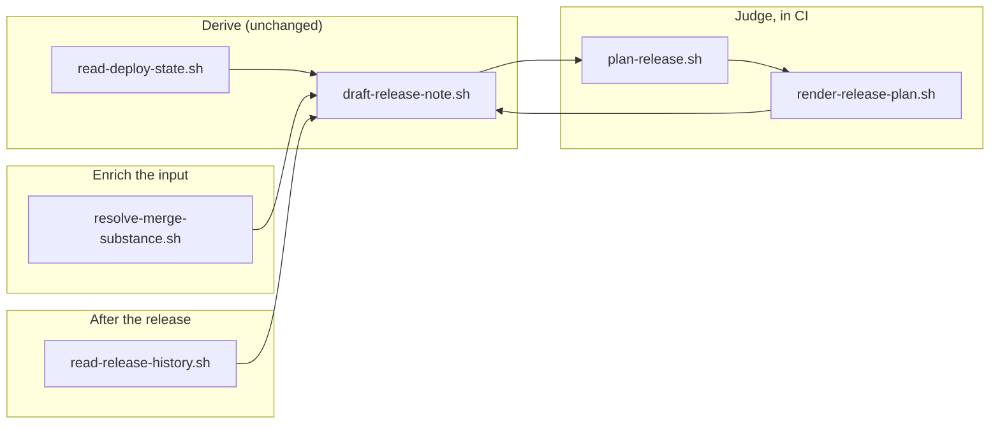

## 1. Overview

A target's draft release note stops being a rendered merge list and becomes an agent's release plan: what ships together, in what order, at what risk, and what is held back. The renderer keeps deriving the facts, an agent authored in CI arranges them, and the note now carries the release through its whole life — plan, then release, then verification.

**Highlights:**

1. `--plan` renders an arrangement over the derived facts; with no plan the output is byte-identical to before.
2. Story-less merges — 56% of them here — now carry what they published, not just their title.
3. The planner runs in CI beside the writer, gated on its credential, and every failure is named on the note's face.

## 2. Motivation

Issue #512 said a deterministic renderer had shipped where planning judgment was asked for: one clamped line per merge, in merge order, with nothing deciding what ships together or at what risk. The header's own contract — *the same base state renders byte-identical output* — was the reason it could not be otherwise, since a judgment is not a function of the base state alone.

The determinism was not the defect. It is what makes a daily re-render diff-free and an idle tick free, and nothing in the ask wanted to lose it. So the two were separated rather than traded: the facts stay derived, the judgment is authored, and the contract is restated as *the same base state **plus the same plan** renders byte-identical output*. Everything else in the mission follows from that split — better input for the plan, a place for the judgment to run, and a document that does not end at the plan.

## 3. Changes

The renderer stayed the one place facts are derived; three seams were added around it — an arrangement rendered over those facts, a richer fact for the merges that carry least, and a projection of what happened after the release.

### 3-1. Give the release note a plan seam over the renderer ([1f9695bd](https://github.com/qmu/workaholic/commit/1f9695bd))

`draft-release-note.sh --plan <path|->` renders an agent-authored arrangement — grouping, order, risk, held-back — over the facts it derives, and `render-release-plan.sh` is the arranging half. A plan may never invent a change, drop a merge or move a fact, and one written for an older base renders as stale rather than as current.

### 3-2. Recover the substance of story-less merges ([0cda5c34](https://github.com/qmu/workaholic/commit/0cda5c34))

Measured over `v1.0.170..main`, 38 of 68 merges (56%) carry no branch story, because a `/propose` pull request auto-merges without ever running `/report`. Their row now carries what that merge published — the feedback record it wrote, the mission it planned, the tickets it queued — as sub-bullets, labelled `Asked for:` rather than presented as a summary.

### 3-3. Run the release planning judgment and reach CI ([70f7ee37](https://github.com/qmu/workaholic/commit/70f7ee37))

The `Release Note Draft` workflow now authors each due target's plan and hands it to the same run's cadence. The Open Decision was ruled (a) — the judgment runs where the write permission and the defined checkout already are — with the two alternatives refused in `ship/SKILL.md` §7 for reasons this repository had already measured.

### 3-4. Append the release confirmation to its own plan ([6d0c2dc1](https://github.com/qmu/workaholic/commit/6d0c2dc1))

The note renders `## Deployment Plan` → `## Releases` → `## Deployment Verification`, deriving the release windows and the per-target attempts from the records their own writers keep. No third store, no new writer, and `fail` / `not_run` / `bypassed` render exactly as loudly as `pass`.

## 4. Outcome

A reader opening a target's draft sees an arrangement rather than a list, sees what each merge was for even when no story joined it, and sees what became of the release. Nothing about the derivation's idempotency moved, and until an `ANTHROPIC_API_KEY` exists the repository renders exactly what it rendered before — saying so on the note's face.

## 5. Concerns

### Two commits exceed the per-commit changed-lines ceiling

- **Severity:** moderate
- **Description:** The branch-safety scan reports `too-large-commit` for [1f9695bd](https://github.com/qmu/workaholic/commit/1f9695bd) (610 added lines) and [70f7ee37](https://github.com/qmu/workaholic/commit/70f7ee37) (623), against a 500-line ceiling; both are a script plus its hermetic fixture plus the documentation the repo's own rule requires in the same commit.
- **How to Fix:** No override is available to an unattended run, so the unit stays at its pull request for a human ruling. Splitting a script from its own test would trade a size finding for an untested commit.

### The planner is inert until a credential exists

- **Severity:** low
- **Description:** `plan-release.sh` needs `ANTHROPIC_API_KEY` in CI; without it the workflow's planner steps are skipped and every note reports `no_planner` (see [70f7ee37](https://github.com/qmu/workaholic/commit/70f7ee37) in `.github/workflows/release-note-draft.yml`).
- **How to Fix:** Set the secret when the operator wants plans authored; nothing else is needed, and the visible fallback means the gap is never silent.

### A plan's durable home is still unchosen

- **Severity:** low
- **Description:** The plan lives in the CI run's own workspace and is regenerated each time; no home outside that run was chosen (see [1f9695bd](https://github.com/qmu/workaholic/commit/1f9695bd) in `plugins/workaholic/skills/ship/reference/release-plan.md`).
- **How to Fix:** Leave it until a reader needs yesterday's plan. The constraints are written down — never inside git, never trusted for freshness — so the choice is cheap when it is actually needed.

## 6. Successful Development Patterns

- Proving a new fixture is meaningful by running the pre-change script head-to-head against it, rather than trusting a green suite that never saw the old behaviour.
- Resolving an Open Decision by measuring each candidate against the refusals already recorded in the skill, so the ruling answers them by name instead of stepping around them.

## 7. Notes

The mission's four acceptance criteria are met by 3-1 through 3-4; the version was bumped to v1.0.188 so a consuming repository picks the scripts up.
