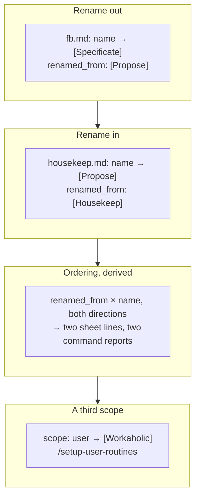

## 1. Overview

Issue #526's routine set lands: `[Propose]` becomes `[Specificate]`, the maintenance tick takes the freed name as `[Propose]`, and a new account-scoped `[Workaholic]` routine converges an account's routines across every repository it has set up. Behaviour did not move under either rename — only `name:` did — and the swap's real cost, an *ordered* operator cutover, is derived from the templates rather than written into prose.

**Highlights:**

1. A swap, not two renames: `render-setup-sheet.sh` compares each template's `renamed_from:` against every other's `name:`, in both directions, and renders the ordering from that.
2. A third scope, `user` — one copy per **account**, reached by a third command (`/setup-user-routines`) because it counts differently from `developer`.
3. The updater's transport was measured, not assumed: none is exposed to the routine-fired class, so it names the refusal and posts one line rather than firing hourly into silence.

## 2. Motivation

The reporter flagged the rename mapping explicitly as a swap rather than two independent renames, and asked implementers to double-check every reference to "Propose" to determine which of the two it means. That warning was the whole risk: convergence matches an account's routines by rendered name, so a template whose `name:` moved creates a *second* routine beside the live one — and here the freed name is immediately claimed by another template. An account converging in the wrong order ends up holding two routines called `[Propose] <repo>`, one firing `/propose` at `:15` and one firing `/housekeep` at `:50`, which nothing in the product can tell apart or repair. The fourth routine is a different ask: routine registration should produce one per-account updater rather than a copy per repository, which needed a scope value no template had.

`[Prepare Release]` had already established the single-rename mechanism a day earlier (2026-08-18, issue #485) — `renamed_from:` on the template, the note derived onto the sheet, the field deleted once the fleet cuts over. That precedent was copied rather than reinvented; what it did not cover is what a *swap* adds, and that is the one mechanism this branch introduces.

## 3. Changes

The two renames could not land independently, so they ride one branch in dependency order: the first frees the name, the second takes it, and the ordering the operator now owes is computed from the two templates together. The updater follows as a separate concern that reuses the same scope machinery — a template field plus a caller, not a new mechanism — and its own transport question was settled by measurement before anything was designed around either answer.

### 3-1. Rename the Propose routine to Specificate ([ac2ee124](https://github.com/qmu/workaholic/commit/ac2ee124))

`routines/fb.md` renders as `[Specificate] <repo>` and declares `renamed_from: "[Propose] {repo_name}"`; every routine-name mention moved across 31 files while no `/propose` *command* mention did. The two Open Decisions were resolved against widening the change: the command does not rename, and the scope stays `developer` because `/propose` acts only on issues assigned to the running identity.

### 3-2. Rename the Housekeep routine to Propose ([952d5428](https://github.com/qmu/workaholic/commit/952d5428))

`routines/housekeep.md` renders as `[Propose] <repo>` with `renamed_from: "[Housekeep] {repo_name}"`, and the sheet gained the ordering both halves need — the vacating routine is told to go first, the routine taking the name is told what to rename before it is created. Issue #525 is resolved to be read *by behaviour*, not by name, with its behaviour change left on the queued ticket that carries it.

### 3-3. Add the per-user Workaholic updater routine ([6978c949](https://github.com/qmu/workaholic/commit/6978c949))

A `user` scope, the `[Workaholic]` template at `:10`, `/setup-user-routines`, and one authorized `🔄 Workaholic` post mirrored byte-identically in the notification catalog. Its enumeration is the account's own routine list, its drift test is the rendered diff, and it never converges its own record.

## 4. Outcome

The routine set is what issue #526 asked for, and the one act the plugin cannot perform for an operator — a rename on an account-level record no other account can see — is now stated in the right order by both setup sheets and both setup commands, derived from the template fields so it disappears when they do. The account scope exists with a command, a sheet header that states its count before a reader repeats it, and a measured, named refusal where its transport does not reach.

## 5. Concerns

### `[Workaholic]`'s converging half is unobservable from the routine-fired class

- **Severity:** moderate
- **Description:** Measured this run: no `RemoteTrigger`-family tool is exposed, `CronCreate`/`CronList`/`CronDelete` are the session-only in-memory scheduler, and the `claude` CLI has no routine subcommand — so in the class this routine runs in it converges nothing, every tick (see [6978c949](https://github.com/qmu/workaholic/commit/6978c949) in `plugins/workaholic/skills/workaholify/routines/workaholic.md`). Everything shipped here is verified; what cannot be verified anywhere reachable is a convergence actually landing on a live account routine.
- **How to Fix:** Run `/setup-user-routines` from an interactive session that carries the tool (FB `20260810214929` found one) and confirm the routine list changed; if no session class can reach it, the operator decides whether the template warrants a `verification_handoff:` declaration at creation.

### `report/scripts/check-version-bump.sh` is referenced but not shipped

- **Severity:** moderate
- **Description:** `workaholic:report` Phase 0 instructs a run to call `check-version-bump.sh` and skip the bump on `already_bumped`; the script exists in neither the checkout nor the installed plugin tree, so every run takes the degraded-read path and bumps unconditionally. The fallback is the safe direction, which is why this has stayed invisible.
- **How to Fix:** Either ship the script or delete the sentence and state that `/report` always bumps — a documented entry point with no implementation is a defect whichever way it is resolved.

### Two `renamed_from:` fields are live at once and nothing expires them

- **Severity:** low
- **Description:** `fb.md` and `housekeep.md` both carry migration fields, alongside `prepare-release.md`'s from the day before (see [952d5428](https://github.com/qmu/workaholic/commit/952d5428) in `plugins/workaholic/skills/workaholify/routines/`). The field describes a migration, not a routine, and the rule is that it is deleted once the fleet has cut over — but nothing measures a cutover, so the notes persist until somebody remembers.
- **How to Fix:** Delete each `renamed_from:` once the accounts running that routine have renamed it; the ordering notes and their assertions are derived and vanish with the field.

### The glossary does not name the renamed routines

- **Severity:** low
- **Description:** `.workaholic/terms/` and `terms/retired-terms.md` still describe the routine set by its pre-swap names. The area is hand-maintained by deliberate design — `area-freshness.sh` reports and never writes, because a machine maintaining a glossary would define the words it already uses.
- **How to Fix:** The operator adds `[Specificate]`, the re-pointed `[Propose]` and `[Workaholic]`, and retires `[Housekeep]` as a term, at whatever interval suits the project.

## 6. Successful Development Patterns

- Resolving a template question by **comparing the template set against itself** (`renamed_from:` × `name:`) kept the swap's ordering out of prose — it appears only while the collision exists and is pinned by an assertion that stops asserting when the fields go.
- **Measuring the transport before designing around it** (ticket 3, step 1) is what made the honest degradation designable: the answer decided that the routine needs one post rather than none, which no amount of reasoning from the ask would have produced.
- Renaming a bracketed identifier needs a grep for the **escaped** form too — a JS regex literal writes `\[Propose\]`, which a sweep over the plain token silently misses and which then fails as an assertion string rather than as behaviour.

## 7. Release Preparation

**Verdict**: Ready for release

- **After release:** Confirm from an account that carries a `RemoteTrigger`-family tool that `/setup-user-routines` converges a live routine — the one property of this branch no session class here can observe.
- **After release:** Tell the accounts running `[Propose] <repo>` to rename it to `[Specificate] <repo>` **before** `/setup-repo-routines` next converges the maintenance tick; both sheets say so, but the sheet only reaches whoever opens it.
