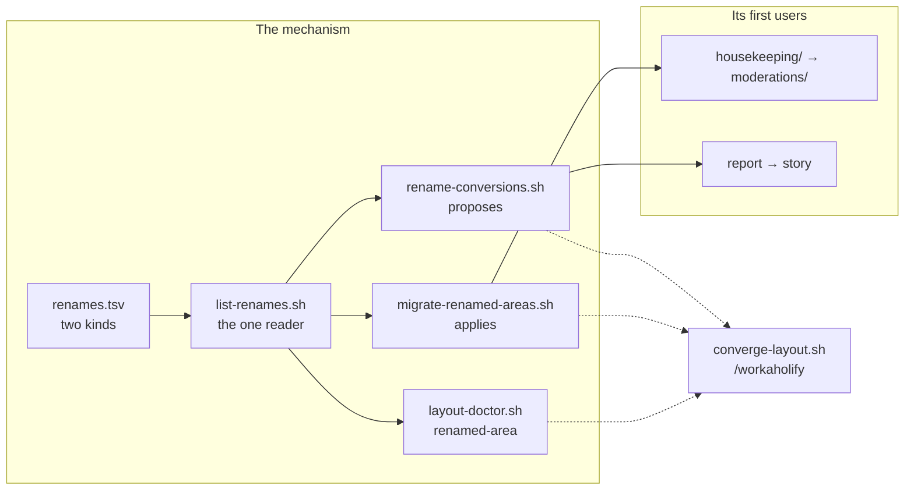

## 1. Overview

A rename in this repository used to cost a manual sweep plus a migration note somebody had to remember, and a consuming repository holding an old name was told only that its directory was *not in the canonical allowlist*. This branch makes a rename **one row** in a shipped table, then spends the last two old names proving it.

**Highlights:**

1. `renames.tsv` declares a rename in two kinds: an `area` is applied by `git mv`, a `name` is proposed as a printed bulk conversion the operator runs or declines.
2. `.workaholic/housekeeping/` is `.workaholic/moderations/`, and `housekeep` is gone from the live tree.
3. `/story` writes the branch story; `/report` survives as a working deprecated alias, and the skill moved with it to `workaholic:story`.

## 2. Motivation

Six things were renamed here in eight days — `/housekeep` → `/propose` → `/moderate`, `/release-status` → `/fullfill` → `/prepare-release`, `[Propose]` → `[Specificate]` — and each one paid the same price twice: a sweep across the tree, and an instruction to the operator that only prose remembered. Two names outlived their sweep. The maintenance tick's routine, command and skill all became **moderate** on 2026-08-19 while the artifact it writes stayed at `housekeeping/`, so the tree named the log after a word nothing else in the plugin used. And `/report` writes a **story**: the artifact, the area it lands in, its write floor and the changelog event every seam emits were already called story; only the command and its skill were not.

The repository already had the shape of an answer — `converge-layout.sh`'s living-migration registry, and `layout-doctor.sh`'s `retired-area` class, which names a de-listed directory instead of shrugging at it. What it lacked was a way to declare a rename once and have both of those read it. So the work was not the two renames; it was making the seventh rename cost a table row, with the two in hand as the proof it does.

## 3. Changes

The mechanism landed first and shipped with an empty table. Each of the two renames then became rows, and each was applied by running the convergence seam rather than by hand — which is how the registry got measured on its first day instead of being taken on trust.

### 3-1. Add the rename registry and its convergence seam ([92392252](https://github.com/qmu/workaholic/commit/92392252))

A shipped table declares each rename in one row; one reader parses it; the doctor classifies a surviving old directory as `renamed-area` **before** consulting the allowlist, the migration `git mv`s it, and a separate script prints the bulk conversion for every name that is not a path. Two judgment calls were resolved toward keeping one behaviour per kind: a retirement is not a rename and stays out of the table, and the doctor checks the registry first because a landed rename leaves the allowlist carrying only the new name.

### 3-2. Rename the housekeeping area to moderations ([e369a857](https://github.com/qmu/workaholic/commit/e369a857))

Adding the first `area` row and running `converge-layout.sh` moved the two day files, rewrote the generated root index's link, and returned the list of 17 files still naming the old word — the same set the ticket had enumerated by hand. The allowlist and the rules table moved in one commit, `step-open-log.sh`'s allowlist probe moved with them, and the day log's own heading now reads *Moderation log*.

### 3-3. Rename report to story and deprecate report ([f9d9b67e](https://github.com/qmu/workaholic/commit/f9d9b67e))

`skills/report/` is `skills/story/` under the `workaholic:story` namespace, with every caller, the build's target list and the marketplace entry following. `/report` is kept as a deprecated alias that states the new name once and runs the identical workflow — not a stub, because `[Implement]`'s routing and consuming repositories' documents still name it. The rename took **five** rows, not the two the ticket anticipated: a skill is referenced in four distinct written forms.

## 4. Outcome

A rename is now declared once and read everywhere: the doctor names it, `/workaholify` applies the machine-owned half and proposes the rest, and a consuming repository is told what a name became instead of that its directory is unrecognised. Both old names are retired, and the next rename costs a row.

## 5. Concerns

### The bulk conversion damages live strings that only a second check catches

- **Severity:** moderate
- **Description:** The `/report` conversion rewrote `ship/scripts/report-deploy-status.sh` into `story-deploy-status.sh` and the JS regex `/reported verbatim…/` into `/storyed verbatim…/` (see [f9d9b67e](https://github.com/qmu/workaholic/commit/f9d9b67e) in `plugins/workaholic/skills/ship/SKILL.md` and `scripts/test-workflow-scripts.mjs`). A token starting with `/` is not a word boundary, so neither read as a broken word; the first surfaced only through `verify.mjs`, the second only by reading the diff.
- **How to Fix:** State in `rename-conversions.sh`'s printed output that the command is a proposal to be followed by `verify.mjs` and a diff read, so the operator is told the check rather than expected to know it.

### rename-conversions.sh will report the retired-type fixture forever

- **Severity:** low
- **Description:** `scripts/test-workflow-scripts.mjs` carries `type: housekeeping` — the retired per-ticket `type:` field, not the log area — so the `housekeeping` row reports one file on every run (see [e369a857](https://github.com/qmu/workaholic/commit/e369a857)).
- **How to Fix:** Nothing, until the row is deleted once the fleet has cut over. The fixture carries a comment saying it is not that name; the tool reporting a survivor a human then declines is the design working.

## 6. Successful Development Patterns

- Ship the mechanism with an empty table and make the pending renames its first rows — the registry was measured on its first day instead of being trusted, and ticket 3 found it needed five rows where two were planned.
- Never illustrate a rename mechanism with a token that exists: the registry's own documentation was swept twice by the renames it explains before the rule was written down.
- Give a rename fixture a synthetic pair (`terms` → `glossary`), and pick an old name that is *allowlisted* — it survives future sweeps and proves the doctor reads the registry before the allowlist.

## 7. Release Preparation

**Verdict**: Ready for release

- **Before release:** None — no version bump is part of this branch.
- **After release:** A consuming repository that still holds `.workaholic/housekeeping/` converges through `/workaholify`; its `/report` keeps working under the alias.
