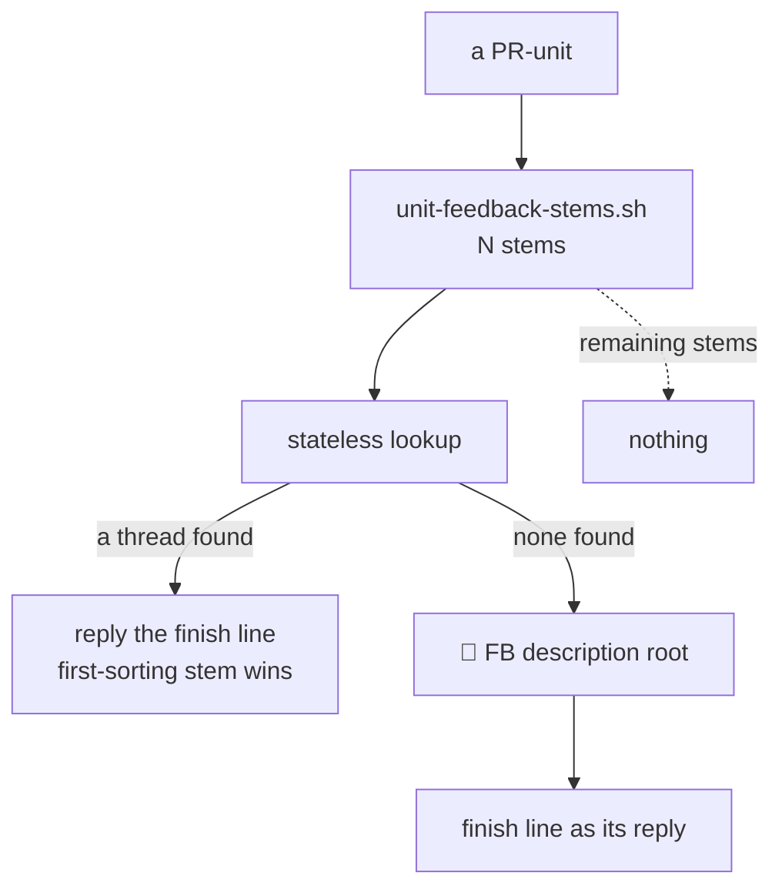

## 1. Overview

`#dev-csnet` carried the identical `🟢 Implemented` line twice, 22 seconds apart: once threaded under the item it answered, once as a bare top-level root. This branch makes the first of those the only one, and gives the root the second one would have been a readable shape.

**Highlights:**

1. A unit posts **one** finish line per channel, into the thread the lookup found — not one per feedback stem.
2. When several stems find a thread, the first-sorting stem's wins: a rule, so two runs of the same unit choose the same thread.
3. `/implement`'s case-4 root is now the **description root** `/specificate` has posted since 2026-08-14, with the finish line as its reply.

## 2. Motivation

The rule read "several stems → post into each thread, once per stem per event", which sounds like one announcement per audience. It is not. It announces an event as many times as the corpus happens to hold records of it, which is a property of capture history rather than of who needs telling.

That was measured once as an accident — a unit whose two stems were two records of **one** request, captured months apart by different seams — and the fix could have been read as tidying the stream. The second measurement closed that reading. The duplicate reappeared on a unit whose second stem was a **strategy's carried-forward `feedback:` ref**, and that carry-forward is load-bearing: `/specificate` puts a strategy's refs on every mission it emits because `attributed-work.sh` has no other link back to the direction. So every strategy-attributed unit resolves to two or more stems by construction, and the old rule turned each of them into two posts. The duplicate was not incidental; it was guaranteed for every unit the loop produced on its own, and it grows with the number of refs a strategy carries.

The second post was always the worse one. A strategy's stem has no description root to thread into, so case 4 fired every time, and `/implement`'s case-4 shape was a status emoji, a pull request number and a bare sixty-character machine key. The skill knew this shape was wrong — it is exactly what the description root was introduced to fix for `/specificate` — and declined to extend the fix on the ground that the `[Implement]` routine prompt did not name the root, which *The prompt is the ceiling* forbids. That refusal named its own remedy: a template edit plus a developer's ruling. Both arrived when the developer, shown the shipped root twice, called it useless.

## 3. Changes

### 3-1. Announce a unit's finish once, not per stem ([aa080ed8](https://github.com/qmu/workaholic/commit/aa080ed8))

`workaholic:notify` states one finish line per unit per channel and records why the per-stem rule had to go, with both measurements. The tie-break is written as a rule rather than a preference so it is reproducible. `workaholic:drive` §3 now resolves **one** thread rather than each, its routing reference reports the one thread the unit posted into, and `CLAUDE.md` carries the rule and its basis. The `[Implement]` template authorizes one line per unit, and the suite pins that wording — the template is what makes a shape legal on the wire, so a prompt still saying "per stem" is a run still allowed to duplicate.

### 3-2. Give the implement no-thread root a shape ([0783830c](https://github.com/qmu/workaholic/commit/0783830c))

Case 4 posts the description root for **both** callers. The shape catalog's heading moved from "`/specificate`, case 4 only" to "every case 4", the `[Implement]` template carries the root block byte-identically with `specificate.md`, and a new pin compares the template against the catalog exactly as the older one does for `/specificate`. The retired refusal is kept in the skill with what answered it, rather than deleted.

## 4. Outcome

One event, one announcement, in a thread that opens with a linked title and a sentence. A run with no thread to reply into no longer publishes a machine key to a channel of humans.

## 5. Concerns

### The rule is prose plus a template pin; nothing computes the fan-out

- **Severity:** moderate
- **Description:** `unit-feedback-stems.sh` still returns every stem, and no script decides how many posts that becomes — the caller does, guided by the skill. What is mechanically enforced is only that the `[Implement]` template does not authorize a per-stem post.
- **How to Fix:** If a duplicate is ever observed again, move the decision into a script that takes the stem list and returns the single thread to post into, so the rule stops depending on a run reading prose correctly.

### The first-sorting tie-break is arbitrary, and deliberately so

- **Severity:** low
- **Description:** When two stems both find threads, the one whose stem sorts first wins. Nothing makes that the *right* thread — it is only the *same* thread every time.
- **How to Fix:** Nothing. Determinism is the property that was missing; a semantic rule (the newest record, the one the unit's own tickets cite) would need a second reader and would still be a guess.

## 6. Successful Development Patterns

- When a rule was refused with its own remedy named — "a template edit plus a developer's confirmation, not an inference" — perform the remedy rather than overriding the refusal, and leave the refusal in the document with what answered it.
- A second measurement that turns an incidental defect into a structural one is worth more than a fix: it moved this from "the stream had duplicates" to "every unit the loop produces posts twice".

## 7. Release Preparation

**Verdict**: Ready for release

- **Before release:** None — no version bump is part of this branch.
- **After release:** A live `[Implement]` routine keeps its old prompt until an account runs `/setup-dev-routines`; until then that copy still authorizes only the finish line and posts no description root.
