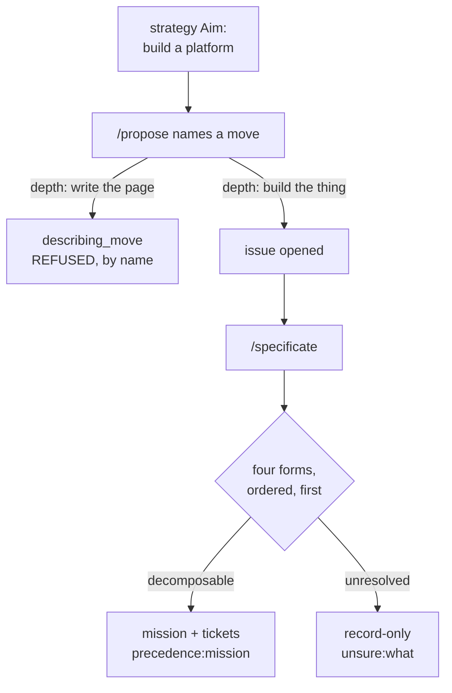

## 1. Overview

A consuming repository's strategy said, plainly, to build an application platform. Over weeks the loop answered it with pages about building it, and the deployment worker's own config still said it had no code of its own. Nothing was broken; every part did what it says.

**Highlights:**

1. `describing_move` is a named refusal: a move producing documentation *about* an Aim whose subject is to build something opens nothing.
2. The four proposal forms are an **ordered rule consulted first**; *when unsure, record-only* applies only to what they did not resolve.
3. Every judgment now reports which rule decided it — `precedence:<form>` or `unsure:<what>`.

## 2. Motivation

`/propose` already refuses the safe small change, and the refusal is well argued: housekeeping is chosen against **nothing**, so the body floor's `## What this is chosen against` section catches it.

A new page about the Aim passes that floor honestly. It is chosen against something real — the Aim is undocumented here — it commits in the imperative, and it is a textbook `depth` move: *go further into what the aim already covers than the landed work has gone*, and a document about what the aim covers is further than no document. So the same floor that stops "tidy this up" waves through "write the page explaining how merging deploys", and then the next page, and the one after that.

The cycle then sustains itself: the documentation tickets carry the strategy's refs, `attributed-work.sh` attributes them, `work_waiting` reads them as progress, and nothing else is proposed until they merge — at which point the next documentation move is named.

The one intervention that should have broken it failed for a different reason. The developer filed exactly the right ask — *this strategy stays documentation-only; revise it so it drives implementation* — naming a runtime, a database, an object store, an access layer, a language, build and test tooling, a framework, authentication and a protocol server. `/specificate` judged it **record-only**, against its own precedence that a decomposable direction is planned. The standing *when unsure, record-only* default had been reached before the rule that had already answered.

So the loop produced a document about the complaint that it produces only documents.

## 3. Changes

### 3-1. Let precedence beat the record-only default ([eba9145b](https://github.com/qmu/workaholic/commit/eba9145b))

The four forms are stated as an ordered rule, consulted before the default, with the measured case recorded. Uncertainty about *how* to decompose is separated from uncertainty about *whether* it decomposes — the conflation that let the default overrule a rule that had already answered. The report opens with the deciding rule, so a record-only outcome is a claim a reader can argue with. `check-floor.sh` is named as what makes leaning toward a plan safe: an under-supported mission is demoted mechanically at the publish seam, so the cost of trying is bounded.

### 3-2. Refuse a describing move against a build aim ([ff650efd](https://github.com/qmu/workaholic/commit/ff650efd))

`describing_move` joins the named refusals, beside housekeeping's, with the reason the existing floor cannot catch it written out. The exemption is the test: a strategy whose Aim is itself documentation is unaffected, which is what keeps this checkable rather than a matter of taste. It is recorded as the run's **judgement** rather than folded into the eight gates `survey-strategies.sh` computes — those the session cannot decide differently; this one it states in words and a reader can argue with.

## 4. Outcome

A strategy that says build gets proposals that build, and an ask that can be planned is planned. What is refused is documentation **as the move** — chosen instead of the build — not documentation.

## 5. Concerns

### The third ticket is unclaimed, so a stale documentation backlog still gates

- **Severity:** moderate
- **Description:** `work_waiting` still counts descriptive tickets as work in flight, so a strategy whose queue already holds documentation stays gated until it drains. `20260822194728-tell-describing-work-from-advancing-work.md` owns this and carries an Open Decision among three mechanisms; it was left queued because it needs a ticket schema change, not a prose one.
- **How to Fix:** Drive that ticket. Its own Considerations say to choose the mechanism against the residue, which is what this branch makes small.

### Both refusals are prose, judged by the run

- **Severity:** moderate
- **Description:** Neither `describing_move` nor the precedence ordering is computed by a script. A run that reads them loosely can still record an ask it should have planned, or propose a page it should have refused.
- **How to Fix:** The report line is the lever — `precedence:<form>` / `unsure:<what>` and the named refusal make a wrong call visible in the run's own output. If wrong calls recur, the next step is a fixture suite over real asks rather than a mechanical gate, since both judgements are about meaning.

## 6. Successful Development Patterns

- When a gate lets something through, ask what the gate's own stated reason *does not* cover before adding a rule — the housekeeping floor works exactly as designed, and the new refusal is a sibling rather than a patch to it.
- Give a judgement-shaped rule an exemption that is mechanical to check (here: the Aim's own subject), or it becomes taste.
- Say in the report which rule decided. A default that fires silently is indistinguishable from a rule that was never reached.

## 7. Release Preparation

**Verdict**: Ready for release

- **Before release:** None — no version bump is part of this branch.
- **After release:** A live `[Propose]` routine keeps its prompt; the refusal lives in the skill the command loads, so no template edit is owed.
