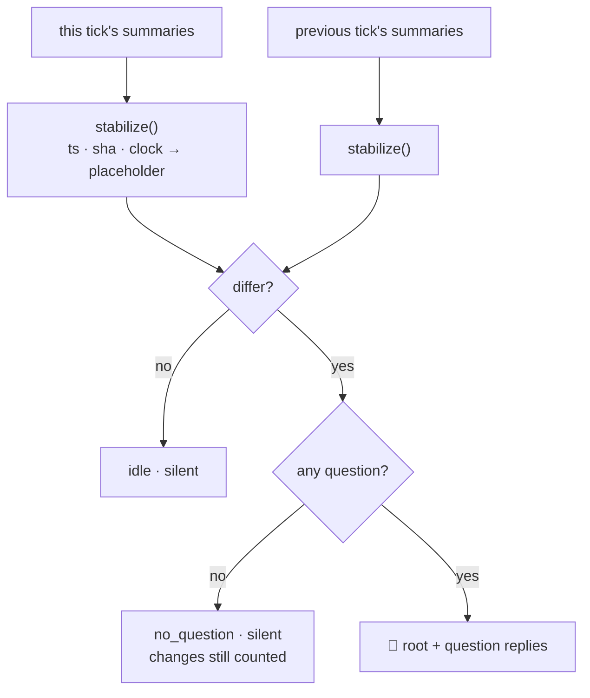

## 1. Overview

Four consecutive hours in a consuming repository's channel, the same post: `🔎 Moderation - 2 change(s), 0 question(s)`, two lines of the tick's own bookkeeping, a machine key. The developer said it was of no use to anybody, twice, and it kept coming.

**Highlights:**

1. The change diff runs on a **stable form** — a timestamp, a bare hex object name and a clock time are normalized out before comparing.
2. A **question is the root's precondition**; `no_question` joins the named silent reasons.
3. Both costs are written down rather than absorbed.

## 2. Motivation

The root was admitted on one argument: a change is a **diff against the previous tick**, so unlike the `📦 Release Preparation` line it replaced — retired for restating an unchanged answer ten hours running — it *cannot* repeat itself. The script's own header says so.

It could. `inbound-sweep` writes `GitHub read since <ISO8601>` and `doc-drift` writes `no new documentation drift since <sha>`, and the comparison was `[ "$was" = "$summary" ]` over the raw text. Both summaries move every tick whether or not the repository does, so both counted as changed, forever. The guarantee that made an hourly root admissible had never held in practice.

The second half is the gate. It was OR — a question **or** a changed step — and the root's stated reason to exist is that it *carries* the tick's questions beneath it, told apart from them by position in the thread. With `0 question(s)` there is nothing beneath it, and what is left is the status line addressed to nobody that `🔧 Needs a decision` and `📦 Release Preparation` were both retired for. The measured posts were exactly that, every hour.

## 3. Changes

### 3-1. Diff the tick's steps on a stable form ([0423a342](https://github.com/qmu/workaholic/commit/0423a342))

`stabilize()` normalizes three things and only three: an ISO8601 timestamp, a bare hex run of 7–40 characters, and a clock time. Stripping more would hide a real change behind noise — the opposite defect — so the list is short, named, and justified in the script's own header. Two pins hold both directions: a summary differing only in a moving value is not a change, and a real difference *beside* a moving value still is.

### 3-2. Make a question the tick root's precondition ([36a57518](https://github.com/qmu/workaholic/commit/36a57518))

The OR is gone. `no_question` — changes, but nothing to ask — joins `idle`, `no_previous_tick` and `no_log` as a named silent reason, so a quiet hour still says which kind of quiet it was. The rejected alternative is recorded with its reasons: letting a *named class* of change earn a question-less root is defensible, but it keeps a line nobody is asked to act on and needs a list maintained per step.

## 4. Outcome

An hour with nothing to ask is silent, and an hour whose steps found what they found last hour no longer counts as changed. The tick speaks when it needs a person.

## 5. Concerns

### A real change with no question attached is now only in the tick log

- **Severity:** moderate
- **Description:** This is the ruling's stated cost, not an oversight. A merge conflict appearing, or an auto-merge failing, produces no post unless the check-in step turns it into a question with a name on it.
- **How to Fix:** Nothing, unless the silence is measured to have cost something. If it is, the rejected alternative is written down with its shape and can be revisited against evidence.

### The lines still read as the tick's bookkeeping

- **Severity:** moderate
- **Description:** When the root does post, its lines are still step summaries written for the log — counters like `0 already captured`, `1 to judge`. `20260822175131-say-what-happened-not-what-the-tick-counted.md` owns this and stays queued.
- **How to Fix:** Drive that ticket. It needs a post-facing field on each of eleven step scripts, which is why it was not folded in here; with the gate now requiring a question, the root is rare enough that its wording is the smaller problem.

## 6. Successful Development Patterns

- When a mechanism's own header states the guarantee it provides, test the guarantee rather than the mechanism — the diff worked exactly as written and the guarantee was still false.
- Normalize a short, named list and say why it is short. A general scrub would have passed the same tests and hidden real changes.
- Record the rejected alternative with its shape, so revisiting it needs evidence rather than a fresh argument.

## 7. Release Preparation

**Verdict**: Ready for release

- **Before release:** None.
- **After release:** No routine template moves — the gate lives in the script the command loads, so the live `[Moderate]` prompt is unaffected.
