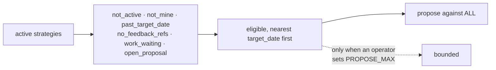

## 1. Overview

`/propose` took one strategy per tick, nearest `target_date` first, and reported the rest as `over_cap`. On a consuming repository with two active directions sharing a date, one of them never got a turn for a day.

**Highlights:**

1. A tick now proposes against **every** eligible strategy — everything it can conclude at that moment.
2. `WORKAHOLIC_PROPOSE_MAX` survives as an explicit opt-in bound; its **default is unbounded**, and the default is the point.
3. `over_cap` is retired from the script, the SKILL, `CLAUDE.md` and the e2e drill.

## 2. Motivation

The cap was written against a real worry — *a developer carrying eight directions must not wake to eight issues at `:40`* — and the worry was already answered elsewhere. `work_waiting` and `open_proposal` together give **one proposal per strategy in flight at a time**, so eight issues can only arrive when all eight directions are idle, and then eight directions each genuinely need their next move. The cap therefore reduced no total.

What it did was fix an **order** — and the order ran backwards. A strategy is skipped while its *own* work is in flight, so the direction whose work takes **longer** is proposed against **less** often. The direction that most needs its next move is the one being starved.

That is not a hypothetical. Measured: two active strategies with the same `target_date`. One builds an application platform, and its build work sits queued for hours, so it was `work_waiting` on every tick. The other is documentation, drains fast, and was therefore eligible on every tick. For a day the channel carried one direction's output while the other never got a turn — and the platform still had no code of its own.

The ruling was blunt and correct: one proposal per tick is not enough; the tick should propose everything it can conclude.

## 3. Changes

### 3-1. Propose against every eligible strategy in the tick ([417df41d](https://github.com/qmu/workaholic/commit/417df41d))

`CAP` defaults to unbounded; unset, empty, non-numeric and `0` all read that way — `0` deliberately means unbounded rather than silence, because a cap of zero would mute the only routine that originates work and no operator asking for a bound means that. The `$ok[0:$cap]` split is bypassed when unbounded, so `over_cap` is emitted by nothing. Ordering by `days_to_target` is untouched: a tick that dies partway has advanced the most urgent direction rather than an arbitrary one.

The retired reasoning is written into the script header, the SKILL and `CLAUDE.md` with its measurement, so a future reader meets the argument rather than a deletion.

## 4. Outcome

Every direction that can be advanced this hour is advanced this hour. The brake on volume stays where it belongs — work in flight, per direction — and no direction waits behind another's slowness.

## 5. Concerns

### The per-tick issue ceiling is now unbounded in principle

- **Severity:** moderate
- **Description:** N idle strategies produce N issues in one tick. That is the intent, but nothing caps it any more except how many directions an identity carries.
- **How to Fix:** Nothing pre-emptively. `WORKAHOLIC_PROPOSE_MAX` exists for an operator who measures a real problem, and the in-flight gates keep the steady state at one proposal per direction.

### The starvation was invisible until someone read the channel

- **Severity:** moderate
- **Description:** `over_cap` was reported by name every tick, exactly as designed, and still nobody noticed a direction had not moved in a day — a per-tick refusal reads as a delay, and a delay repeated twenty times reads as nothing at all.
- **How to Fix:** No refusal that repeats should be judged by its own wording. If this recurs for another gate, the fix is a report of how long a direction has been refused, not a clearer refusal.

## 6. Successful Development Patterns

- When a bound is defended by a worry, check whether something else already answers the worry. Here two other gates did, which made the cap pure ordering with no volume benefit at all.
- Ask which side of a queue a gate favours. This one favoured the fast direction over the slow one, which is the opposite of what a loop that must reach an Aim needs.
- Keep a retired rule's reasoning and its measurement together, so the next reader can disagree with the change rather than rediscover the problem.

## 7. Release Preparation

**Verdict**: Ready for release

- **Before release:** None.
- **After release:** No routine template moves — the gates live in the script the command loads.
