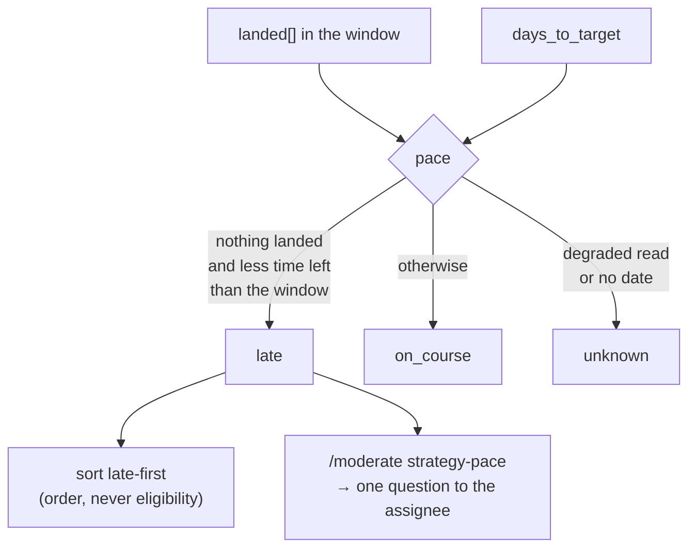

## 1. Overview

All seven `/propose` gates were brakes. A strategy could be perfectly gated — every brake correct, every tick silent for a correct reason — and reach its date with nothing built.

**Highlights:**

1. Every surveyed strategy carries **`pace`**: `late`, `on_course` or `unknown`.
2. Eligible strategies sort **late first**, so a tick that dies partway advanced the direction least likely to arrive.
3. `/moderate` gains an eleventh step, `strategy-pace`, which asks the owner of a direction that will not arrive.

## 2. Motivation

`survey-strategies.sh` already had both halves and never joined them. It computed `days_to_target` and used it only to sort and to refuse `past_target_date` — *it has passed*, never *will it be met*. It read `landed[]` from the attribution reader and used it only for `no_citing_artifacts` and `work_waiting`. So the survey could state *seven days remain* and *nineteen artifacts have landed* and never form the sentence a person forms on hearing both.

Measured: a platform strategy seven days from its date whose nineteen attributed artifacts were all specification pages, with no `tsconfig` and a deployment config still saying the worker had no code of its own. Every gate was correct on every tick.

Three defects fixed the same day shared this root — the missing `describing_move`, record-only overruling the form precedence, and `over_cap` starving the slowest direction. Each was fixed; the root was that nothing anywhere asked whether the aim was getting closer.

## 3. Changes

### 3-1. Read a strategy's pace against its date ([dc945787](https://github.com/qmu/workaholic/commit/dc945787))

`pace` is derived from what already existed; no artifact gained a field. **`late` needs no threshold** — it means *nothing landed over a period as long as the one that remains*, and both terms were already justified here: the window is the evidence the judgment is made against, and the remaining days are the strategy's own date. A ratio would imply an accuracy `landed[]` cannot support, since its own reader states attribution is transitive and lossy.

`unknown` is a real third answer. It never collapses into either other one, because a degraded read cannot tell a stalled direction from a moving one, and an undated strategy is malformed rather than late.

### 3-2. Order by lateness and name what will not arrive ([c62fc674](https://github.com/qmu/workaholic/commit/c62fc674))

Eligible strategies sort late-first, then nearest date; `unknown` orders exactly where it did before, because a reading that failed must neither promote nor demote. `refused` rows gained `pace` too — additively, so every existing reader still sees `{slug, reason}` — because a direction that will not arrive **and** is gated produces no proposal, and that is the case that starves.

The Open Decision on *where* a `late` reading is said was ruled **(c)**: `/moderate`'s new `strategy-pace` step, which reads the same survey script and hands one question per strategy to the check-in. `/propose`'s own run report was refused — an hourly routine's report is read by nobody on the day it matters, which is the invisibility this exists to end; `over_cap` named itself on every single tick and still hid a day of starvation. The proposal issue was refused for the opposite reason: it says nothing exactly when the direction is gated.

## 4. Outcome

The loop can now tell a direction heading for an empty date from one on course, advances the former first, and tells the person who owns it. What it will not do is lift a gate for lateness.

## 5. Concerns

### `late` fires on a young strategy that nothing has cited yet

- **Severity:** moderate
- **Description:** A strategy created inside the window with nothing attributed reads `late` as soon as fewer days remain than the window — observed on this repository's own strategy at nine days out. That is arguably correct (nothing has started, so it will not arrive) but it is indistinguishable from a direction that stalled after real work.
- **How to Fix:** If it proves noisy, the distinguishing fact is the strategy's `created_at`, which is already on the artifact. Add it to the derivation only against measurement — a second term added on suspicion is how the threshold-free property is lost.

### The reading depends on attribution, which is lossy by its own admission

- **Severity:** moderate
- **Description:** `landed[]` comes from a `feedback:` ref intersection plus one hop. Work that advanced a direction without citing its refs is invisible, so a moving direction can read `late`.
- **How to Fix:** Nothing new — this is why the answer is a **question to a person**, not a refusal or a proposal. The `unknown` branch covers the read failing outright; this covers it succeeding and being incomplete, and a person resolves both.

## 6. Successful Development Patterns

- When several defects share a shape, name the shape and fix it as its own change. Three fixes on one day all reduced to "the gates count volume and nothing asks about arrival".
- Prefer a derivation whose terms are already justified elsewhere over one that needs a new constant. The threshold-free `late` is defensible precisely because it borrows the window and the date.
- Put a judgement in exactly one place. Pace deliberately does not judge *what* landed, because `describing_move` already does and two homes for one judgement drift.

## 7. Release Preparation

**Verdict**: Ready for release

- **Before release:** None.
- **After release:** No routine template moves — the new step is registered in `run.sh`, which the `[Moderate]` prompt reaches through the command.
