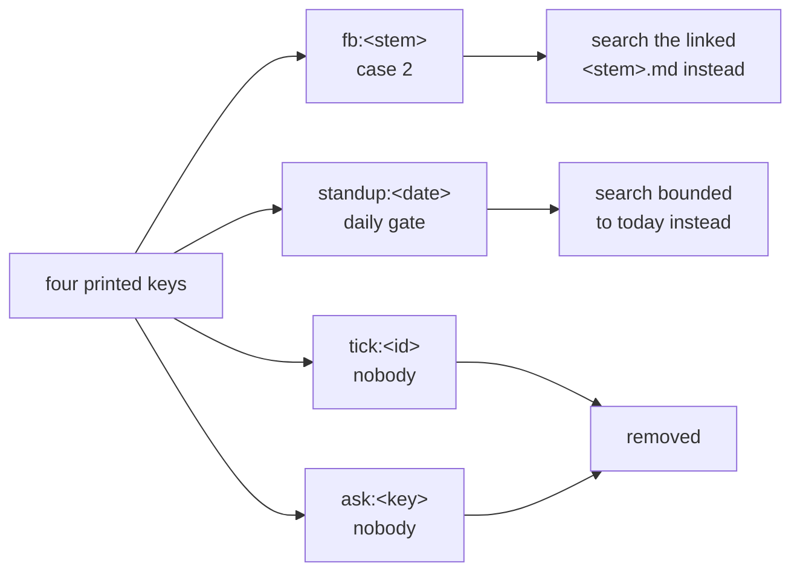

## 1. Overview

Every post in the channel ended in a line a person was not meant to read. The developer said so repeatedly, and it kept being printed, because the design believed removing it would break the thread lookup.

**Highlights:**

1. **Two of the four keys were searched by nothing at all.**
2. Slack indexes **link URLs** — measured — so the root already carried the identifier case 2 needs.
3. No rendered post carries a printed key; the suite pins their absence.

## 2. Motivation

The blocker was a written constraint: `` `fb:<stem>` `` sits on the root, *case 2 searches for that key, so a root without it regresses the whole lookup*. It reads like a fact. It was a claim, and it stood for a day while the thing it protected kept annoying the person it was shown to.

Two probes settled the whole mission. First, an inventory of who consults each key: `fb:<stem>` by case 2, `standup:<date>` by the daily gate — and `tick:<tick-id>` and `ask:<key>` **by nobody**. The already-asked ledger moved to the tick log on 2026-08-19 and `ask-question.sh` reads Slack at no point, so those two had been noise from the day their consumer moved and nobody had checked.

Second, the constraint itself. Searching `` <stem>.md `` — a string present nowhere in the message except inside the linked URL — returned the exact message. Slack indexes link URLs. The root links the record at `.../feedbacks/<stem>.md`, so the identifier was already in the message twice: once usefully, once at a human.

## 3. Changes

### 3-1. Identify every path that printed a visible key ([8fe24f13](https://github.com/qmu/workaholic/commit/8fe24f13))

Four keys, their consumers named. The tokened fallback is a fifth path that cannot search at all; it keeps an identifier, now the record URL rather than a bare key — the same string in the one form a person can also use.

### 3-2. Measure what the Slack search surface matches ([0d57bf47](https://github.com/qmu/workaholic/commit/0d57bf47))

The `<stem>.md` probe. If that behaviour ever changes the lookup degrades to case 4 and posts a root, which is the documented not-found branch rather than a new failure mode.

### 3-3. Take the dedup key out of every read post ([5efdfe22](https://github.com/qmu/workaholic/commit/5efdfe22))

Case 2 searches the record filename. The standup morning became a search bound (`📣 Standup`, bounded to today) instead of a printed date. The tick and question keys were removed outright. Four routine templates, both shape copies, `notify`'s SKILL, `standup`'s SKILL, `render-tick-post.sh` and `CLAUDE.md` moved together, and the suite's pins were inverted — they asserted each key's **presence** and now assert its absence, plus the surviving link, because the link is what makes the removal safe.

## 4. Outcome

A person reading the channel sees a marker, a linked title, a sentence and a session link. Nothing else. The machine finds the same thread it always did, through the URL that was already there.

## 5. Concerns

### The lookup now depends on a measured search behaviour rather than a string we control

- **Severity:** moderate
- **Description:** Case 2 matches because Slack indexes link URLs. That was measured in one workspace, once. If it changes, case 2 misses and case 4 posts a new root — the item accumulates threads, which is the failure #360 was spent fixing.
- **How to Fix:** The degradation is the documented not-found branch, not a crash, so it is visible in the channel as duplicate roots. If that is ever observed, the answer is a store outside the repository, which the 2026-08-11 ruling already constrained — never a `thread_ref` committed here.

### Two keys were noise for three days and no mechanism noticed

- **Severity:** moderate
- **Description:** `tick:` and `ask:` outlived their consumers by three days. Nothing failed, nothing warned; only reading every searcher by hand found it.
- **How to Fix:** When a consumer of a rendered token moves, the token's removal belongs in the same change. There is no check for this today, and inventing one for four tokens would cost more than it saves — what is cheap is the habit, recorded here.

## 6. Successful Development Patterns

- Test the constraint before designing around it. A written impossibility in this repository's own documents held up a fix for a day and died to one search.
- Ask *who consults this* before asking *how do we keep it*. Half the keys had no consumer, and that question is cheaper than any redesign.
- When a pin asserts a thing's presence and the thing is being removed, invert the pin and pin what makes the removal safe — here, the surviving link.

## 7. Release Preparation

**Verdict**: Ready for release

- **After release:** A live routine keeps its old prompt until an account converges it, so its posts still print the key until then. The four templates moved in this branch.
