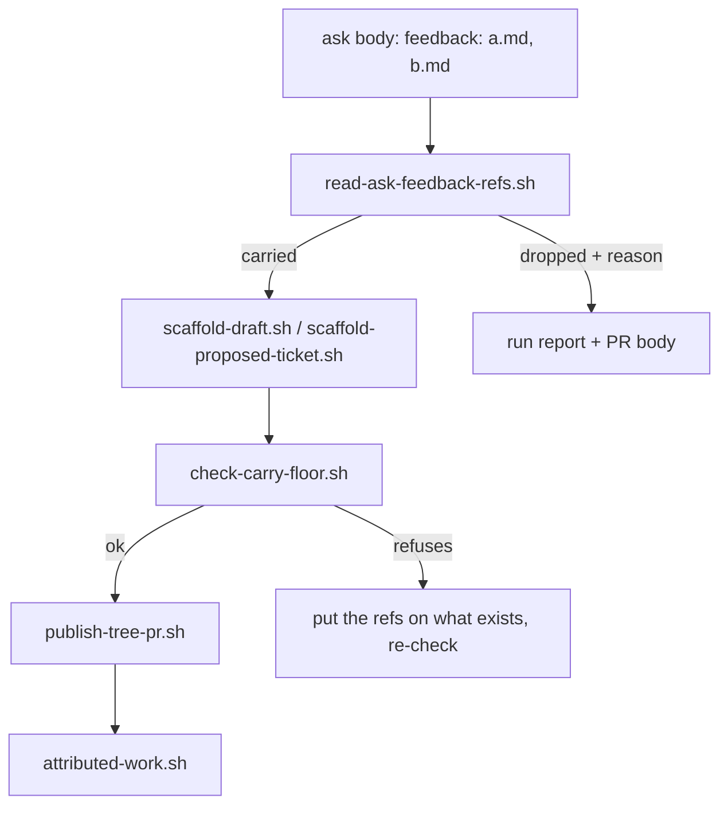

## 1. Overview

The loop's fourth link — work `/specificate` emits staying attributable to the direction that asked for it — was carried by a paragraph telling the run to read the ask's `feedback:` line by eye. This branch gives that line a reader, makes the carry visible on both reporting surfaces, and refuses at the publish seam when a resolved ref does not reach what was emitted.

**Highlights:**

1. `read-ask-feedback-refs.sh` is the single reader of the ask's own line, the mirror of `read-feedback-relation.sh` on the artifact side.
2. `check-carry-floor.sh` refuses a publish that lost a resolved ref, naming each `{artifact, ref}` and the concrete repair.
3. `no_citing_artifacts` now means one thing, and a hermetic chain test is what says so.

## 2. Motivation

The failure this closes was invisible by construction. A forgotten carry leaves `strategy.feedback[] ∩ artifact.feedback[]` empty, so `attributed-work.sh` answers `no_citing_artifacts` — byte-identical to a direction nothing has answered yet. `workaholic:propose` treats that reading as explicitly *not* a refusal, which is right for the first case and makes the second self-perpetuating: the loop keeps proposing against a direction it can no longer see its own work on, and every turn reports success on the turn that lost the link.

The repository already had the shape of every answer needed. One reader per relation is a written rule whose own header explains what two parsers cost; the two-ticket floor already proves that a creation seam is where a cross-artifact question becomes answerable. What was missing was applying them to the one surface nobody had: the ask.

## 3. Changes

The four tickets run in dependency order: the reader first, then the floor that consumes it, then the reporting obligation over its output, and last the test and documents that turn the result into a guarantee a change can lose.

### 3-1. Read the ask's feedback line via a script ([aca770f5](https://github.com/qmu/workaholic/commit/aca770f5))

Added `read-ask-feedback-refs.sh`: the ask body on stdin, `{line_found, carried, dropped:[{ref, reason}]}` out, exit 0 in every case. It reads only the first line-initial `feedback:` line, normalises refs exactly as the artifact reader does, and drops what does not resolve with a named reason rather than inventing or rewriting it.

### 3-2. Floor the carry at the publish seam ([26af72a0](https://github.com/qmu/workaholic/commit/26af72a0))

Added `check-carry-floor.sh` and wired it into step 9 beside the two-ticket floor. When the ask carried refs that resolved and the run emitted a mission or a loose ticket, those refs must be on what it emitted or the seam refuses — exit 1, refusal on stderr, repair named.

### 3-3. Report every carried and dropped feedback ref ([90034101](https://github.com/qmu/workaholic/commit/90034101))

The run report and the pull-request body now name, per emitted artifact, what was carried (a count) and every dropped ref (by name, with its reason). A record-only outcome names the refs it *would* have carried beside `emitted:none`, so a lost link and an unproposed ask stop reading alike.

### 3-4. Make no_citing_artifacts a provable reading ([1f5eeab6](https://github.com/qmu/workaholic/commit/1f5eeab6))

A hermetic test walks ask → reader → scaffold → floor, passing when the ref rides and refusing when it is dropped, and the preserved negative still answers `no_citing_artifacts`. `attributed-work.sh` is unchanged, and the guarantee's limits are stated in three documents so it is not over-read.

## 4. Outcome

After the floor, a proposal that emitted work from an ask whose refs resolved cannot have lost them, so `attributed-work.sh`'s `no_citing_artifacts` means *nothing has answered this direction yet* and nothing else. The guarantee is bounded and says so: work a run never emitted, an ask that named no refs, a ref that did not resolve, and any hand-written artifact stay uncited for ordinary reasons.

## 5. Concerns

### The carry floor is invoked by prose, not by the scaffolds

- **Severity:** moderate
- **Description:** `check-carry-floor.sh` is a verdict a step must remember to call, exactly as `check-floor.sh` is; a `/specificate` run that skips step 9's new line publishes a lost ref with no refusal (see [26af72a0](https://github.com/qmu/workaholic/commit/26af72a0) in `plugins/workaholic/skills/specificate/reference/workflow.md`)
- **How to Fix:** If a skipped invocation is ever measured, move the check inside `publish-tree-pr.sh` behind an explicit ref argument, so the seam that publishes is the seam that proves.

### The report contract is prose over a script's output

- **Severity:** low
- **Description:** Steps 10 and 13 oblige the run to state what the reader returned, and nothing mechanically checks that the line was written (see [90034101](https://github.com/qmu/workaholic/commit/90034101) in `plugins/workaholic/skills/specificate/reference/workflow.md`)
- **How to Fix:** Accepted deliberately — the floor, not the report, is what makes a silent loss impossible; add a check only if a run is observed publishing without the line.

## 6. Successful Development Patterns

- Mirroring an existing verdict script (`check-floor.sh`) gave the new floor its exit discipline, its stderr/stdout split and its name-the-repair obligation for free — copying a proven seam beats re-deciding one.
- The chain test's value is its *negative* half; a passing chain only shows today's scripts agree, while the dropped-ref case is what makes the guarantee losable.

## 7. Release Preparation

**Verdict**: Ready for release

- **After release:** The mission closed `achieved` at the archive gate; nothing further is queued for it.
