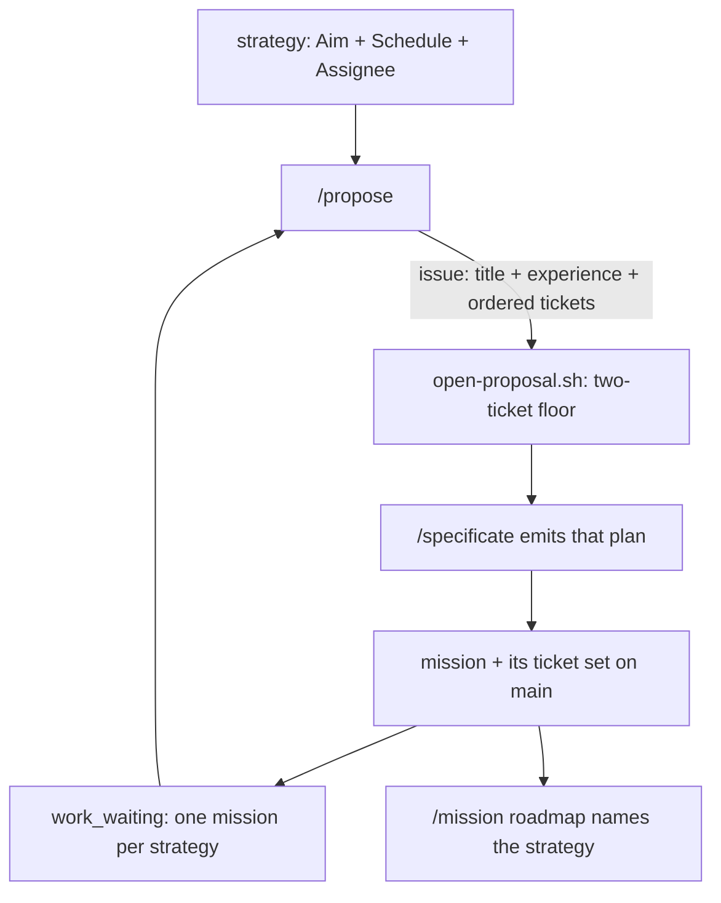

## 1. Overview

The operator asked that the loop turn one **mission** at a time rather than one change. `/propose` now plans a whole mission — a title, the experience it demands, an ordered ticket set — `/specificate` emits that plan instead of re-deriving it, the in-flight brake bounds one mission per strategy, and the roadmap finally shows which direction each mission serves.

**Highlights:**

1. The proposing seam gains its own two-ticket floor (`under_planned`), mirroring the publish seam's.
2. `work_waiting` reads an *active attributed mission*, closing the drained-queue window a second mission would have slipped through.
3. `mission-strategy.sh` inverts the citation walk, so the strategy↔mission link is visible without being stored.

## 2. Motivation

`/propose` judged one evolutionary move and `/specificate` re-derived the decomposition from prose, so the loop's unit of work was a change and the strategy→mission link was a side effect of carried `feedback:` refs rather than the visible shape of the roadmap. Two costs followed. The routine kept converging on small, safe moves — a mission-sized proposal cannot be "add a test" without saying so out loud — and two sessions deciding the same decomposition let the ask's plan and the emitted mission drift apart, leaving the operator reading a roadmap that did not match the proposal they approved.

The scale of the unit is the change; the architecture is not. `/propose` plans and `/specificate` writes, because the publish-tree seam, both floors and the pull request already live on the writing side, and moving them would give the tree a second unattended writer.

## 3. Changes

The five tickets run in dependency order: the proposing grain first, then the brake and the emitting rule that depend on it, then the visibility the link always deserved, and last the repository-level documents no single skill owns.

### 3-1. Judge a whole mission, not one change ([6db81a36](https://github.com/qmu/workaholic/commit/6db81a36))

`/propose`'s proposal now names a mission title, the experience it demands and an ordered ticket set at the ruled 7–8 scale. `open-proposal.sh`'s body floor gained `## Experience` and `## Tickets`, and fewer than two tickets is refused `under_planned` with the alternative named.

### 3-2. Bound the brake to one mission per strategy ([6bff4aac](https://github.com/qmu/workaholic/commit/6bff4aac))

`work_waiting` reads an active attributed mission OR'd with a queued attributable ticket. The mission term holds the gate while a mission's last ticket sits at a pull request with its queue drained; the ticket term still brakes a loose ticket. The gate releases when the mission closes.

### 3-3. Emit the mission the ask already planned ([bbc887ea](https://github.com/qmu/workaholic/commit/bbc887ea))

An ask that already names a mission is emitted as *that* plan, in that order. Every floor stays over the top of it, a breach is demoted and reported by name, and the extend-before-mint rule decides whether the plan becomes a new mission or tickets into the existing one.

### 3-4. Make a mission's strategy visible ([bf58f1dc](https://github.com/qmu/workaholic/commit/bf58f1dc))

`mission-strategy.sh` answers which strategy a mission belongs to by composing `attributed-work.sh` — no second walker, no field on any artifact — and the bare `/mission` roadmap renders it, with an explicit *no strategy* where nothing could be attributed.

### 3-5. Update the documents the grain moves ([1f508c6d](https://github.com/qmu/workaholic/commit/1f508c6d))

`CLAUDE.md`, both READMEs, three runbooks and `rules/workaholic.md` describe the mission grain, and a fourteenth decision round (S1–S6) records the ruling with every rejected fork.

## 4. Outcome

The loop's unit of work is a mission from end to end: proposed as one, emitted as one, braked as one, and rendered against the direction that asked for it. Nothing was stored to achieve it — no artifact gained a field, and the `strategy:` relation retired in 2026-07-28 stays retired.

## 5. Concerns

### One prose reference expanded the generated bundle by ~40k lines

- **Severity:** moderate
- **Description:** Naming `${CLAUDE_PLUGIN_ROOT}/skills/strategy/scripts/mission-strategy.sh` in `mission/reference/command-flows.md` pulled strategy's transitive script closure — and through it drive, ship, story, specificate, check-deps and system-safety — into the `mission` and `catch` bundles, and is most of this branch's `too-many-files` finding (see [bf58f1dc](https://github.com/qmu/workaholic/commit/bf58f1dc) in `outputs/workflows/`)
- **How to Fix:** If bundle size becomes a real cost, teach `build.mjs` to carry only the scripts a skill's own closure reaches rather than every skill in the transitive graph. Do **not** fix it by dropping the reference or by inlining the reads — that would create the second attribution walker this mission refused.

### A test issue was opened and closed on the real repository

- **Severity:** low
- **Description:** A local smoke test of the new two-ticket floor reached `open-proposal.sh`'s network path and opened issue [#608](https://github.com/qmu/workaholic/issues/608), which was closed `not_planned` with a comment saying why (see [6db81a36](https://github.com/qmu/workaholic/commit/6db81a36) in `plugins/workaholic/skills/propose/scripts/open-proposal.sh`)
- **How to Fix:** Exercise `open-proposal.sh`'s happy path only through fixtures that stop before `gh api user` — the hermetic suite and `verify-propose` both do; an ad-hoc shell check does not.

### `verify-specificate` cannot drill the chain without a seed

- **Severity:** low
- **Description:** The mission-grain chain is provable end to end only with `verify-propose` plus `verify-specificate <issue>`, and the second needs a seeded issue and a live loop, so an unattended container proves only the first half (see [1f508c6d](https://github.com/qmu/workaholic/commit/1f508c6d) in `docs/loop-drill-runbook.md`)
- **How to Fix:** Accepted and stated in §5g rather than hidden. A hermetic half of `verify-specificate` — the form judgment over a fixture tree, with no network — would close it.

## 6. Successful Development Patterns

- Mirroring an existing floor (`check-floor.sh`) at a new seam carried its exit discipline, its stderr/stdout split and its name-the-alternative obligation for free.
- The gate that needed changing was not the one that looked wrong: `waiting_count > 0` already treated seven tickets and one alike, so the defect was the *drained* queue, not the count — worth re-deriving what a gate actually admits before re-expressing it.

## 7. Release Preparation

**Verdict**: Ready for release

- **Concern:** The branch carries a `too-many-files` `override`-tier finding (267 files), almost all generated `outputs/`.
- **Before release:** Nothing — `override`-tier findings do not hold a release; the tier is a granularity nudge.
