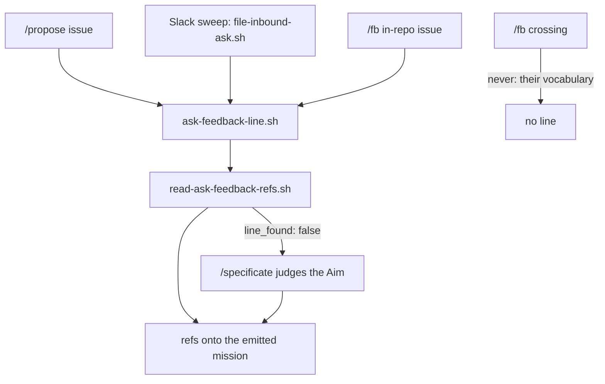

## 1. Overview

The loop had two inbound mouths and only one was attributable: `/propose` wrote a `feedback:` header line naming the strategy's refs, while the Slack sweep and `/fb` wrote none. This branch gives every mouth the same line from one writer, teaches `/specificate` to judge a direction for an ask that names none, and extends the chain test so the guarantee covers all three writers.

**Highlights:**

1. `ask-feedback-line.sh` is the one writer of the line the one reader reads — extracted before it was multiplied, not after.
2. The sweep and `/fb`'s in-repo path stamp the direction; the crossing never does, and the reason is written down.
3. `/specificate` judges a direction for an ask naming none, reports **how** it decided, and the floor stays out of it.

## 2. Motivation

Measured on this repository on 2026-08-26: a developer's message became issue #604, `/specificate` emitted a five-ticket mission from it, and `attributed-work.sh` still reported that strategy's `waiting_count: 0`. Because `/propose`'s in-flight brake reads that count, the brake stood open over a whole queued mission — the loop could have proposed a second one against a direction it was already working.

The link was never missing; the *stamp* was. `attributed-work.sh` walks `strategy.feedback[] ∩ artifact.feedback[]`, so an ask that names no refs produces work that intersects every direction at nothing, however plainly the ask was about one. The previous mission made a dropped link impossible for `/propose`'s asks; this one is the other half — the asks that never carried a link at all.

## 3. Changes

The formatter comes first because the next two tickets add a *caller* rather than a parser; the judgment and the chain test follow.

### 3-1. Write the ask's feedback line in one place ([02e2490b](https://github.com/qmu/workaholic/commit/02e2490b))

`feedback/scripts/ask-feedback-line.sh` is the single formatter: refs in, one canonical line out, **nothing** for an empty set. `open-proposal.sh` composes line 3 through it, and the issue body it opens is byte-identical.

### 3-2. Carry the direction onto a swept ask ([bbf5ff65](https://github.com/qmu/workaholic/commit/bbf5ff65))

`file-inbound-ask.sh --feedback` stamps the direction's own refs after `slack-link:`. The judgment is explicit slug → the `active` set → `unattributed`, reported per filed issue and never enforced; with no direction the body is byte-identical to before the flag existed.

### 3-3. Carry the direction onto an fb ask ([b44d3c6a](https://github.com/qmu/workaholic/commit/b44d3c6a))

`/fb`'s in-repo path gained the same step and the same report field. The **crossing never carries the line** — it would name records the target cannot resolve, in our vocabulary rather than theirs — and `open-issue.sh` still composes nothing.

### 3-4. Decide the direction for an unattributed ask ([6e1e249c](https://github.com/qmu/workaholic/commit/6e1e249c))

`/specificate` step 7 judges the direction for an ask step 3b found no line on, using the Aims step 5b already read. A line beats a judgment outright, both surfaces report `direction:<slug>:<line|slug|aim>`, and `check-carry-floor.sh` is unchanged.

### 3-5. Walk the sweep's ask in the chain test ([781b3b6e](https://github.com/qmu/workaholic/commit/781b3b6e))

`testCarryChainIsProvable` walks the sweep's and `/fb`'s header shapes through the same four links from one loop, proves an unattributed swept ask passes the floor with `checked: 0`, and four documents state the extended bound with its limits.

## 4. Outcome

Every writer the loop owns now stamps the direction its ask answers, through one formatter, and what it could not decide it says out loud. `no_citing_artifacts` accordingly means *nothing has answered this direction yet* for asks from all three writers — bounded, stated, and pinned by a test rather than asserted. No artifact gained a field and the retired `strategy:` relation stays retired.

## 5. Concerns

### The direction judgment is prose, and only its edges are tested

- **Severity:** moderate
- **Description:** "Which `active` Aim does this ask fall under" is a model judgment in three skills; the suite pins the report shapes, the floor's scope and the precedence between a line and a judgment, but nothing checks that a run actually made the call (see [6e1e249c](https://github.com/qmu/workaholic/commit/6e1e249c) in `plugins/workaholic/skills/specificate/reference/workflow.md`)
- **How to Fix:** Accepted deliberately — the judgment is reported and never enforced, so a missed one costs a `direction:unattributed` line rather than a suppressed ask. If runs are observed never reporting a direction, make the report field mandatory in the run-report contract before making the judgment mechanical.

### The mission's own acceptance covers three of its five tickets

- **Severity:** low
- **Description:** `## Acceptance` names the swept ask, the judgment and the chain test; the formatter extraction and the `/fb` half are unlinked, so the mission closed `achieved` on three ticked items while five tickets landed (see [02e2490b](https://github.com/qmu/workaholic/commit/02e2490b) in `.workaholic/missions/`)
- **How to Fix:** Nothing here — the acceptance ceiling is ≤3 items by design and `unlinked` counts items without a ticket, not tickets without an item. Worth knowing when reading a mission's `checked/total` as coverage.

## 6. Successful Development Patterns

- Extracting the single writer **before** the second and third callers existed made both of them a one-line change; the same extraction after three call sites would have been three rewrites and a byte-identity argument each time.
- Proving "byte-identical when the flag is absent" by composing both bodies from otherwise-identical inputs, rather than filtering differing lines out of the comparison — the first attempt filtered two lines and would have hidden a regression in the second.

## 7. Release Preparation

**Verdict**: Ready for release
