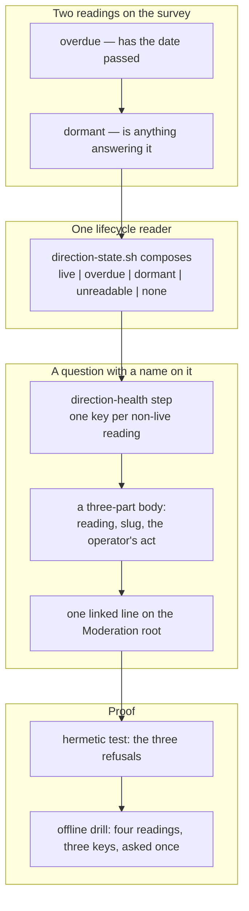

## 1. Overview

Every mission so far enriched the loop's **turn**; this one gives the **direction** a life the loop can read. Three states were silent and each was byte-identical to a healthy idle hour — a direction past its date, a live direction nothing is answering, and a repository with no direction at all — so a developer watching an hourly loop go quiet could not tell health from empty fuel. They are now read once, by one reader, and asked about by name in the channel.

**Highlights:**

1. `survey-strategies.sh` gains `overdue` and `dormant` on every surveyed row; `direction-state.sh` composes them into `live | overdue | dormant | unreadable` plus the repository-level `none`.
2. `/moderate`'s new `direction-health` step asks the direction's assignee once per non-`live` reading, in a body naming the reading, the slug and the operator's own next act.
3. The three refusals — writes nothing, reaches no writer, lifts no gate — are pinned by a hermetic test and drillable offline by an operator.

## 2. Motivation

`pace` answers *will this direction arrive*, and it cannot answer *has its date already gone*: `late` requires that nothing landed, so a direction that sailed past its `target_date` **while producing work** reads `on_course`, is refused `past_target_date` for a perfectly correct reason, and produces no proposal and no question — forever. Beside it sat two more silences. `/propose` reports `no_evolutionary_move` honestly, into a run report that on the day it matters is read by nobody; `/standup` reports `no_strategies` as a no-op everywhere. Each of the three is a real state of the direction layer, and each was indistinguishable from an hour in which everything was fine.

The loop already knew where to put a finding it cannot decide: `strategy-pace` and `stalled-units` both read something and hand it to the check-in, which asks a named person once. This mission follows that shape rather than inventing a surface, which is why nothing here proposes, closes or merges — it reads, and it asks.

## 3. Changes

The branch runs bottom-up: two readings are added to the one script that already derives everything they need, a single reader composes them so no consumer assembles its own answer, the tick turns each non-`live` answer into a question addressed to a person, and the last two tickets make all of it provable — mechanically in CI, and on demand in an operator's checkout with no network and no credential.

### 3-1. Add the overdue reading to the survey ([31c4b8a7](https://github.com/qmu/workaholic/commit/31c4b8a7))

`overdue` is emitted on every surveyed row, eligible and refused alike, `true` exactly when `days_to_target < 0`, and computed **before** `refusal` so no gate, no `pace` value and no sort moves. Folding it into `pace` as a fourth value was refused: one field answering two questions is how the two drift.

### 3-2. Add the dormant reading to the survey ([0948d699](https://github.com/qmu/workaholic/commit/0948d699))

`dormant` is a conjunction of terms the row already holds — legible, `active`, owned, in date, cited, nothing landed in the window, nothing waiting at either grain, no proposal open. It adds no counter and no field, and it leaves the strategy **eligible**, which is precisely what makes its silence a finding rather than a gate.

### 3-3. Write the one direction lifecycle reader ([b348bc1e](https://github.com/qmu/workaholic/commit/b348bc1e))

`strategy/scripts/direction-state.sh` composes the survey and re-derives nothing — no date arithmetic, no attribution walk. The only thing it owns is the precedence (`unreadable` > `overdue` > `dormant` > `live`), and a survey that refuses yields `readable: false` with the survey's own reason at exit 0.

### 3-4. Add the moderate step direction-health ([891cddff](https://github.com/qmu/workaholic/commit/891cddff))

The step reads that one reader and hands every non-`live` reading to the check-in, keyed `direction-overdue:<slug>` / `direction-dormant:<slug>` / `direction-none`. `unreadable` is counted and never asked about — the rule `strategy-pace` already applies to its own `unknown`.

### 3-5. Make the direction question actionable ([9930f1d1](https://github.com/qmu/workaholic/commit/9930f1d1))

Each subject carries its own `heading` and `body`: the reading, the slug, and the operator's act named in the operator's vocabulary (*announce that it ended*, never *call `close.sh`*). Every body says what the loop will not do, so *it still stands* is a complete answer.

### 3-6. Render the direction reading on the root ([ecea2cef](https://github.com/qmu/workaholic/commit/ecea2cef))

The step supplies `event` beside its log-facing `summary`, worded as a repository event and linking each direction it names. An all-`live` tick supplies the empty string and renders no line at all; `render-tick-post.sh` needed no change.

### 3-7. Pin the three refusals with a test ([290ae6dd](https://github.com/qmu/workaholic/commit/290ae6dd))

The suite now fails if the step writes under `.workaholic/strategies/`, if its closure reaches `close.sh` or `open-proposal.sh`, if a third writer of the strategy file appears, or if any `/propose` gate outcome moves. Each of the four was falsified in a scratch copy first — a test that cannot fail proves nothing.

### 3-8. Drill direction health with no network ([598bf9c4](https://github.com/qmu/workaholic/commit/598bf9c4))

`loop-drill.sh verify-direction-health` seeds an overdue direction carrying landed work, a dormant one and an empty tree, and asserts the four readings, the three question keys, the asked-once gate and a byte-identical checkout — re-run with `gh` absent from `PATH` and both proxies dead, proving the no-network claim rather than asserting it.

## 4. Outcome

The direction layer now has a lifecycle a reader can state and a surface that names a person. Nothing gained a field, no artifact gained a relation, the strategy keeps its two writers, and `/propose`'s gates are byte-identical — the mission's whole delivery is a reading, a question and two proofs.

## 5. Concerns

### The dormant reading spans two different periods

- **Severity:** low
- **Description:** `landed` is bounded by the survey's window while `waiting_*` is computed over the whole queue, so `dormant` means "nothing landed in the window **and** nothing is waiting at all" (see [0948d699](https://github.com/qmu/workaholic/commit/0948d699) in `plugins/workaholic/skills/propose/scripts/survey-strategies.sh`)
- **How to Fix:** The asymmetry is upstream in `attributed-work.sh` and is inherited rather than reconciled here; reconciling it is a change to that reader, not to this conjunction.

### Another identity's direction can never read dormant

- **Severity:** low
- **Description:** `dormant` requires `owns == "mine"` in the survey, so `direction-state.sh` can see that a colleague's direction has run out of date but not whether anything is answering it (see [b348bc1e](https://github.com/qmu/workaholic/commit/b348bc1e) in `plugins/workaholic/skills/strategy/scripts/direction-state.sh`)
- **How to Fix:** Stated in the script header and the skill rather than silently inherited; lifting it means giving the survey a per-row ownership-independent dormancy term, which nothing has yet needed.

### The writer count is a grep and can be evaded indirectly

- **Severity:** low
- **Description:** The hermetic test counts writers of the strategy artifact by resolving path variables and looking for a redirect or an `mv`, so a writer reached through a helper would pass it (see [290ae6dd](https://github.com/qmu/workaholic/commit/290ae6dd) in `scripts/test-workflow-scripts.mjs`)
- **How to Fix:** The bound is stated in the test's own comment, in the same spirit as `attributed-work.sh` naming its lossiness; it catches the failure that has actually happened three times, not every possible one.

### The check-in's five-question ceiling can hold direction questions a tick

- **Severity:** low
- **Description:** A repository with several expired directions could fill a tick's five questions and hold other steps' questions to the next hour (see [891cddff](https://github.com/qmu/workaholic/commit/891cddff) in `plugins/workaholic/skills/moderate/scripts/step-direction-health.sh`)
- **How to Fix:** Held is not dropped, so this is a latency cost rather than a loss; no cap of this step's own is invented for a load nobody has measured.

## 6. Successful Development Patterns

- **Falsify every assertion before trusting it.** Each of the new test's four claims was broken deliberately in a scratch copy and confirmed to fail — it caught nothing here, but it is the only evidence that a green suite means anything.
- **Let the step supply the wording, not the renderer.** The step knows what its reading means; splitting `heading`/`body` to match the notify shape stopped the composing agent from re-deriving a question the step had already answered.
- **Tolerate both JSON formattings in every matcher.** Two drill rows went red while the behaviour underneath was correct, because the happy paths come from `jq -c` and the degrade paths from shell `printf`.
