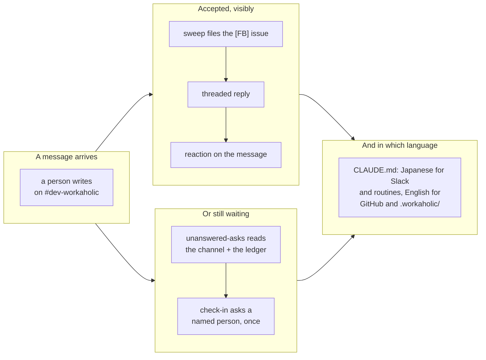

## 1. Overview

One message named three gaps in how the loop is legible to the person it works for, and this branch closes all three. A captured ask now leaves a mark on the message itself, a message nobody has answered now reaches a named person through the maintenance tick, and `CLAUDE.md` states which language each surface is written in.

**Highlights:**

1. The inbound sweep's receipt gains a `:inbox_tray:` reaction, so acceptance is legible from a channel scroll without opening a thread.
2. `/moderate` gains a sixteenth step, `unanswered-asks`, which turns a message nobody answered into a question addressed to a person — mention or no mention.
3. `verify-moderate` stopped being red: both of its step counts now derive from `run.sh`'s own `STEPS` instead of literals two additions out of date.

## 2. Motivation

The measured failure is one evening on `#dev-workaholic`. Two asks written at 18:56 and 19:20 JST became issues within the hour, and the developer — seeing no trace in the channel — asked why neither had been treated as feedback; the capture had worked and only its receipt was missing. The 19:18 tick had seen a third message, filed nothing, deferred to the `:40` sweep, and told nobody, because the tick's question set was bounded by what its own steps found and no step read the channel. Underneath both sat a question nobody had answered: which language a surface speaks, which until now was decided per session.

## 3. Changes

The three tickets attack one property from three sides. Two of them close the loop on a single message: if the sweep captured it, the channel now shows that at a glance; if nobody answered it, a person is asked about it exactly once. The third settles the question both raise — which language a surface speaks — as a rule rather than a per-session drift. A fourth change was not planned: the moderation drill had been failing for two days on a hard-coded step count, and adding a step would have made that worse, so the count was derived instead.

### 3-1. Write the surface language rule into CLAUDE.md ([b5c1fc6b](https://github.com/qmu/workaholic/commit/b5c1fc6b))

`CLAUDE.md`'s `## Important` block now states the split by audience: Japanese for `#dev-workaholic` reasoning and Claude Code Web routines, English for GitHub and `.workaholic/` artifacts, and names what the rule does not cover. It stayed out of `plugins/workaholic/rules/` deliberately — it names this repository's own channel.

### 3-2. Stamp a swept message with a reaction ([0350633a](https://github.com/qmu/workaholic/commit/0350633a))

The sweep's receipt was a threaded reply, and a reply lives inside a thread — so from a channel scroll a captured ask and an ignored one still looked identical. The reaction is the same receipt at a glance, on the same `slack-ref` coordinate, under the same three bounds: no lookup, only a message this run filed, never load-bearing.

### 3-3. Ask about a message that has been sitting unanswered ([3e48b930](https://github.com/qmu/workaholic/commit/3e48b930))

`step-unanswered-asks.sh` names the channel, the window and the already-asked refs, and hands the channel probe to the agent — Slack is a connector held by the session, not by a script. Each candidate is keyed `unanswered-ask:<channel>:<ts>` through the existing `ask-question.sh`, so the asked-once gate, the per-tick cap, the quiet hours and the working-day hold all apply unchanged and no second ledger exists.

## 4. Outcome

The mission's three acceptance items are met and `archive.sh` closed it `achieved` on its own arithmetic. The tick can now ask about something no step of its own discovered, which is the first time its question set has not been bounded by its own readers.

## 5. Concerns

### The notify catalog's post shapes are on the wrong side of the new language rule

- **Severity:** moderate
- **Description:** Nine of the eleven shipped post shapes are English — `🔵 Proposed`, `📝 FB`, `🟢 Implemented`, `🚀 Auto Merge`, `🟡 Handoff`, `🔴 Blocked`, `🔎 Moderation`, `🙋 <@U…>` and `⚪ Paused` — while the rule makes `#dev-workaholic` Japanese (see [b5c1fc6b](https://github.com/qmu/workaholic/commit/b5c1fc6b) in `plugins/workaholic/skills/notify/reference/notifications.md`). The ticket forbade fixing it here: each shape is pinned byte-identical against a routine template.
- **How to Fix:** One change moving the catalog and all four routine templates together, updating each drift pin in the same commit.

### README.md still describes the tick's retired one-shape Slack output

- **Severity:** low
- **Description:** The `/moderate` row says its one Slack shape is `🙋 Question <@U…>`, a reply in the thread of the item it concerns — superseded by the 2026-08-21 root-plus-replies design (see [3e48b930](https://github.com/qmu/workaholic/commit/3e48b930) in `README.md`). The step enumeration in the same row was corrected here because this branch moves it; the post shape was not.
- **How to Fix:** Rewrite that sentence against `workaholic:notify`'s *The moderator's hourly thread*.

### The unanswered window inherits the sweep's, so older messages are never asked about

- **Severity:** low
- **Description:** The step reads `WORKAHOLIC_INBOUND_SLACK_WINDOW_HOURS` (default 26) so the two readings cannot disagree, which means a message already older than the window when the step first runs is never asked about and nothing backfills it (see [3e48b930](https://github.com/qmu/workaholic/commit/3e48b930) in `plugins/workaholic/skills/moderate/scripts/step-unanswered-asks.sh`).
- **How to Fix:** Nothing, unless a real backlog is measured — a separate variable is what would let the two readings drift, which is the cost the shared one was chosen to avoid.

## 6. Successful Development Patterns

- Pinning a *count* of a registered list goes stale on the next addition: `verify-moderate` did it twice and its own comment records the first as a one-off. Deriving from `run.sh`'s `STEPS` keeps the property (every step reports) without the bookkeeping.
- A non-post Slack act has no fenced block for the template/catalog drift pin to compare, so it needs its own extraction rule — name it once in the catalog in a matchable shape, then pin the template against that shape.
- Composing prose inside a single-quoted `jq -n` program makes every apostrophe a live hazard: one ends the program silently and the shell reports something unrelated.
