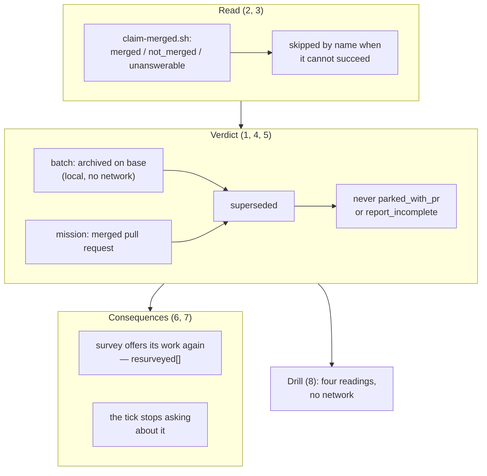

## 1. Overview

A squash merge leaves a claim branch's content on the base and none of its commits, so `base..ref` stays positive and the unit is claimed forever — and every **mission** claim was out of scope of the local check by construction. The oracle now answers at both grains, the work behind a finished claim comes back to the survey, and nobody is asked to look at a merged pull request.

**Highlights:**

1. `claim-merged.sh` — one grain-agnostic, three-valued reader asking whether a merged pull request has this branch as its head; it reads no artifact, so the many-valued `mission:` relation still has one parser.
2. An `unanswerable` read leaves every verdict byte-identical to the local-only answer and is named in `merged_lookup_unanswered` — proved over a fixture, not asserted.
3. On this repository the three measured units flipped to `superseded`, `resumable` emptied, and the mission stranded behind one came back to the offer.

## 2. Motivation

Three of five claims here headed pull requests #521, #537 and #546 — all merged, all mission units — and one was still being offered `resumable: true` five days after its own pull request merged. Taking that offer costs a full story-and-pull-request cycle whose only correct outcome is to be closed; it had already happened once. Behind one of those claims a mission sat `active` at 2/3 acceptance with queued tickets nobody could reach, and a person was being asked, hourly, to look at all three merged pull requests. The signal `superseded` shipped with in 2026-08-26 answered only for batch units, and said so honestly: the mission equivalent was left out as "a shape nothing has measured". It had since been measured.

## 3. Changes

The mission is built bottom-up: a baseline fixture that asserts today's answer, then the reader, then the degradation contract that keeps the reader from costing the oracle its offline promise, then the behaviour change itself — and only then its two consequences, which are about what the rest of the loop does with a claim now known to be finished. The last ticket makes all four readings drillable without a network, and moves the record that said the opposite.

### 3-1. Pin the merged-claim shape with a fixture ([3fff1a3f](https://github.com/qmu/workaholic/commit/3fff1a3f))

A hermetic fixture builds a squash-merged mission claim and batch claim and asserts what today's oracle answers for each. Two mission-grain assertions state today's answer rather than the intended one, deliberately: without them the change that follows cannot be shown to have changed anything.

### 3-2. Read whether a claim's work reached the base ([d045640d](https://github.com/qmu/workaholic/commit/d045640d))

`claim-merged.sh` answers `merged` / `not_merged` / `unanswerable` and exits 0 always. It asks the pull request rather than the tree, which is what makes it grain-agnostic, and classifies the one call's failure into six named reasons instead of spending a probe first.

### 3-3. Make the oracle degrade by name, not by guess ([ee4eadf8](https://github.com/qmu/workaholic/commit/ee4eadf8))

`claims_merged_state` consults the reader, skips it by name when it cannot succeed (`offline`, `disabled`), and records every claim it could not answer for into `list-claims.sh`'s new `merged_lookup_unanswered`. The asymmetry is written into the header: a wrong `merged` releases work still in flight, a wrong `in flight` only delays a claim.

### 3-4. Answer superseded for a mission claim ([4d9bd99a](https://github.com/qmu/workaholic/commit/4d9bd99a))

`claims_superseded`'s early-`false` for a non-ticket artifact is replaced, along with its reason. The local ticket test stays first and stays network-free, so a batch verdict is byte-identical to what it always was.

### 3-5. Never offer a merged claim for resumption ([58be55ad](https://github.com/qmu/workaholic/commit/58be55ad))

Both resumable tiers are pre-empted at the mission grain, and `claim.sh resume` refuses a `superseded` claim under its own reason — it had been reporting `identity_unresolved`, as had `shallow_history`, because the `case` default asserted a cause.

### 3-6. Re-survey a mission behind a merged claim ([f322a59b](https://github.com/qmu/workaholic/commit/f322a59b))

A claim proved empty no longer holds its queued tickets: the mission and its backlog are offered again and named in the survey's own `resurveyed[]` with the dead claim branch, so a unit that came back is never mistaken for one that was never claimed.

### 3-7. Stop asking about a finished claim ([73a6802b](https://github.com/qmu/workaholic/commit/73a6802b))

The stalled-unit step drops `superseded` rows from its question set and counts them as a finding, and its summary loses the age that made the moderation root call it changed every hour.

### 3-8. Drill the merged-claim readings with no network ([03ecd624](https://github.com/qmu/workaholic/commit/03ecd624))

`verify-merged-claim` proves all four readings over a real squash-merged fixture with the transport stubbed, and the runbook, the claims reference, the drive skill and `CLAUDE.md` all state the mission-grain answer with the evidence behind it.

## 4. Outcome

Measured on this repository after the change: the three units headed by merged pull requests read `superseded`, `resumable` is empty, `make-workaholify-converge-the-account-s-routines` is offered again and reported re-surveyed against its dead claim, and the tick asks about one genuine stall instead of five claims.

## 5. Concerns

### The mission grain now depends on a network read

- **Severity:** moderate
- **Description:** A batch claim's verdict is reached from the tree; a mission claim's needs GitHub, so an offline or refused run keeps today's verdict and reports the claim as unanswered (see [4d9bd99a](https://github.com/qmu/workaholic/commit/4d9bd99a) in `plugins/workaholic/skills/drive/scripts/lib/claims.sh`). That is the chosen failure direction, not an oversight, but it means a container with no GitHub reach never sees a merged mission claim.
- **How to Fix:** Nothing, unless a local signal for the mission grain is found that does not parse the `mission:` relation a second time. `merged_lookup_unanswered` is what makes the gap visible when it happens.

### A superseded claim is still nobody's job to close out

- **Severity:** low
- **Description:** The verdict is reported and never acted on: nothing deletes the branch, closes its pull request, or releases the claim (see [ee4eadf8](https://github.com/qmu/workaholic/commit/ee4eadf8) in `plugins/workaholic/skills/drive/scripts/lib/claims.sh`). With the tick no longer asking about them, three dead branches on this repository now have no surface naming them to a person at all.
- **How to Fix:** If the residue accumulates, a `/moderate` step could report the count as a finding — deliberately not a question, which is what this mission just removed.

### One claim-protocol variable is now the caller's to set

- **Severity:** low
- **Description:** `CLAIMS_FETCH_OK` must be assigned by each caller between `claims_fetch` and `claims_scan`, because a command substitution loses what the function sets (see [ee4eadf8](https://github.com/qmu/workaholic/commit/ee4eadf8) in `plugins/workaholic/skills/drive/scripts/lib/claims.sh`). A future caller that forgets skips the lookup silently.
- **How to Fix:** It defaults to `false`, so the failure is a lookup that does not run rather than a wrong verdict; a caller-count assertion in the suite would close the rest.

## 6. Successful Development Patterns

- Asserting *today's* answer first (ticket 1) is what let ticket 4's change be shown to have changed something — and the untouched batch assertion beside it is the proof nothing regressed.
- A skip-when-degraded gate that fails closed looks identical to one that works: the offline assertions all passed while the lookup was disabled by a lost variable, and only the stubbed-transport assertion exposed it.
- A verdict added to a ladder needs two answers, not one — what the row says, and what the survey does with the work behind it. `superseded` shipped with the second inherited from its neighbours, and inherited it wrong.
