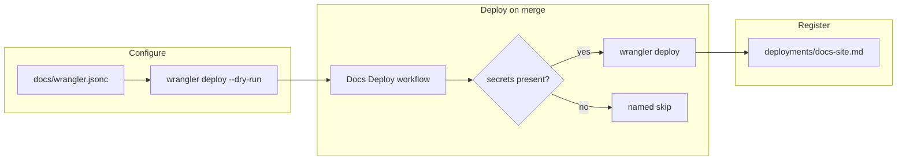

## Handoff

**This branch is complete but unverified here. Someone must verify it before it merges.**

- **Done:** The Worker configuration (`docs/wrangler.jsonc`, proved offline by
  `wrangler deploy --dry-run` with no token), the `Docs Deploy` workflow, and the
  registered deployment target — all three tickets implemented, archived and pushed. The
  mission closed `achieved` on its own arithmetic at the last archive.
- **Not done:** "The Cloudflare account: an API token and account id must be added as
  repository secrets, and workaholic.qmu.co.jp must be bound to the Worker as a custom
  domain. An unattended run holds neither the account nor the DNS."
- **Next step:** Add `CLOUDFLARE_API_TOKEN` and `CLOUDFLARE_ACCOUNT_ID` as repository
  secrets and bind `workaholic.qmu.co.jp` to the `workaholic-docs` Worker as a custom
  domain, then run `Docs Deploy` via `workflow_dispatch` and confirm the site per
  `.workaholic/deployments/docs-site.md`, then merge.
- **Attempted:** Not attempted — declared unrunnable in an unattended environment at
  ticket creation (`verification_handoff:` on
  `20260826112804-build-and-deploy-the-docs-site-on-merge-to-main.md`).

## 1. Overview

The VitePress site under `docs/` had no publisher, so documentation this repository keeps
current by rule was current only in git. This branch gives a merge to `main` a path to
production: an assets-only Worker, a workflow that deploys it, and a record `/ship` reads.

**Highlights:**

1. `docs/wrangler.jsonc` serves the real build output and is proved with no credential.
2. `Docs Deploy` builds on every `docs/**` merge and **skips, never fails**, without the secrets.
3. The site is a registered `deploy-on-merge` target that states why it cannot deploy yet.

## 2. Motivation

The ask named its own target and the gap was concrete: <https://workaholic.qmu.co.jp> did
not reflect the base because nothing published the site. The three tickets split along the
seam that matters for an unattended run — what can be proved without the Cloudflare
account and what cannot. Configuration and the workflow's build half are provable offline;
the last mile needs credentials this environment does not hold, declared at creation rather
than discovered mid-drive.

## 3. Changes

The Worker was proved against the real build output first, so the credentialed step had
nothing left to debug; the workflow consumed that configuration unchanged; the record made
the path legible to the tools that gate on it. Every step was checkable without touching
Cloudflare, which is what let an unattended run finish all three and hand over one part.

### 3-1. Configure the Worker serving the docs site ([75e65f2a](https://github.com/qmu/workaholic/commit/75e65f2a))

Adds an assets-only Worker whose `assets.directory` is the `.vitepress/dist` that
`npm run docs:build` actually writes, with `not_found_handling: "404-page"` so a missing
path is a real 404. `wrangler` becomes a devDependency of `docs/` alone.

### 3-2. Deploy the docs site on merge to main ([657f013e](https://github.com/qmu/workaholic/commit/657f013e))

Adds `.github/workflows/docs-deploy.yml`: `push` to `main` filtered to `docs/**` plus
`workflow_dispatch`, `contents: read`, `npm ci` so the lockfile decides. Without the
Cloudflare secrets it builds and writes a named skip into the job summary instead of
failing.

### 3-3. Register the docs site as a deploy target ([92f5c91b](https://github.com/qmu/workaholic/commit/92f5c91b))

Registers `.workaholic/deployments/docs-site.md` as a `deploy-on-merge` target with an
`api-probe` confirmation split pre-merge/post-merge, and states that the target is
inactive until the secrets and the custom domain exist.

## 4. Outcome

A merge touching `docs/**` now builds the site and deploys it to the `workaholic-docs`
Worker with no human step in the build path, and `/prepare-release` reports the target
beside the marketplace one. What remains is the account — the declared handoff.

## 5. Concerns

### The mission-mode verification axis cannot see a ticket's declaration

- **Severity:** moderate
- **Description:** `verification-handoff.sh mission <slug>` reads the mission file alone, so a member ticket's `verification_handoff:` answers `handoff: false` — against `drive/SKILL.md` §6 and the script's own "ANY MEMBER DECLARING IT WINS". This unit answers `handoff: true` in `tickets` mode (see [e8a6cb5c](https://github.com/qmu/workaholic/commit/e8a6cb5c) in `plugins/workaholic/skills/drive/scripts/verification-handoff.sh`)
- **How to Fix:** Ticket `20260826135100-read-the-verification-axis-over-a-mission-s-tickets.md` is queued — expand the mission mode through `read-relation.sh`. An `auto` mission would merge unattended until it lands

### Neither deployment target declares `paths:`

- **Severity:** low
- **Description:** Both read `attribution: whole_range`, so every base commit counts as unreleased for both, a note-only commit included (see [92f5c91b](https://github.com/qmu/workaholic/commit/92f5c91b) in `.workaholic/deployments/docs-site.md`)
- **How to Fix:** Declare `paths:` on **both** records in one change — one alone flips `read-deployments.sh`'s `any_paths`, and every component the other has not claimed then reports `unmatched_component`

### The `paths:` filter can leave the live site behind the base

- **Severity:** low
- **Description:** A change altering the rendered site without touching `docs/**` — a theme bump, a config move — does not redeploy (see [657f013e](https://github.com/qmu/workaholic/commit/657f013e) in `.github/workflows/docs-deploy.yml`)
- **How to Fix:** `workflow_dispatch` is the deliberate escape hatch; widen the filter only if manual runs become routine

## 6. Successful Development Patterns

- Proving the configuration offline **before** the credentialed step left the deploy half one unknown (the account), not two — the ticket split paid for itself.
- Reading the real build output before configuring the assets binding caught the `not_found_handling` choice no later HTTP check could catch: a soft 404 returns 200.
