# Drive the work the loop wrote: one resolution of who a person is

## 1. Overview

A person's git addresses are now named in one place and resolved through one script, so an
artifact the loop writes is an artifact the loop can drive.

**Highlights:**

1. `gather/scripts/identity.sh` is the mapping's one reader; with no mapping it is the
   identity function, so every existing answer is byte-identical.
2. `/specificate` resolves the assignee before stamping it — an unmapped login produces named
   team-owned work, never an address no run can drive.
3. The walk from assignee to the survey's offer is pinned by a hermetic case and an offline
   drill, both proved to fail when the resolution is removed.

## 2. Motivation

The loop was writing work it could not drive. `/specificate` resolved an issue's assignee by
judgement rather than through the committed mapping, and that mapping could name only **one**
address per login. Measured 2026-08-26: `backlog_size: 10` with `backlog: []` and
`owned_by_other` ×7 since 2026-08-21 — two active missions and five queued tickets carrying an
address `owns.sh` answered `other` for, while every hourly tick surveyed a clean checkout and
drove nothing. The mission that would have repaired the other half of this was itself one of
the stranded units.

Each component was internally consistent; the break lived in the seam. Five days of green
surveys told nobody, because a full unofferable queue renders exactly like an empty one,
`/implement` may not ask, and no step read the state that would have named a person.

## 3. Changes

```mermaid
flowchart LR
  subgraph read["Name the person once"]
    A["identity.sh<br/>the mapping's one reader"]
  end
  subgraph stop["Stop the next strand"]
    B["/specificate<br/>stamps only what resolves"]
  end
  subgraph recover["Recover what exists"]
    C["owns.sh<br/>an alias answers mine"]
    D["migrate-assignee-aliases.sh<br/>rewrites, never guesses"]
  end
  subgraph tell["Say it where a person looks"]
    E["backlog_all_excluded<br/>in the run report"]
    F["/workaholify<br/>audits coverage"]
    G["/moderate<br/>asks the assignee once"]
  end
  subgraph pin["Keep the seam honest"]
    H["hermetic walk + offline drill"]
  end
  read --> stop --> recover --> tell --> pin
```

The mapping's format gained a second field and a single reader; the writer and the ownership
oracle both resolve through it; a living migration recovers the artifacts already written; and
three surfaces carry what none of that can fix — a report, an audit that proposes the missing
line, and a question addressed to a person. The last ticket pins the whole walk so the link can
still be lost but can no longer be lost silently.

### 3-1. Read a person's addresses through one script ([11d564f5](https://github.com/qmu/workaholic/commit/11d564f5))

The mapping's value became `<login>=<canonical>[,<alias>...]` and `gather/scripts/identity.sh`
its one reader, resolving a login or an address. A line with no comma resolves exactly as it
did, which is what made the reader safe to land before any consumer.

### 3-2. Stamp only an address the loop can drive ([4ec83433](https://github.com/qmu/workaholic/commit/4ec83433))

`/specificate` resolves the triggering issue's assignee through that reader before either
scaffold is called. An unmapped login gets no `--assignee` at all — team-owned work, reported
`assignee_unmapped: <login>` — because a wrong address is silently unrecoverable while
`assignees: []` is a documented state any run can pick up.

### 3-3. Answer mine for a person's other address ([b43e1f3b](https://github.com/qmu/workaholic/commit/b43e1f3b))

`owns.sh` canonicalises both sides before its existing slug comparison, so a mapped alias
answers `mine`. Nothing else moved: an address no entry names still answers `other`, and a tree
with no mapping file is byte-identical to before.

### 3-4. Recover the work stranded on an unmapped address ([707b321d](https://github.com/qmu/workaholic/commit/707b321d))

`gather/scripts/migrate-assignee-aliases.sh` rewrites an alias entry onto its canonical address
across `tickets/`, `missions/` and `strategies/`, registered at `/workaholify`'s converge seam
in the same commit. It touches nothing it cannot resolve and names every address it left alone.

### 3-5. Say when a survey excluded its whole backlog ([2c439156](https://github.com/qmu/workaholic/commit/2c439156))

`plan-units.sh` emits `backlog_all_excluded` — the queue's size and a count per exclusion
reason — so *the queue is empty* and *the queue is full and I can offer none of it* stop
rendering alike. It deliberately moves no token.

### 3-6. Audit the addresses the tree actually uses ([1fa611ca](https://github.com/qmu/workaholic/commit/1fa611ca))

`/workaholify` now audits the mapping's coverage, naming each uncovered address **with the line
that would cover it**, and appends each as a commented proposal. It proposes and never decides:
which account an address belongs to is a human's ruling.

### 3-7. Ask a person about work nothing can drive ([75ce482a](https://github.com/qmu/workaholic/commit/75ce482a))

`/moderate`'s new `undrivable-units` step asks the direction's assignee, once per artifact,
about queued work whose owner no mapping entry names. A colleague's queue and team-owned work
produce no question, which is what keeps the step worth reading.

### 3-8. Drill the identity hand-off with no network ([ef126ebd](https://github.com/qmu/workaholic/commit/ef126ebd))

A hermetic case and `sh scripts/e2e/loop-drill.sh verify-identity-handoff` walk issue assignee
→ stamped address → the survey's offer for three inputs. Both were proved to fail on a tree
with the resolution removed, so neither is documentation.

## 4. Outcome

An issue assigned to any mapped address now produces artifacts that developer's next survey
offers; an unmapped one produces team-owned work the run names. The mission's three acceptance
items are met and the archive gate closed it `achieved`. One thing is left to the operator —
see Concerns.

## 5. Concerns

### The stranded artifacts need one line from the operator

- **Severity:** moderate
- **Description:** the migration is complete as mechanism, pending as data — run here it reports `migrated: 0` with `unresolved: [noreply@anthropic.com, tamura.yoshiya@gmail.com]`, so the seven artifacts stay excluded (see [707b321d](https://github.com/qmu/workaholic/commit/707b321d) in `plugins/workaholic/skills/gather/scripts/migrate-assignee-aliases.sh`)
- **How to Fix:** add `tamurayoshiya=a@qmu.jp,tamura.yoshiya@gmail.com` to `.claude/git-identities`. Asserting two addresses are one person is a human's ruling this mission forbids an unattended path to make.

### One archive commit carries the whole implementation

- **Severity:** low
- **Description:** the tickets were implemented before any was archived and `archive.sh` stages the whole worktree, so the first archive commit carries the implementation — one `override`-tier `too-large-commit` finding (see [11d564f5](https://github.com/qmu/workaholic/commit/11d564f5))
- **How to Fix:** archive per ticket where a unit's tickets are independent; here they were not — the reader had to exist before four consumers could be written against it.

### `identity_map_missing` does not gate `ok`, and that is left open on purpose

- **Severity:** low
- **Description:** the bootstrap check reports an absent mapping as an advisory, so `/workaholify` still calls such a repository bootstrapped (see [1fa611ca](https://github.com/qmu/workaholic/commit/1fa611ca) in `plugins/workaholic/skills/workaholify/scripts/check-bootstrap.sh`)
- **How to Fix:** the queued ticket `install-and-audit-the-identity-mapping` owns the existence check and should decide whether it gates; the vocabulary is in place for it to extend.

## 6. Successful Development Patterns

- Landing the reader first, in a format whose old shape stays valid, let four consumers be written against it without any inventing its own resolution.
- Proving a new test *fails* on a broken copy of the tree — in a temp directory reproducing `REPO_ROOT` — is what separates a seam test from documentation.
- Where a ticket's Key Files disagreed with a ruling recorded elsewhere, the departure was implemented against the ticket's stated *intent* and named in its Final Report.

## 7. Notes

`/moderate` is now seventeen steps; `CLAUDE.md`, `README.md`, both `workaholify` documents, the
drive survey reference and the loop-drill runbook moved in the same change.
