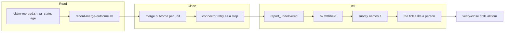

## 1. Overview

The loop drove work to a green pull request and stopped there. A routine container's REST merge
is refused `session_type_cannot_merge`, the one permitted retry lived only in prose, and the
stopped unit then read `claimed_reported` — like one waiting on a person — so `/implement`
reported `ok` over it.

**Highlights:**

1. A `review` unit's report names `merged`, `merge_refused: <word>` or `merge_not_attempted`.
2. The connector retry is a numbered step; a report without its outcome is non-conformant.
3. `report_undelivered` splits the reason, forbids `ok`, and reaches a person by name.

## 2. Motivation

Measured 2026-08-27: pull requests #622, #625, #633 and #635 green and unmerged, `backlog_size:
11` with `backlog: []`, and every hourly run reporting `ok`. No single reading was misfiring —
the queue *was* drained, the claim *was* excluded, the survey *was* current — which is why the
silence was total rather than intermittent, and why the fix is new readings rather than repairs
to old ones.

## 3. Changes

The order was the design: read what became of a pull request, give the merge attempt an outcome,
make the retry a step that must report, then split the reason so the survey, the token and the
tick can each act on it — and only then drill the seam, once it had settled.

### 3-1. Read whether a reported unit ever landed ([40a4c383](https://github.com/qmu/workaholic/commit/40a4c383))

Widened `claim-merged.sh` rather than adding a second network read, as its own Considerations
preferred: `state=all` is a superset of `state=closed`, so `state` is byte-identical and the same
call now answers `pr_state`, the number, the URL and an open pull request's age.

### 3-2. Give a unit's close its own reported outcome ([5f495ba7](https://github.com/qmu/workaholic/commit/5f495ba7))

A `review` unit's report line names `merged`, `merge_refused: <merge-reason.sh word>` or
`merge_not_attempted: <tier>` — never collapsed, because a scan-held pull request is the gate
working and a refused merge is the loop stopping.

### 3-3. Make the connector retry a step of the route ([040b52cd](https://github.com/qmu/workaholic/commit/040b52cd))

`rules/shell.md`'s one qualification became three numbered steps with its bounds restated and not
widened. A report carrying `session_type_cannot_merge` and no retry outcome is now non-conformant
on its face.

### 3-4. Never report ok over an undelivered unit ([6b53157c](https://github.com/qmu/workaholic/commit/6b53157c))

Two sibling rows in §7's table: `merge_refused` forbids `ok` and names the unit; the scan-held
case is unchanged and still reports `ok`, which is what keeps the token reachable.

### 3-5. Split the exclusion that hides the difference ([4e8fcd39](https://github.com/qmu/workaholic/commit/4e8fcd39))

`report_undelivered` / `claimed_undelivered`, read off the branch story the attempting run
records into — no network call and no second derivation. An absent record keeps `queue_drained`.

### 3-6. Name undelivered units in the survey reading ([9f8e6f6f](https://github.com/qmu/workaholic/commit/9f8e6f6f))

The per-reason counts were already generic, so the count needed no code; what was missing was the
report saying that this one reason means the loop's own finished work.

### 3-7. Ask a person about an undelivered unit ([e9dd1d18](https://github.com/qmu/workaholic/commit/e9dd1d18))

An eighteenth `/moderate` step hands each undelivered unit to the check-in as a question
addressed to the claim holder, naming the pull request, its age and the refusal.

### 3-8. Drill the closing seam with no network ([e49b2d67](https://github.com/qmu/workaholic/commit/e49b2d67))

`loop-drill.sh verify-close` — all four closing outcomes over three units driven to the identical
finished shape, transport stubbed, plus one row that deliberately breaks the seam.

## 4. Outcome

A unit the loop finishes now reaches `main`, or the run names the refusal that stopped it — in
the run report, in the survey's own reading, in the terminal token, and once to a person by name.
The mission closed `achieved` at the archive gate on its own arithmetic.

## 5. Concerns

### The connector retry's enforcement is prose, by necessity

- **Severity:** moderate
- **Description:** No script may call an MCP tool, so nothing mechanically requires the retry to
  be attempted — only a report that omits its outcome is visibly non-conformant (see
  [040b52cd](https://github.com/qmu/workaholic/commit/040b52cd) in
  `plugins/workaholic/skills/drive/reference/routing.md`)
- **How to Fix:** Nothing available today. A wrapper shelling out to an MCP tool is the same gap
  with more moving parts; revisit only if a script gains a sanctioned connector transport

### A merge through the connector is still measured only interactively

- **Severity:** low
- **Description:** The retry's success path is unproven in a routine-fired container — only the
  connector's read tools are measured there (see
  [040b52cd](https://github.com/qmu/workaholic/commit/040b52cd) in `plugins/workaholic/rules/shell.md`)
- **How to Fix:** Nothing to change; the step reports both outcomes by name rather than assuming,
  and the first tick that takes the retry will settle it

## 6. Successful Development Patterns

- Driving the reader first and the drill last, as the ticket set specified, meant no ticket was
  rewritten by the one after it — and ticket 6 turned out to need no code at all, which only
  became visible because its dependency had already landed.
- Asserting a derivation's *reconciliation* to its input (counts summing to `excluded[]`) rather
  than the presence of one expected value: the former fails when the derivation stops being
  generic, and no per-value assertion can catch that.
