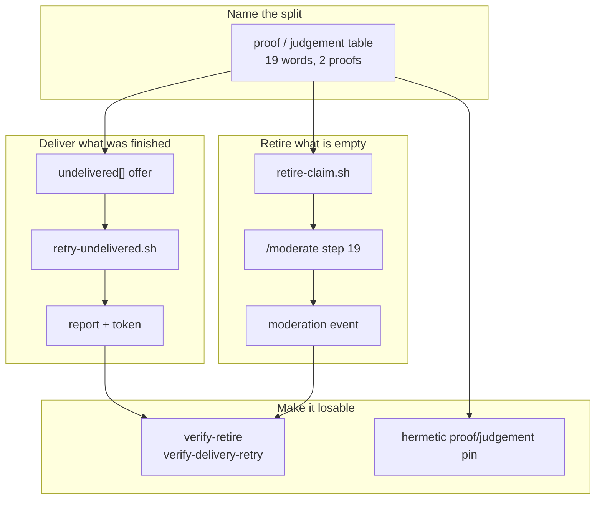

## 1. Overview

Two of the claim oracle's verdicts — `superseded` and `report_undelivered` — are **proofs** the
tree or a merged pull request established; the rest are judgements that say *look at this*. Both
proofs stopped at a report. This branch acts on exactly those two, names the distinction once,
and pins it mechanically.

**Highlights:**

1. `retry-undelivered.sh` re-attempts a refused merge, offered through a new `undelivered[]` field.
2. `retire-claim.sh` closes, deletes and reaps a claim proved empty; one `/moderate` step calls it.
3. Both acts are drilled with no network; a hermetic test fails when a gate widens.

## 2. Motivation

Two recent readings made the right facts visible and left them unreachable.
`report_undelivered` named a unit whose merge the transport refused — measured, four green pull
requests still open a day later — while every later survey excluded it and `claim.sh resume`
refused it, so nobody delivered it. `superseded` proved a claim's content was already on the base
and was *reported, never acted on*, so the claim table only grew: 7 claims here, 4 superseded.

Both are the same shape one layer apart — a correct reading with no path to an act — and
answering them together forced the distinction underneath into the open. Acting on a judgement is
how a runner discards work somebody is still driving, so the licence had to be written first.

## 3. Changes

One table named which verdicts a consumer may act on; two acts were then built on the two proofs,
each reported at the surface that records the run; and the whole split was pinned by a hermetic
test plus two no-network drills, so a later change that widens a gate fails rather than merges.

### 3-1. Name which claim verdicts are proofs and which are judgements ([2fa1387c](https://github.com/qmu/workaholic/commit/2fa1387c))

Wrote the *Proofs and judgements* table into `drive/reference/claims.md`, keyed on the word set
`lib/claims.sh` actually emits rather than the seven the ticket named — nineteen rows across the
resumability verdict, the merged lookup and the unit resolution. A classifier function in the
library was refused as a second derivation of the same fact.

### 3-2. Re-attempt an undelivered unit's merge in a later driving run ([010e40b9](https://github.com/qmu/workaholic/commit/010e40b9))

Added `undelivered[]` to `plan-units.sh` as a named field beside `resurveyed[]` — never a
loosened exclusion, which would have returned the unit's archived tickets to the backlog to be
re-driven — and `retry-undelivered.sh`, which makes one `PUT` through the same REST seam that
refused it and records a still-refused unit's new outcome back onto its branch with no worktree.

### 3-3. Report the retry's outcome and move the token only when it delivered ([c003f643](https://github.com/qmu/workaholic/commit/c003f643))

Extended §7's report and token table in §6's existing three words rather than a second
vocabulary. A delivered retry stops withholding `ok`; a still-refused one keeps withholding it
and names both refusals; the scan-held case is byte-identical to before.

### 3-4. Write retire-claim.sh, the one retirement writer ([e196c658](https://github.com/qmu/workaholic/commit/e196c658))

Close the pull request, delete the remote branch, reap the worktree — three idempotent acts, each
reporting its own word, resolved through the live-row rule so a superseded branch beside a live
one can never cost the live one its worktree. Every judgement verdict is refused by its own name.

### 3-5. Add the /moderate step that retires a proved claim ([9db824a9](https://github.com/qmu/workaholic/commit/9db824a9))

`step-retire-claims.sh` at position 19, the writer's only caller. It acts directly where
`closable-missions` hands off, because `retire-claim.sh` writes nothing into the tree and there is
no publish-tree seam to cross; `needs_agent` is empty because a proved retirement is not a
person's business.

### 3-6. Drill both acts with no network ([90a18014](https://github.com/qmu/workaholic/commit/90a18014))

`verify-retire` (10 rows) and `verify-delivery-retry` (6), each over a local bare origin with the
transport stubbed, each with a deliberately broken seam demonstrated rather than asserted.

### 3-7. Pin the proof judgement split with a hermetic test ([bfef3879](https://github.com/qmu/workaholic/commit/bfef3879))

`testProofJudgementSplit` derives the word set from the library's emissions, the classification
from the table's rows and each gate from its consumer's own source, asserting set equality in both
directions. All three failure modes were introduced and run.

### 3-8. Render the retirement as a moderation event ([69c23bdc](https://github.com/qmu/workaholic/commit/69c23bdc))

Asserted both halves of the event rule — a line when a claim was retired, none when nothing was —
which needed a third superseded claim in the fixture, and stated in the step's header that the
line is not a posting gate.

## 4. Outcome

An undelivered unit now gets one bounded merge re-attempt in a later run, reported in the existing
vocabulary and reflected in the token; a claim proved empty is retired by the hourly tick. The
distinction that makes both safe is written once and enforced by a test.

## 5. Concerns

### The retry's second gate is unreachable through the verdict chain

- **Severity:** low
- **Description:** the `merge_not_attempted` check sits after a gate that already excluded it, so it cannot fire and reads as dead code (see [010e40b9](https://github.com/qmu/workaholic/commit/010e40b9) in `plugins/workaholic/skills/drive/scripts/retry-undelivered.sh`)
- **How to Fix:** nothing, deliberately — the broken-seam drill showed it is the live backstop when the first gate is removed; revisit only if the chain stops routing scan-held units to `queue_drained`

## 6. Successful Development Patterns

- Building each drill before trusting the design disproved the ticket's own wording: a completed
  retirement deletes the branch, so the claim ceases to exist and there is no second run to be
  idempotent about.
- Breaking each seam and watching one row go red turned "this drill can fail" into a demonstrated
  property — and revealed the second gate's real role.

## 7. Notes

The claim's heartbeat lapsed between two long tickets and another container resumed the unit,
pushing an empty `Resume` commit. It was merged in rather than rewritten.
