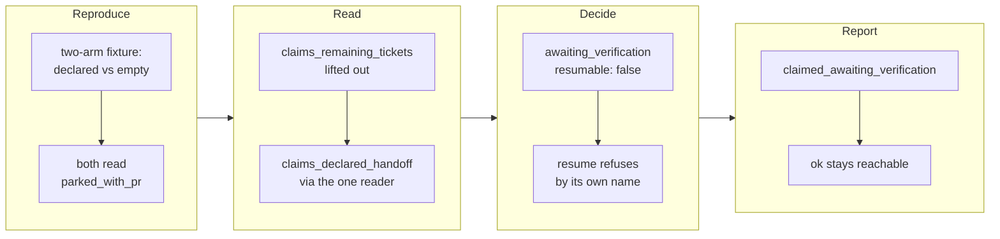

## 1. Overview

A claim whose remaining queued work was declared unverifiable here now answers its own verdict,
`awaiting_verification`, and is offered to nothing. The declaration was read at route time and
never again, so every survey after the pull request opened offered a takeover that could drive nothing.

**Highlights:**

1. The defect landed as a two-arm hermetic reproduction, then was inverted by the fix.
2. `verification-handoff.sh` stays the field's only reader; no artifact gained one.
3. The reading releases itself — driving the declared ticket restores the old verdict.

## 2. Motivation

`verification_handoff:` exists so a unit nothing unattended can finish costs no tick. The route
honoured it — pull request open, claim standing, `🟡 Handoff` posted — but the claim oracle
consulted it exactly once and never again, so the moment `/story` committed the branch story the
claim read `parked_with_pr`, `resumable: true`. Measured on PR #647: routed at 02:14 UTC, taken
over again at 06:43 for nothing.

`CLAUDE.md` has asserted since 2026-08-14 that *a standing handoff claim is not re-surveyed and
costs nothing per tick* — the design, never the behaviour — while `parked_with_pr`'s contract has
said *taking it over is legitimate*, true of every unit it covered except this one.

## 3. Changes

The defect was pinned before anything moved, with both arms of the comparison present so the fix
could invert one and leave the other byte-identical. The reading was then carried into the scan
with no verdict change at all, the verdict was given its own word, the survey was taught to name
it, and the documents were brought in line in the same branch.

### 3-1. Reproduce the handoff re-resume and pin it ([c3c64fff](https://github.com/qmu/workaholic/commit/c3c64fff))

A hermetic fixture drives one ticket of a batch, declares a handoff on the one still queued,
commits the branch story, and asserts today's `parked_with_pr` / `resumable: true` and the
survey's takeover offer. It also records which readers produced each half of the verdict, so the
later tickets changed one of them rather than trusting the reporter's proposed mechanism.

### 3-2. Read the declared handoff in the claim scan ([2fea216a](https://github.com/qmu/workaholic/commit/2fea216a))

`claims_declared_handoff` materialises the branch tip's still-queued blobs and hands them to
`verification-handoff.sh`, which stays the field's only reader. The ticket set comes from
`claims_remaining_tickets` — the walk `claims_has_work` already made, lifted out so the two
readings cannot answer from two different sets. No verdict moved; the row gained a column.

### 3-3. Give a declared handoff its own claim verdict ([2aa9908f](https://github.com/qmu/workaholic/commit/2aa9908f))

`awaiting_verification`, `resumable: false`, answered where `parked_with_pr` is reached and the
declaration holds. A sibling word rather than a narrowing, on the `report_undelivered` precedent:
*take it over* and *satisfy the declared verification* are different next actions, so `claim.sh
resume` refuses under the new name and the reproduction is inverted in the same commit.

### 3-4. Exclude a declared handoff from the survey offer ([f811de89](https://github.com/qmu/workaholic/commit/f811de89))

The survey names the drop `claimed_awaiting_verification` instead of `claimed_resumable`, which
had promised a takeover nothing could take. §7 gains the token row: it does **not** forbid `ok`,
on the scan-held pull request's own reasoning — a unit waiting on a declared human verification is
the gate working, and the claim stands until that person acts.

### 3-5. Classify the verdict and update the documents ([65612f0f](https://github.com/qmu/workaholic/commit/65612f0f))

The word is classified a **judgement** in *Proofs and judgements* with its reason — a proof cannot
become false by looking again, and this reading is designed to. `survey.md`, `drive/SKILL.md` §1
and §6, `CLAUDE.md` and the drive-loop runbook now describe the shipped behaviour, and `outputs/`
was regenerated.

## 4. Outcome

A declared handoff now costs no tick — what §6 meant by *the claim stays standing*. The verdict
releases itself: driving the declared ticket makes the same reader answer `false`, with no stored
state and no cursor to reset.

## 5. Concerns

### An unmakeable declaration read answers false rather than being named

- **Severity:** moderate
- **Description:** A failed `mktemp -d` or an absent reader script answers `false` and nothing
  says the read did not happen (see [2fea216a](https://github.com/qmu/workaholic/commit/2fea216a)
  in `plugins/workaholic/skills/drive/scripts/lib/claims.sh`); the merged lookup got a named
  `merged_lookup_unanswered` field for exactly this choice.
- **How to Fix:** Report it through `claims_note_unanswered`, so a degraded scan says so instead
  of reading as a repository with no declarations.

### The declaration is read on every claim row, including rows that cannot use it

- **Severity:** low
- **Description:** One temp directory, one `git show` per queued ticket and one script exec run
  per claim before the verdict chain, even where identity or liveness decides the row first (see
  [2fea216a](https://github.com/qmu/workaholic/commit/2fea216a) in
  `plugins/workaholic/skills/drive/scripts/lib/claims.sh`).
- **How to Fix:** If a scan gets slow, make it lazy behind the consuming branch while keeping the
  row's field, or memoise per branch tip.

## 6. Successful Development Patterns

- **Both arms in the reproduction** made the case invertible rather than deletable.
- **Lifting the shared walk out first** made two readings disagreeing impossible, not merely untested.
- **The proof/judgement pin** pulled the classification into the verdict's own ticket.

## 7. Notes

`superseded` keeps its precedence over the new word, asserted over the fixture: a claim proved
empty is superseded whatever it declares.
