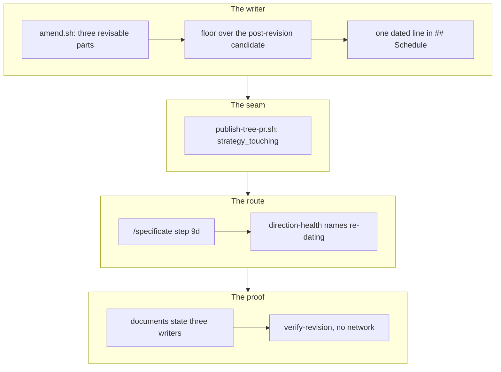

## 1. Overview

An announced *change* to a live direction was applied by the operator **by hand on `main`** — the
one act here that required editing the base directly. This branch adds `amend.sh` bounded to the
three revisable parts, routes `/specificate`'s *changed* branch to it, and moves the exemption
that makes a third writer admissible from prose into the publish seam.

**Highlights:**

1. `amend.sh` revises `## Aim`, the Schedule and `assignees:` — and writes nothing on any refusal.
2. `publish-tree-pr.sh` refuses to merge any publish touching `.workaholic/strategies/`.
3. The reversal is stated in every document that recorded "two writers and no third", and pinned.

## 2. Motivation

The two-writer rule existed to stop a machine authoring what the operator decided, and it was
enforcing more than its own reason: *re-date this by a month*, a decision already made and
announced, could reach the tree only through a human editing `main`, and `/moderate`'s `overdue`
question could not name re-dating as an act because it was not one the loop could carry.

The premise survives, which is what makes a third writer admissible: the machine still only
**carries** a revision announced by explicit slug, onto a pull request only the operator merges.
That last clause had to become real — prose since 2026-08-14, with nothing stopping a run from
setting `WORKAHOLIC_AUTO_MERGE`, which a third writer cannot rest on.

## 3. Changes

The writer came first because everything else routes to it, the seam second because it is the
premise the writer rests on, the route and the question third because they are how a person
reaches it, and the documents and the drill last because a reversal nobody can tell from an
oversight is a defect of its own.

### 3-1. Write amend.sh, the one writer of a live direction ([9785372d](https://github.com/qmu/workaholic/commit/9785372d))

Adds the third writer in the siblings' own dialect and shape, revising the three parts alone or
together and refusing eleven named ways with nothing written. The candidate is composed under a
temporary directory and the artifact is touched only by the final `mv`, so a refusal leaves the
file and the index byte-identical.

### 3-2. Hold a revised strategy to the write-time floor ([c2931b7a](https://github.com/qmu/workaholic/commit/c2931b7a))

`hooks/validate-strategy.sh` grandfathers git-tracked files, and every strategy an amendment
touches is git-tracked — so the hook is silent on exactly these writes. The writer evaluates the
post-revision candidate against the hook's three properties itself, under `create.sh`'s refusal
names, and the hook's header now says so.

### 3-3. Record what a revision moved in the Schedule prose ([4a883896](https://github.com/qmu/workaholic/commit/4a883896))

Each revision appends one dated line to `## Schedule` naming what moved, append-only and after the
operator's own prose. No frontmatter key and no second artifact: the append sits past the `already`
return, so a no-op cannot grow the file.

### 3-4. Refuse to auto-merge a strategy publish ([dbb3b812](https://github.com/qmu/workaholic/commit/dbb3b812))

`publish-tree-pr.sh` derives from the tree it is publishing whether any `.workaholic/strategies/`
path is touched and reports `merged: false`, `merge_reason: strategy_touching` — the exemption
working, never a merge failure. Every other path is byte-identical.

### 3-5. Route a changed announcement to amend.sh ([b8a37131](https://github.com/qmu/workaholic/commit/b8a37131))

`/specificate` gains step 9d, with `not_active` and `no_revision` as its own record-only outcomes.
Every recognition rule is unchanged — explicit slug only — and `strategy_exists_no_update_writer`
is retired with what replaced it stated where a reader meets the row.

### 3-6. Name re-dating in the overdue question ([4380cc11](https://github.com/qmu/workaholic/commit/4380cc11))

The `overdue` body names three acts in 23 words, in the operator's vocabulary. The `dormant` body
deliberately does not move, and every question key, gate and hold is byte-identical.

### 3-7. State the three-writer rule everywhere ([b7792a5e](https://github.com/qmu/workaholic/commit/b7792a5e))

Eleven documents and script headers now state three writers, what did **not** move, and why the
authorship premise survives — the two-writer reasoning answered rather than deleted, so a later
reader can tell a deliberate reversal from an oversight.

### 3-8. Drill the revision path with no network ([30eaecca](https://github.com/qmu/workaholic/commit/30eaecca))

`verify-revision` drills the three revisions, every refusal with the artifact's hash asserted
untouched, and the auto-merge exemption — eleven rows, local fixtures, transport stubbed.

## 4. Outcome

The operator announces a revision and the loop carries it to a pull request within the hour, their
merge still the act that authors it. The mission closed itself at the archive gate (3/3, queue
empty).

## 5. Concerns

### An amendment cannot repair a strategy it did not break

- **Severity:** low
- **Description:** the floor is evaluated over the whole post-revision artifact, so a strategy already carrying an empty `## Aim` refuses an unrelated date revision with `empty_aim` (see [c2931b7a](https://github.com/qmu/workaholic/commit/c2931b7a) in `plugins/workaholic/skills/strategy/scripts/amend.sh`)
- **How to Fix:** none needed unless it is hit — it is the stated contract, and the alternative is a writer that leaves an artifact below its own floor. Revisit only if a real malformed strategy blocks a real revision.

### The writer pin is a grep and an indirect writer would pass it

- **Severity:** low
- **Description:** the writer count resolves path variables one hop and asks what is done with them, so a fourth writer reached through a helper would not be counted (see [9785372d](https://github.com/qmu/workaholic/commit/9785372d) in `scripts/test-workflow-scripts.mjs`)
- **How to Fix:** the bound is stated at the assertion and inherited from 2026-08-26; keep the write in the writer itself rather than widening the detector.

## 6. Successful Development Patterns

- Composing the candidate under `mktemp -d` and finishing with one `mv` satisfies both "a refusal never wrote" and the mechanical writer pin — the two looked like they were in tension and were not.
- Each deliberately broken seam was actually broken and observed red before the ticket was archived, which is what turns "the drill can fail" from a claim into a measurement.
- Retiring a reason that named an **absence** (`strategy_exists_no_update_writer`) required stating what replaced it *and* why the old rule's premise survives; deleting it would have read as the rule being dropped.

## 7. Notes

Two `too-large-commit` findings (593 and 502 added lines) are the only scan output — the writer
plus its tests, and the regenerated `outputs/` for six bundled skills. No secret, no leak.
