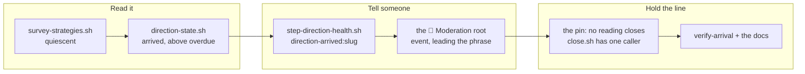

## 1. Overview

Every direction-layer reading answered *is this direction in trouble*; none answered *has it
arrived*, so a direction whose work was all in looked like one still running — and once its date
passed, the loop reported that success as an hourly `direction-overdue` question. This branch adds
the reading end to end: `quiescent` on the survey, `arrived` above `overdue` in the lifecycle
reader, one question to the direction's owner, a root line, a drill and a mechanical pin.

**Highlights:**

1. `arrived` outranks `overdue`, so a direction that finished late is no longer named a failure.
2. It is a **candidate, not a verdict**: it lifts no gate and closes nothing — the operator answers.
3. `close.sh` now has a pinned caller set of exactly one: `/specificate`'s *ended* route.

## 2. Motivation

The direction layer could see trouble and could not see completion. A finished direction stayed
eligible, produced `no_evolutionary_move` into a report nobody opens, and then — the moment its
`target_date` passed — asked its owner every hour to re-date or close it. The loop's only
vocabulary for a completed direction was lateness.

The 2026-08-26 mission that added `dormant` and `overdue` named three states byte-identical to a
healthy idle hour. This is the fourth, and the one where the loop was not silent but wrong.

## 3. Changes

The reading is derived once and projected everywhere else: the survey computes `quiescent` from
terms already on the row, the lifecycle reader projects it as `arrived` and owns only the
precedence, the tick asks about it, and the root names it. Nothing counts anything twice, no
artifact gained a field, and the last three tickets exist to make sure it stays that way.

### 3-1. Add the quiescent reading to the survey ([46ca85cc](https://github.com/qmu/workaholic/commit/46ca85cc))

`survey-strategies.sh` emits `quiescent` on every surveyed row — eligible and refused alike,
because a direction past its date is refused `past_target_date` and is exactly the one whose
arrival must still be visible. It carries no date term, and is `dormant`'s complement on the one
term that separates them: `landed` empty versus non-empty.

### 3-2. Project quiescent as the arrived state ([b37ade04](https://github.com/qmu/workaholic/commit/b37ade04))

`direction-state.sh` projects it as `arrived` at `unreadable > arrived > overdue > dormant > live`.
It composes and re-derives nothing — no date arithmetic, no attribution walk. The header records
why `arrived` outranks `overdue` and that it is a candidate rather than a verdict.

### 3-3. Say what propose is proposing against ([27fd4dd8](https://github.com/qmu/workaholic/commit/27fd4dd8))

`quiescent` lifts and closes no gate: an arrived direction stays eligible and `/propose` keeps
proposing against it, naming `arrived` in the run report as evidence. The reason is recorded so a
later change refuses to gate on it deliberately rather than by accident.

### 3-4. Ask once whether an arrived direction is done ([7b8d43ed](https://github.com/qmu/workaholic/commit/7b8d43ed))

`direction-health` asks `direction-arrived:<slug>`, addressed to the strategy's assignee, naming
what landed and the date in 23 words. To quote those facts the survey's refused rows and the
lifecycle rows gained `landed_count` / `target_date` as projections — no new counting.

### 3-5. Pin that no reading closes a direction ([3039e90d](https://github.com/qmu/workaholic/commit/3039e90d))

The suite now fails when the step's closure reaches **any** of the three strategy writers, and
when `strategy/scripts/close.sh` is reached from anywhere but `/specificate`'s *ended* route. Both
halves were demonstrated failing and restored, not asserted to fail.

### 3-6. Report the arrival as a moderation event ([a7ae8bce](https://github.com/qmu/workaholic/commit/a7ae8bce))

The tick's `event` names and links an arrived direction, **leading** the phrase — reading an
arrival after a lateness clause about a different direction is how a success gets read as a
failure. An all-`live` tick still supplies the empty string and renders no line.

### 3-7. Drill the arrival readings with no network ([7f5e3803](https://github.com/qmu/workaholic/commit/7f5e3803))

`loop-drill.sh verify-arrival` — 15 rows over a git-backed fixture, proving all five readings, the
question key, the asked-once gate and that no reading closes a direction. It was run with `gh`,
`curl` and `wget` stubbed to log every call: none was made.

### 3-8. Write the arrival reading into the docs ([a488cf52](https://github.com/qmu/workaholic/commit/a488cf52))

`CLAUDE.md`, `workaholic:strategy`, `workaholic:propose`, `workaholic:moderate` and both script
headers name `arrived`, its precedence, that it is a candidate, that it gates nothing, and that
the writer set did not move — written against what shipped rather than what was planned.

## 4. Outcome

The loop says a direction has arrived, to the one person who can rule on it, exactly once. It
outranks `overdue`, so a finished-but-late direction is no longer reported as a failure; it
changes no gate, and two pins plus a drill hold the rule that no reading closes a direction.

## 5. Concerns

### The archive commit swept the whole unit into the first ticket's commit

- **Severity:** moderate
- **Description:** all eight tickets were implemented before the first was archived, so default
  staging put 26 files into ticket 1's commit (see
  [46ca85cc](https://github.com/qmu/workaholic/commit/46ca85cc)) — also this branch's only scan
  finding, `too-large-commit`, 564 added lines against 500.
- **How to Fix:** drive each ticket to its archive before starting the next, so a commit carries
  the work its Final Report describes.

### The size finding is the shape of the sweep, not of the work

- **Severity:** low
- **Description:** the gate decision is `override_only` — one `size` finding, no secret and no
  leak — so the branch stays releasable by the scan's own tier policy, but the finding really does
  signal the lost granularity above.
- **How to Fix:** nothing in the code; the concern above carries the repair.

## 6. Successful Development Patterns

- Breaking a seam on purpose turned "the drill covers this" into a fact: removing `quiescent`'s
  waiting terms failed three rows, and restoring them passed.
- Keying a call-site pin on the **path-qualified** reference let the documents keep naming the
  script they refuse to call; a bare-name pin would have failed on its own prose.

## 7. Notes

The mission closed itself at the archive gate — acceptance 3/3, queue empty — so no
`/mission-close` was needed.
