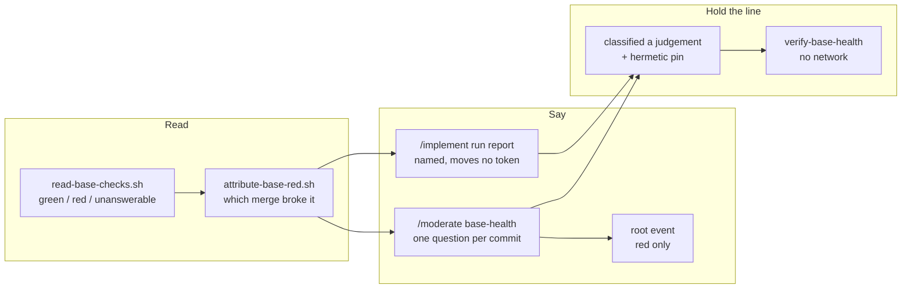

## 1. Overview

Nothing in this plugin read a check run, so a green base and a base nobody looked at were one
reading. This branch adds the reader, the walk naming the merge that broke it, and the two
surfaces that say so — taking as much care that neither can act on what it reads.

**Highlights:**

1. `read-base-checks.sh` answers `green` / `red` / `unanswerable`; no checks is never green.
2. `/moderate`'s twentieth step asks the attributed author once per broken commit.
3. The reading is a classified **judgement**, and the hermetic pin fails if a consumer acts.

## 2. Motivation

A red base reached a person through no path at all: `/implement` may not ask, `stuck-prs` and
`merge-conflicts` read pull requests and find nothing wrong with one already merged, and
`stalled-units` reads claims a red base does not have. The one approximation, `pulls-state.sh`,
asks a different question of a different object.

The repository had already drawn the line this depends on: `superseded` and `report_undelivered`
became **proofs** because they cannot become false by looking again, and a check run is
*designed* to be re-runnable. So the ask rejected the obvious next step — gating — and the branch
spends as much effort proving nothing acts as producing the reading.

## 3. Changes

The branch builds bottom-up: one reader, then the walk that composes it, then the two surfaces
that report it, then the classification and the drill that keep both surfaces honest. Nothing
consumed the reader until the surfaces arrived, which is what kept its contract arguable while
it was still cheap to change — and the last three tickets exist only to make the *absence* of an
action checkable rather than promised.

### 3-1. Write read-base-checks.sh, the one checks reader ([8bc639e6](https://github.com/qmu/workaholic/commit/8bc639e6))

One reader of a check run, over `repos/{owner}/{repo}/commits/{sha}/check-runs` through the one
GitHub transport, exiting 0 in every case. `red` outranks a still-pending sibling because a
completed failure is a reading we did make; every other non-green answer is `unanswerable` under
its own reason, because a base nobody looked at must never read like one that passed.

### 3-2. Name the merge that turned the base red ([d10ace0e](https://github.com/qmu/workaholic/commit/d10ace0e))

The walk from the base tip back to the last green commit, naming the oldest red one after it
with its pull request and author. It derives no check state of its own — one derivation, in one
place — and answers `unattributable` with a reason rather than blaming the tip when the walk
exhausts its bound, reaches the start of history, or meets a commit it cannot read.

### 3-3. Add the moderate step base-health ([8be15207](https://github.com/qmu/workaholic/commit/8be15207))

`/moderate`'s twentieth step hands a red base to the check-in as one question addressed to the
attributed author, keyed `base-red:<commit>`. The addressee is resolved through the identity
mapping, and an unmapped login leaves the question addressed to nobody rather than stamping an
address nobody verified.

### 3-4. Render the base's health as a tick event ([1d69b4bc](https://github.com/qmu/workaholic/commit/1d69b4bc))

Only a red base supplies a root line, naming the commit and the failing checks and linking both.
A green base and every degraded read supply none — the renderer's own guard, *a step with no
event renders no line*, is what keeps a nothing-happened line off an hourly root.

### 3-5. Name the base's health in the run report ([45b4e51a](https://github.com/qmu/workaholic/commit/45b4e51a))

Every driving run reads the base once — never once per unit — and names the reading before its
per-unit outcomes. §7 gained a token-table row stating that the reading moves **no** token and
why, so a later reader does not read the omission as an oversight.

### 3-6. Classify the base reading as a judgement ([7b26ea15](https://github.com/qmu/workaholic/commit/7b26ea15))

All four words are judgements, written as a sub-table beside the claim protocol's in the same
section. The existing hermetic pin was extended rather than copied: it now parses the two
vocabularies apart, refuses any row called a `proof`, and enumerates both consumers so a third
must be registered rather than slipping in unclassified.

### 3-7. Drill the base reading with no network ([3dd38934](https://github.com/qmu/workaholic/commit/3dd38934))

`sh scripts/e2e/loop-drill.sh verify-base-health` walks the whole chain over a stubbed transport
in fourteen load-bearing rows, including one labelled as the intentional failure. The
gates-nothing property is drilled as the survey's byte-identity over a red and a green base plus
the absence of any reference to either reader in the driving chain.

### 3-8. Write the base reading into the documents ([630f4ba5](https://github.com/qmu/workaholic/commit/630f4ba5))

`CLAUDE.md`, `README.md` and the loop-drill runbook now describe what shipped. `README.md` was
three step-additions stale before this mission began and three documents carried ordinals from
when the tick had nine steps; both are said rather than absorbed.

## 4. Outcome

The loop answers "did the base survive what I merged?" without anyone opening the Actions tab,
and a red base reaches the person whose merge it was — once, by name, with the failing checks.
Nothing merges differently, and that restraint is enforced by the classification, the pin and
the drill rather than promised.

## 5. Concerns

### The reader sees only check runs, never legacy commit statuses

- **Severity:** low
- **Description:** `read-base-checks.sh` reads `commits/{sha}/check-runs` only, so a repository whose CI reports through the legacy combined-status API reads `no_checks` — hence `unanswerable` — forever (see [8bc639e6](https://github.com/qmu/workaholic/commit/8bc639e6) in `plugins/workaholic/skills/drive/scripts/read-base-checks.sh`)
- **How to Fix:** Add the `/status` call behind the existing three-valued shape when a consuming repository that needs it is measured; the degradation is honest today and the second call would double the attribution walk's cost

### A step count lives in six documents and nothing pins it

- **Severity:** moderate
- **Description:** `/moderate`'s step count is repeated in `CLAUDE.md`, `README.md`, `moderate/SKILL.md` (three times) and `reference/workflow.md`'s title, with nothing checking any of them against `run.sh`'s `STEPS=` line — `README.md` was three additions stale and three files carried ordinals from when the tick had nine steps (see [630f4ba5](https://github.com/qmu/workaholic/commit/630f4ba5) in `plugins/workaholic/skills/moderate/scripts/run.sh`)
- **How to Fix:** The suite already parses `STEPS=` for other assertions; add a pin that fails when a document's count disagrees with it

### The attribution walk costs one network read per commit inspected

- **Severity:** low
- **Description:** A red base walks back to the last green commit, one `check-runs` call per commit, bounded by `WORKAHOLIC_BASE_ATTRIBUTION_MAX` (default 20) — a base red for a long stretch spends the full bound on every tick and every driving run (see [d10ace0e](https://github.com/qmu/workaholic/commit/d10ace0e) in `plugins/workaholic/skills/drive/scripts/attribute-base-red.sh`)
- **How to Fix:** Watch it in practice; a green base costs one call and the asked-once key already stops the *question* repeating, so only the reads repeat

## 6. Successful Development Patterns

- **Ship the reader before anything consumes it** — ticket 1 landed a script nothing called, which kept its contract arguable while changing it was free.
- **Ban call sites, never words** — the step's own prose forbids reverting in English, so a word-level ban fails on the sentence stating the rule.
- **Drill an absent action as an absent reference** — "gates nothing" is checkable as *no script in the driving chain mentions either reader*.

## 7. Notes

Both guards were observed failing rather than asserted to: four breakages of the pin each turned
exactly the expected row red, and two of the drill did the same. All six were reverted first.
