## 1. Overview

The handoff axis was complete on the routing side and empty on the asking side: a unit the loop declared it cannot verify was routed, parked at an open pull request, and then addressed to nobody ever again. `/moderate` gains `handoff-units`, which hands every `awaiting_verification` claim to its holder as one question naming the declared reason verbatim, and `stalled-units` stops asking a differently-worded question about the same unit.

**Highlights:**

1. The declared reason is resolved per candidate, through the one reader of `verification_handoff:` — no second parser, no field on any artifact.
2. One step asks and the other filters, and the hermetic suite fails if either half drifts.
3. `verify-handoff-question` proves the whole chain offline, with one row that deliberately breaks the seam.

## 2. Motivation

Measured on 2026-08-27: three units parked on a human act — queued since 2026-08-18, 2026-08-19 and 2026-08-26 — each naming its own blocker in its own ticket, and none mentioned to the account holder since the hour it routed. `awaiting_verification` appeared nowhere outside `drive/`, so the one surface in this plugin that names a person could not learn there was anything to say. Worse, once such a claim's tip went stale, `stalled-units` asked *a claimed unit has not moved for a day or more* — which sends somebody to look at a claim when what they need is the single act it waits on.

That is the same shape the loop has now closed four times: a state the protocol reads correctly and nobody is told about. `report_incomplete`, `report_undelivered` and `undrivable-units` each split a word that was covering two situations; this one splits the *audience* instead — the verdict was already correct, and the gap was that no consumer read it.

## 3. Changes

```mermaid
flowchart TD
  subgraph read["Read the declaration"]
    A["declared-handoff-detail.sh<br/>reason + pull request, per candidate"]
  end
  subgraph ask["Ask the holder"]
    B["step-handoff-units.sh<br/>handoff-unit:&lt;unit&gt;"]
    C["moderation event<br/>only when one stands"]
  end
  subgraph quiet["Stop asking the wrong thing"]
    D["stalled-units filters<br/>and counts instead"]
  end
  subgraph prove["Prove it stays that way"]
    E["proof/judgement pin<br/>report-and-ask only"]
    F["verify-handoff-question<br/>offline drill"]
  end
  subgraph say["Say it once per document"]
    G["run report + CLAUDE.md<br/>+ SKILL.md + claims.md"]
  end
  read --> ask --> quiet --> prove --> say
```

The reading came first because everything downstream consumes it, the step and its event next, then the filter that keeps one unit to one question. The last three tickets are what stop the pair drifting apart: a hermetic pin, an offline drill, and one statement per document.

### 3-1. Read a claim's declared handoff and its pull request ([aaf51ed](https://github.com/qmu/workaholic/commit/aaf51edb))

`claims_declared_handoff` computed the reason and threw it away, so the row carried only a boolean. It was split into one derivation — `claims_declared_reading` — with the boolean and the new `claims_declared_reason` as thin reads of it, and `declared-handoff-detail.sh` resolves the string plus the pull request **per candidate** rather than on every claim row.

### 3-2. Add the moderate step handoff-units ([266c387](https://github.com/qmu/workaholic/commit/266c387c))

The step reads `list-claims.sh`, filters on `awaiting_verification`, and hands each candidate to the check-in keyed `handoff-unit:<unit>`, addressed to the claim holder and quoting the declared reason verbatim. A candidate whose reason could not be resolved is counted rather than asked about.

### 3-3. Render the standing handoff as a moderation event ([3d572fa](https://github.com/qmu/workaholic/commit/3d572fa9))

The event is supplied only where a standing handoff was found, and names the repository event rather than the counters. Verified end to end that an unchanged finding renders no line on later ticks, so a standing handoff cannot become an hourly restatement.

### 3-4. Stop stalled-units asking about a declared handoff ([9d5226d](https://github.com/qmu/workaholic/commit/9d5226d4))

Reproduced first, then filtered in the **same expression** as `superseded` — one rule with two verdicts — and counted in the summary as its own finding. The filter is deliberately not widened to "any non-resumable verdict".

### 3-5. Name the declared-handoff exclusion in reports ([7b6ddc0](https://github.com/qmu/workaholic/commit/7b6ddc0a))

The discovery finding held: `backlog_all_excluded.reasons` already counts `claimed_awaiting_verification` generically, so **no script changed**. What was missing was the report contract, written into `drive/SKILL.md` §7 and `CLAUDE.md`: a queue held by a declared handoff is a person's business, and it moves no token.

### 3-6. Pin the new consumer as report-only ([5f9f8d1](https://github.com/qmu/workaholic/commit/5f9f8d15))

`testProofJudgementSplit` gained its first **reporting** consumer: the verdict is asserted still a judgement, the step asserted to reach no acting call site, and the ask/filter pair asserted from both sides. All three deliberate breaks were introduced and observed to fail.

### 3-7. Drill the handoff question with no network ([1085a21](https://github.com/qmu/workaholic/commit/1085a21b))

`verify-handoff-question` builds a fixture that reaches `awaiting_verification` through the real derivation, then proves: asked once, second tick silent, `stalled-units` silent, nothing cleared. Its intentional-failure row — a unit whose declaring ticket was driven — was observed to fail when the reading was pointed at the archived work.

### 3-8. Write the asking half into the documents ([eed701a](https://github.com/qmu/workaholic/commit/eed701a2))

One statement per document, the step count reconciled with `run.sh`'s `STEPS` (twenty-one), and the refused rival recorded once: a single unified *what the loop is blocked on* report across the four vocabularies is a status line addressed to nobody.

## 4. Outcome

`awaiting_verification` now has exactly one reporting consumer, and a unit waiting on a person is told to that person once, in the words the ticket wrote. Nothing gained a field, `verification-handoff.sh` is still the field's one reader, and the verdict still forbids no token — the step asks, and that is the whole licence.

## 6. Successful Development Patterns

- Confirming a discovery finding **before** writing code turned ticket 3-5 from an edit into a documentation change — the mechanism was already generic, and "adding an edit to make the sentence come out right" would have introduced the second vocabulary the derivation exists to prevent.
- Splitting one derivation into a shared reading with two thin readers (`claims_declared_reading`) bought a new answer at zero extra work, and left the scan's output byte-identical — which is what made the refactor checkable.
- The drill's fixture bug was the useful part: git prunes an empty `stories/` directory on checkout, so a later branch's `&&` chain fell silently through `|| true`. The load-bearing fixture row caught it, which is exactly why that row runs first.

## 8. Notes

The mission was closed `achieved` by the archive gate's own arithmetic (3/3 acceptance, queue empty) rather than by hand. The 115 open deferred concerns were judged unaffected by this branch and left `still_active`; no superseding record was written.
