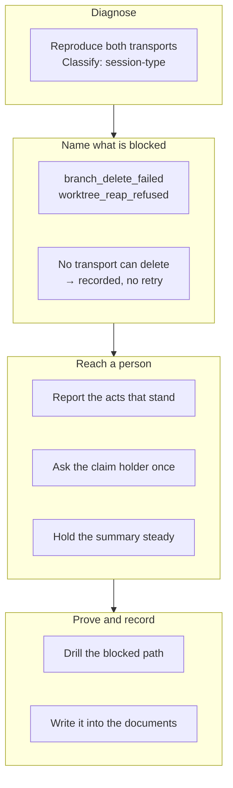

## 1. Overview

The retirement's second act — deleting the remote branch — is refused on every tick in the
container the loop runs in, so a claim proved empty never leaves the table and the step reported
`0 retired` with nobody told. This branch measures the refusal, names the blocked act, and puts
the standing block in front of the person who can clear it.

**Highlights:**

1. The refusal is measured rather than hypothesised: both transports answer `403`, session-type — not a protection rule, not a missing scope.
2. No transport can delete a branch here, and that is the recorded finding: the connector has no ref-delete surface, so no retry is added.
3. A blocked retirement names the blocked act, reports the acts that stand, and reaches its claim holder exactly once.

## 2. Motivation

Acting on a proof makes the retirement's destructive acts safe — but only if the acts happen.
Measured 2026-08-27: seven claims, four `superseded`, `0 retired` on every tick since the
mechanism landed, and three units reporting `partial_retirement`, one word covering a refused
close, a refused delete and a dirty worktree alike. The script's 2026-08-05 comment predicted the
refusal and called it "not fatal"; it is fatal to the purpose, since unmerged remote branches are
the only claim oracle. The mission refused to build on that prediction — the three candidate
causes share one symptom and need different repairs.

## 3. Changes

The branch runs diagnosis-first and never departs from it. Ticket 1 ships no fix at all: it
attempts both transports in the loop's own routine-fired container, captures both refusals
verbatim, and classifies them. Only then does ticket 2 split the collapsed reason word — and it
splits it *downward*, one word for the delete rather than three, because the measurement found one
cause. Ticket 3 asks whether a second transport can take the act, enumerates the surfaces, and
records that none can. Tickets 4–6 make the standing block legible without making it noisy;
tickets 7–8 prove and record what the first six concluded.

### 3-1. Reproduce the refused branch delete and name it ([cb4c8820](https://github.com/qmu/workaholic/commit/cb4c8820))

Attempted the delete from a routine-fired container against a real `superseded` claim, over both
`git push --delete` and the REST ref-delete endpoint, capturing stderr instead of discarding it.
Both answer `403`, the two agree, and the refusal is session-type — an ordinary push of the same
branch succeeds in the same container, so it is the delete specifically that is refused.

### 3-2. Give a refused delete its own reported word ([38f1b7f0](https://github.com/qmu/workaholic/commit/38f1b7f0))

Split `retire-claim.sh`'s closing branch so each blocked act reports its own reason, derived in act
order from the three states already on the row: `branch_delete_failed` and `worktree_reap_refused`
join the close's existing words and `partial_retirement` is retired. Every success word and the
always-exit-0 contract are untouched.

### 3-3. Record that no transport can delete a branch ([43c83908](https://github.com/qmu/workaholic/commit/43c83908))

Enumerated the candidate surfaces: REST answers `403` through the proxy, and the GitHub connector
carries no ref-delete tool at all. No retry is added anywhere — a second REST call is measured to
fail and a connector step has nothing to call — and the finding is written where a later session
looking for a retry will find it, with the condition that would reopen the question.

### 3-4. Report what stands and what is outstanding ([a8359892](https://github.com/qmu/workaholic/commit/a8359892))

A refused row now names all three act states beside its reason, as the retired row already did, so
`pr already_closed, branch failed` reads as what it is: a re-run of one act, not of three. The
states come straight off the writer's row, so `not_attempted` stays distinct from `failed`.

### 3-5. Ask the holder for the branches left undeleted ([4d97b2f3](https://github.com/qmu/workaholic/commit/4d97b2f3))

A unit blocked on the delete now reaches its **claim holder** as one question, keyed
`retire-blocked:<unit>` so it is asked exactly once, naming the exact branch left on origin. The
step's empty-`needs_agent` rule is narrowed, not reversed: a retirement that succeeded still asks
nobody anything.

### 3-6. Stop restating a standing blocked retirement ([f7e6cf45](https://github.com/qmu/workaholic/commit/f7e6cf45))

Held the summary to a pure function of the claim set and the act states, so two ticks over an
unchanged block render the same string and — with `event` empty on a tick that retired nothing —
no root line. A newly blocked unit still moves the summary the hour it appears; suppression is by
nothing.

### 3-7. Drill the blocked retirement with no network ([c2798dc2](https://github.com/qmu/workaholic/commit/c2798dc2))

Nine rows extend `verify-retire` with the production shape, reproducing the refusal through the
bare origin's own `update` hook — the same receive-side path a remote refusal takes, with no
network. Three superseded claims reach three different outcomes in one tick, which is what makes
the breaker row able to catch a candidate set widened in either direction.

### 3-8. Write the blocked retirement into the documents ([94e43cd6](https://github.com/qmu/workaholic/commit/94e43cd6))

Five documents updated in the same change: `CLAUDE.md`'s claim-protocol bullet and `/moderate` step
list, the claim protocol reference's new *When an act of the retirement is refused* section,
`rules/shell.md`'s record that no transport can take the act, and the drill runbook's blame table.
`superseded`'s classification as a proof is unchanged and the new word stays out of the oracle's
tables.

## 4. Outcome

A claim proved empty either loses its branch or produces one question, addressed by name to the
person who can delete it. Reading `retire-claims` says which act is blocked and which stand, a
standing block renders identically hour after hour, and what the loop cannot do is written down.

## 5. Concerns

### The first archive commit carries the whole unit's implementation

- **Severity:** low
- **Description:** All eight tickets were implemented before the first archive, so `archive.sh`'s default staging swept every change into ticket 1's commit ([cb4c8820](https://github.com/qmu/workaholic/commit/cb4c8820), 523 added lines) and the later seven carry only their ticket moves. The per-ticket commits are therefore not a per-ticket diff, and the branch-safety scan reports one `override`-tier `too-large-commit` finding on that commit.
- **How to Fix:** Implement and archive one ticket at a time within a unit, so each archive commit carries only that ticket's change; the run's own ordering already knows the sequence.

### `stalled-units` and `retire-claims` are exclusive by coincidence

- **Severity:** moderate
- **Description:** No unit draws both a `stalled-unit:` and a `retire-blocked:` question only because `step-stalled-units.sh` filters `superseded` for its own unrelated reason (a merged claim is a fact, not a question) — nothing in either step enforces the pairing (see [4d97b2f3](https://github.com/qmu/workaholic/commit/4d97b2f3) in `plugins/workaholic/skills/moderate/scripts/step-retire-claims.sh`).
- **How to Fix:** Pin the exclusivity in `scripts/test-workflow-scripts.mjs` the way the handoff pair is pinned, so removing `stalled-units`' `superseded` filter fails a test rather than producing two questions about one unit.

### The question is bounded but the block is not

- **Severity:** low
- **Description:** The asked-once gate means a branch that stays undeletable is mentioned exactly once, ever. If nobody acts, the claim accumulates silently again — the state this mission was written against — with only the tick log recording it (see [f7e6cf45](https://github.com/qmu/workaholic/commit/f7e6cf45) in `plugins/workaholic/skills/moderate/scripts/step-retire-claims.sh`).
- **How to Fix:** Leave as is for now and watch: the check-in's existing one-more-ask-at-the-next-working-day rule already covers a live question, and a per-unit escalation ladder is the second ledger this mission deliberately refused.

## 6. Successful Development Patterns

- Diagnosis-first paid for itself literally: ticket 1's measurement made ticket 2 *smaller* (one word for the delete, not three) and closed ticket 3 by construction rather than by argument.
- A bare repository's `update` hook reproduces a partial, server-side transport refusal on the real code path with no network — reusable for any drill needing a specific git operation to fail.
- Each of the three seams was broken on purpose and the drill re-run, which caught a breaker row that passed against a genuinely broken seam; a breaker row proves only what its fixture can distinguish.

## 7. Release Preparation

**Verdict**: Ready for release

- **Concern:** One `override`-tier `too-large-commit` finding (523 added lines on `cb4c8820`), a granularity artefact of when the tickets were archived rather than mixed concerns.
- **Before release:** None — no secret and no leak finding; the size tier is a nudge, not a block.
- **After release:** Watch one `/moderate` tick to confirm a blocked retirement renders its acts-that-stand line and asks its holder once.
