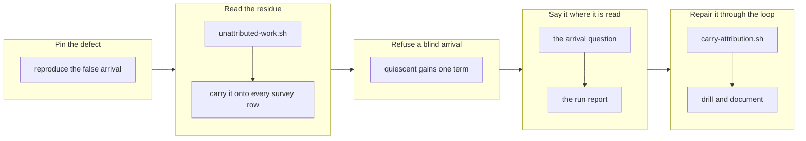

## 1. Overview

`quiescent` renders as *this direction has arrived* — the one reading whose next act is to **close** a direction — and it was true of everything the citation walk could see and blind to everything it could not. This branch makes that blind spot legible without making the walk guess: one pure reader names what no direction claims, a **degraded** read of it refuses the arrival outright, the arrival question and the run report name the residue by slug, and an operator's ruling that an unattributed mission answers a direction now reaches a pull request instead of a hand edit of `main`.

**Highlights:**

1. `strategy/scripts/unattributed-work.sh` — the one reader of *what does no direction claim*, composing `mission-strategy.sh`, adding no walker, no relation and no field.
2. `quiescent` gains exactly one term — an **unreadable** residue refuses the arrival; a non-empty **readable** one deliberately does not.
3. `carry-attribution.sh` carries the operator's attribution ruling onto a mission, removing the last act in this repository that required editing the base by hand.

## 2. Motivation

Measured on this repository at 2026-08-28 00:41 UTC: the strategy `an-autonomous-improvement-loop-run-by-the-routines` read `quiescent: true` with 125 landed items, while **four active missions and ten queued tickets** read `attributed: false` through `mission-strategy.sh` — three of them the loop's own machinery. *Everything I could attribute has landed* was true and **partial**, and nothing anywhere named the other half. An operator asked *is this done?* had the answer's evidence and none of its limit.

The attribution walk is transitive and lossy by design, and every previous reading built on it says so; what was missing was a reader for the complement. The 2026-08-26 reading `no_citing_artifacts` had already been through the same repair once — it covered two situations a reader could not tell apart, and closing that hole at the writing end is what made it provable. This branch does the same work one reading later, and takes the same care not to over-reach: the residue is *named*, never inferred from.

## 3. Changes

The defect was made mechanical before anything was coded against it, then read, then carried onto every survey row without moving a gate. Only once the reading existed did `quiescent` gain its single new term — and deliberately the narrowest one, since a non-empty residue refusing the arrival would let any unrelated mission suppress every direction's arrival forever. The last two tickets close the loop in the other direction: the operator's answer to the question now has a route back into the tree, and a drill proves the whole chain with no network.

### 3-1. Reproduce the false arrival and pin it ([dd6ef9c3](https://github.com/qmu/workaholic/commit/dd6ef9c3))

A git-backed hermetic fixture in which a strategy's attributed work has all landed beside an **unattributed** active mission holding two queued tickets, with a characterization case recording that the survey answers `quiescent: true` over it — so every later ticket had something that moves when it changes the reading.

### 3-2. Read what no direction claims ([8674d0c8](https://github.com/qmu/workaholic/commit/8674d0c8))

`unattributed-work.sh` names each unattributed active mission by slug and path with its queued-ticket count, and each unattributed queued ticket by path, composing `mission-strategy.sh` and reading the queue through the `mission:` relation's single reader. `readable: false` carries its own reason and **null** counts, never a zeroed residue.

### 3-3. Carry the residue onto every survey row ([4f2bad15](https://github.com/qmu/workaholic/commit/4f2bad15))

`survey-strategies.sh` reads the residue **once per survey** — it is a fact about the repository, not about a direction — and puts the same object on every row, eligible and refused alike, computed before `refusal` so no gate, sort or selection moves.

### 3-4. Refuse an arrival over a tree we cannot see ([3703496e](https://github.com/qmu/workaholic/commit/3703496e))

`quiescent` is `false` when the residue read was **degraded**, and only then. `dormant` is deliberately untouched: an arrival invites the operator to *close* a direction while every other reading only invites them to *look*, and that asymmetry is the whole justification.

### 3-5. Name the residue in the arrival question ([4a558420](https://github.com/qmu/workaholic/commit/4a558420))

`/moderate`'s `direction-arrived:<slug>` question names each unattributed mission by slug with its queued count, bounded to three names then `and N more`. The key, the asked-once gate, the addressee and the body's register are unchanged.

### 3-6. Report the residue beside an arrived reading ([4c2e9665](https://github.com/qmu/workaholic/commit/4c2e9665))

A run reporting `arrived` reports that strategy's residue beside it as evidence, with a degraded read reported as degraded. A hermetic case slices the survey's gate chain and asserts no refusal, sort or selection names the field.

### 3-7. Carry an operator attribution to a mission ([31e7b709](https://github.com/qmu/workaholic/commit/31e7b709))

`carry-attribution.sh` appends a named `active` strategy's own existing `feedback:` refs to a named active mission and writes nothing else, joining `/specificate`'s announcement route as step 9e. It writes nothing on any refusal and re-runs byte-identically.

### 3-8. Drill the residue and document it ([958c1a32](https://github.com/qmu/workaholic/commit/958c1a32))

`sh scripts/e2e/loop-drill.sh verify-residue` drills the whole chain over local git fixtures with no network — twelve load-bearing rows including a breaker that fires the moment the reader is wired at the archived missions — and the five documents state what is now true.

## 4. Outcome

The loop can now say what it could not see before calling a direction finished, and cannot claim an arrival over a tree it failed to read. The residue changes nothing else: `refusal`, `pace`, `overdue`, `dormant`, the sort and `selected` are byte-identical, pinned by a hermetic diff, and `/propose` keeps proposing against an arrived direction exactly as before. Where the operator disagrees with the residue, their ruling now has a route into the tree that ends at a pull request rather than at a hand edit of `main`.

## 5. Concerns

### The residue over-reports a loose queued ticket

- **Severity:** low
- **Description:** `unattributed-work.sh` answers at the mission grain, so a queued ticket naming no mission is residue by construction even when its own `feedback:` refs cite a live direction (see [8674d0c8](https://github.com/qmu/workaholic/commit/8674d0c8) in `plugins/workaholic/skills/strategy/scripts/unattributed-work.sh`). The limit is stated in the script's header, and over-reporting is the conservative direction, but a repository emitting many loose tickets would see a permanently noisy residue.
- **How to Fix:** Only if it is measured: resolve a loose ticket's own refs against the `active` set through `attributed-work.sh`, at the cost of a second call per strategy — which is why it was not done speculatively.

### The attribution carry's no-auto-merge rule is the caller's, not the seam's

- **Severity:** moderate
- **Description:** `publish-tree-pr.sh` derives `strategy_touching` from a path under `.workaholic/strategies/`, and step 9e writes `.workaholic/missions/` — byte-indistinguishable from any other mission write — so the seam cannot enforce the exemption and the rule lives in the caller's prose plus a text assertion (see [31e7b709](https://github.com/qmu/workaholic/commit/31e7b709) in `plugins/workaholic/skills/specificate/reference/workflow.md`). That is exactly the weaker guarantee the 2026-08-27 change moved *away* from for the strategy artifact.
- **How to Fix:** If a run is ever measured auto-merging an attribution carry, give the seam something derivable — a distinguishable commit subject or a publish-tree marker — rather than adding a caller-supplied flag, which is the same prose one layer down.

## 6. Successful Development Patterns

- A degraded-read fixture must degrade the *reader* without degrading the thing under test: `all_strategies_unreadable` would have made the strategy unreadable too, so both the suite and the drill copy the plugin tree and remove `mission-strategy.sh` — otherwise the assertion passes on `unreadable` and pins nothing.
- A breaker row needs bait the broken seam would actually surface: the first version was green under a deliberately broken reader, because the only archived mission in the fixture was *attributed* and therefore invisible either way.
- Emptying a fixture's residue by *attributing* it is not a neutral edit — it puts that direction's own work in flight and moves `work_waiting` — so a byte-identity assertion must empty it by removal.
