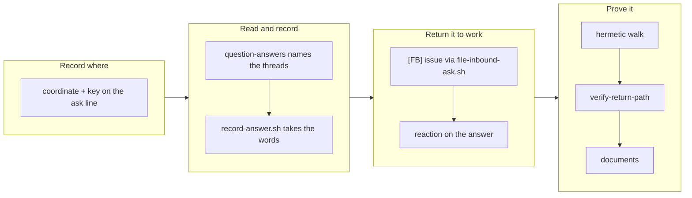

## 1. Overview

An answer typed into the `🔎 Moderation` thread reached no writer in this plugin. `/moderate`
gains a twenty-second step that reads each outstanding question's own thread on a coordinate
recorded at post time, hands the words to `record-answer.sh`, files the ones that ask for work as
`[FB]` issues, and stamps the answer message.

**Highlights:**

1. The coordinate rides the ask line `ask-question.sh` already writes — no new store, no search.
2. `question-answers` names the threads; the agent reads them, because Slack is a session's connector.
3. The dedup is structural: an `answered` question is not a candidate, so one answer is read, filed and stamped once.

## 2. Motivation

`record-answer.sh` had been the only writer of the answered line since 2026-08-23 and nothing
executed it: its documented flow cost a session per answer, and a reply written where the question
was asked reached nothing — no channel message, so `step-unanswered-asks.sh` cannot see it, and
the `:40` sweep excludes answers to the tick's own questions by rule. The words survived in Slack
and `question-state.sh` read `asked` forever.

The gap was also written down as closed: `docs/routine-loop.md` already told its reader a thread
reply is recorded by the next tick. The documents gained no new claim here — one stopped being
wrong.

## 3. Changes

The branch is ordered as its tickets are: record where a question was posted, read that one
thread and hand the words to the existing writer, return an answer that asks for something to the
issue ledger and acknowledge it where it was written, then pin the whole walk hermetically, drill
it end to end with no network, and correct the one document that already claimed the behaviour.
Every stage composes a seam that already existed — the log, the question id, the filer, the
catalog — so nothing here adds a store, an inbox, a writer or a field.

### 3-1. Record the coordinate a question was posted at ([251e2291](https://github.com/qmu/workaholic/commit/251e2291))

`ask-question.sh` gains a `--record-ask` mode writing the `human-checkin-ask-<slug>` line with the
coordinate the agent held at post time and the content key, in a format with one home
(`lib/question-coordinate.sh`); `question-state.sh` reads both back. The gate returns before any
of it, so which questions are asked, the caps and the holds are byte-identical.

### 3-2. Read the answer in a question's own thread ([147fcc79](https://github.com/qmu/workaholic/commit/147fcc79))

`step-question-answers.sh` names every question in state `asked` with a recorded coordinate and
hands one thread read per candidate back in `needs_agent`, following `step-unanswered-asks.sh`'s
split. No search, no channel history, bounded to ten reads newest-first, with the remainder and
every degradation named.

### 3-3. Record the answer through the one writer ([6ec3a6c8](https://github.com/qmu/workaholic/commit/6ec3a6c8))

`record-answer.sh` is unchanged and gains a caller. The judgement's bar is written in
`reference/workflow.md` rather than in a script: a person's reply in that question's thread, every
post this plugin emits excluded by shape, and nothing recorded when unsure.

### 3-4. Turn an answer that asks for work into an issue ([dbe76cd6](https://github.com/qmu/workaholic/commit/dbe76cd6))

An answer that asks for something becomes one `[FB]` issue through `file-inbound-ask.sh`, assigned
to the running identity and carrying the direction through `ask-feedback-line.sh`. No second inbox
and no cursor: the marker is the answer message's own `slack-ref`, which the sweep's reader
already reads back out of the issue ledger.

### 3-5. Stamp the answer where it was written ([28e14568](https://github.com/qmu/workaholic/commit/28e14568))

The catalog names `:ballot_box_with_check:` once and the routine template reads it from there. It
is a reaction on the answer message and no reply is posted for this event; it rides the
coordinate already in hand, covers only an answer this run recorded, and is never load-bearing.

### 3-6. Reproduce the dead return path and pin it ([17158f85](https://github.com/qmu/workaholic/commit/17158f85))

`testAnswerReturnPath` walks ask → coordinate → candidate set → recording → `answered` → the
gate's refusal, over a fixture with no network, with the four measured facts and the flip point
named in its header. Both localization assertions hold and did not flip.

### 3-7. Drill the return path with no network ([ffc52ece](https://github.com/qmu/workaholic/commit/ffc52ece))

`verify-return-path` walks all five stages over local fixtures with `gh` stubbed, asserts the
negatives beside the happy path, and carries a breaker row that wires the read at the **channel**
and must fail. `docs/loop-drill-runbook.md` gains §5q and its blame table.

### 3-8. Write the return path into the documents ([37284b23](https://github.com/qmu/workaholic/commit/37284b23))

`docs/routine-loop.md`'s claim is true as written and its step count moved 14 → 22; `CLAUDE.md`,
`workaholic:moderate` (SKILL and reference §22), the notify catalog, `propose/SKILL.md` and
`record-answer.sh`'s own header carry the return path with what it deliberately does not do.

## 4. Outcome

`/moderate` is a twenty-two-step tick whose questions can be answered where they are asked. The
mission's three acceptance items are met and the archive gate closed it `achieved`. The hermetic
suite is green at 4311 assertions; `verify-return-path` passes with twelve load-bearing rows.

## 5. Concerns

### The dedup marker deviates from the ticket, and the reason is recorded rather than silent

- **Severity:** low
- **Description:** ticket `20260828032101-turn-an-answer-that-asks-for-work-into-an-issue.md` named the question's own content key as the dedup marker; the branch uses the answer message's `slack-ref` instead (see [dbe76cd6](https://github.com/qmu/workaholic/commit/dbe76cd6) in `plugins/workaholic/skills/moderate/reference/workflow.md`)
- **How to Fix:** nothing, unless the ledger read stops being enough — a key-shaped marker needs a second marker and a second reader for a dedup the state machine already provides, since an `answered` question is not a candidate on any later tick

### A filing that fails after the answer is recorded is not retried

- **Severity:** low
- **Description:** the candidate set is the `asked` questions, so once the answer is recorded the question leaves it — a filing that failed in the same tick is never re-attempted (see [dbe76cd6](https://github.com/qmu/workaholic/commit/dbe76cd6) in `plugins/workaholic/skills/moderate/scripts/step-question-answers.sh`)
- **How to Fix:** leave it: the outcome is reported per answer and the words are on the base, so a person can file it; a retry path would need the second ledger this design refuses

### The whole change landed in one commit, so the size scan reports a nudge

- **Severity:** low
- **Description:** `archive.sh` stages the working tree, so the first archive swept all 894 added lines and `too-large-commit` fires against the 500 ceiling (see [251e2291](https://github.com/qmu/workaholic/commit/251e2291) in `plugins/workaholic/skills/drive/scripts/archive.sh`)
- **How to Fix:** nothing here — the finding is `override`-tier by design, a granularity nudge rather than a block; a per-ticket staging seam would be its own change

## 6. Successful Development Patterns

- Reading `step-unanswered-asks.sh` and `step-inbound-sweep.sh` in full before writing anything meant the mechanical/judgement split, the `needs_agent` shape and the named-degradation rule were inherited rather than re-invented — the second vocabulary the tickets warned about never got written.
- Deriving the candidate set in **one** jq pass over three log reads, rather than invoking `question-state.sh` per key, kept the ask lines and the answered lines from being read out of two different snapshots — and caught a real bug, where `$done` was being computed against the already-mapped array.
- Narrowing the "no script executes X" assertion to a **path reference** kept it honest: the step names `record-answer.sh` inside its payload, which is the shape under test rather than a violation of it.

## 8. Notes

The first archive commit carries the whole implementation because `archive.sh` stages the working
tree; the seven after it are ticket moves with their Final Reports.
