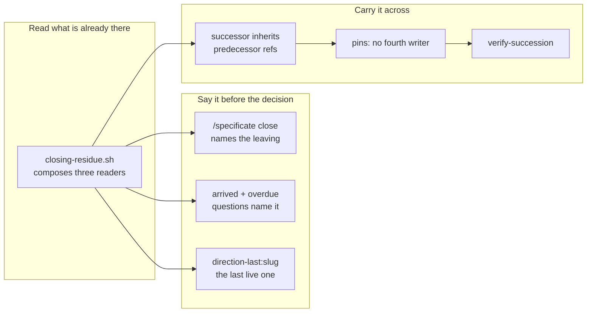

## 1. Overview

Every reading in the direction layer was bounded to `status: active`, so ending a direction ended the loop with it: `/propose` refuses `not_active`, the inbox empties, and the only signal was `direction-none`, addressed to nobody. This branch makes the boundary a turn instead of a stop — what a direction leaves is composed and stated *before* the operator decides, and a successor they announce inherits the predecessor's citation so the attribution walk carries straight across.

**Highlights:**

1. `closing-residue.sh` composes the three readings that already existed; no second walker, no relation, no field.
2. `/specificate`'s close and `/moderate`'s `arrived` / `overdue` questions both state the leaving — and the **last live** direction is now named to its owner before the silence.
3. A successor announced by explicit predecessor slug carries that predecessor's own `feedback:` refs, so `/propose` resumes on the next tick.

## 2. Motivation

The direction layer had grown four readings that each answer *is this direction in trouble*, and one — `arrived` — that answers *has it finished*. None of them survived the close. The moment a strategy left `active`, `attributed-work.sh`, `unattributed-work.sh` and `direction-state.sh` all stopped speaking about it, so the one question the operator actually faces (*what am I leaving behind if I end this?*) could be answered everywhere except where it was asked. And once the last direction closed, nothing originated work at all.

The two halves are the same defect read from either side of the boundary. Stating the leaving is what makes the decision informed; carrying the citation is what makes the decision survivable.

## 3. Changes

The work runs in one direction: compose the reading first, then put it in front of the person deciding, then make the decision survivable by letting the next direction inherit what the last one cited. The last three tickets exist because the succession's premise — that it costs no new writer, no relation and no field — is exactly the kind of property a later change loses silently.

### 3-1. Read what a direction leaves behind ([4010b198](https://github.com/qmu/workaholic/commit/4010b198))

`closing-residue.sh <slug>` composes the waiting grains, the residue and the lifecycle state into one object, owning only the assembly. Each block carries its own `readable` flag and reason, a degraded block reports **null** counts, and `exhaustive` is `false` always.

### 3-2. State the leaving at the close ([6f0e1635](https://github.com/qmu/workaholic/commit/6f0e1635))

`/specificate`'s *ended* route reads that composition after `close.sh` returns and names it in the pull-request body and the run report. `close.sh` stays the only writer of an end state and the pull request still does not auto-merge.

### 3-3. Name the leaving in the direction questions ([be437dbc](https://github.com/qmu/workaholic/commit/be437dbc))

`/moderate`'s `arrived` and `overdue` questions both name what the direction never reached beside what no direction claimed, carried onto the row by `direction-state.sh --with-leaving` at no extra read. The named detail rides the heading; only the size rides the body.

### 3-4. Name the last live direction to its owner ([832bcd1b](https://github.com/qmu/workaholic/commit/832bcd1b))

`direction-last:<slug>` fires when exactly one live direction remains, addressed to its assignee. It is silent with more than one, and silent for a direction that already has a non-`live` question this tick. `direction-none` is byte-identical.

### 3-5. Let a direction name its predecessor ([aa85bb6b](https://github.com/qmu/workaholic/commit/aa85bb6b))

A *created* announcement naming an explicit predecessor slug carries that predecessor's own `feedback:` refs onto the successor, composed through `ask-feedback-line.sh --refs-only` and handed to `create.sh` unchanged. Refusals: `strategy_not_found`, `predecessor_active`, `no_predecessor`.

### 3-6. Pin the succession's writer and field cost ([11015296](https://github.com/qmu/workaholic/commit/11015296))

The suite asserts the attribution reads through the succession, that the artifact still has exactly three writers, and that `create.sh` learns nothing about it — each detection exercised against planted breakage in the same run.

### 3-7. Drill the succession end to end ([7ccb45f8](https://github.com/qmu/workaholic/commit/7ccb45f8))

`verify-succession` walks all six seams over a git-backed fixture with no network and asserts the negatives too. It also repairs `verify-arrival` and `verify-direction-health`, whose state extractor had been silently defeated by a nested field since 2026-08-28.

## 4. Outcome

A direction's end is now legible on both sides of it: the operator sees what they are leaving at the moment they decide, and the successor they announce inherits the citation that keeps the loop originating work. The strategy artifact still has exactly three writers, no artifact gained a field, and the retired `strategy:` relation stays retired.

## 5. Concerns

### The last-live question fires on a healthy single direction

- **Severity:** low
- **Description:** `direction-last:<slug>` fires whenever exactly one live direction remains, including a perfectly healthy one; it is bounded to once per slug by the asked-once ledger, but a repository that habitually runs one direction at a time will see it for each (see [832bcd1b](https://github.com/qmu/workaholic/commit/832bcd1b) in `plugins/workaholic/skills/moderate/scripts/step-direction-health.sh`)
- **How to Fix:** If it proves noisy, narrow it to a direction that is also `arrived` or within N days of its `target_date` — measure before narrowing, since the reading exists precisely to arrive *before* the close

### The leaving is composed per row under `--with-leaving`

- **Severity:** low
- **Description:** `direction-state.sh --with-leaving` spawns one `closing-residue.sh` per surveyed row; each is pure JSON reshaping over data already in hand, but the process count grows with the active set (see [be437dbc](https://github.com/qmu/workaholic/commit/be437dbc) in `plugins/workaholic/skills/strategy/scripts/direction-state.sh`)
- **How to Fix:** Fold the loop into a single `jq` invocation if a repository ever carries enough live directions for it to matter; the flag is opt-in, so no existing caller pays for it today

## 6. Successful Development Patterns

- Handing a computed row **back** to the composing script (`--state-row`) keeps an assembly single-sourced without recursion — the alternative, re-deriving it in the consumer, is exactly how two readings of one fact drift.
- Repairing a drill's extractor revealed two verifications that had been silently passing nothing for a day: a parser that keys on field *adjacency* fails invisibly the moment a nested object joins the row.

## 7. Notes

`doc-drift.sh` reports one structural change with no doc candidate (`mission-lens.sh`, removed on `main` before this branch); `area-freshness.sh` reports no retired terms. The branch scan's only finding is one `override`-tier `too-large-commit` — the first archive commit carries the shared implementation, which is the shape of a seven-ticket unit driven in one pass.
