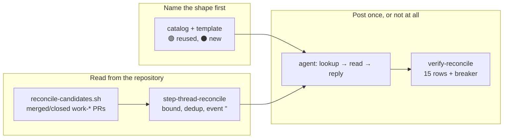

## 1. Overview

A finish line is posted by the run that **finishes** a unit, so when a person merges or closes a handed-off pull request by hand it is posted by nobody: the item's Slack thread keeps `🔵 Proposed` or `🟡 Handoff` as its last word while the work is long merged. No step could see it — `stuck-prs` and `merge-conflicts` read **open** pull requests, `handoff-units` a standing claim, `stalled-units` a stale tip. `/moderate` gains a twenty-third step that names those items from the **repository**, reads each thread before writing, and posts the missing finish exactly once.

**Highlights:**

1. The candidate set is repository-derived, never a channel scan — `workaholic:notify` forbids a full-channel read at any point.
2. The narrowing is what keeps this from being `[Consent]` again: only a `🔵`/`🟡`-ended thread is a candidate, and a `🟢`-ended one is never touched.
3. The idempotence is **structural** — the agent reads the thread before it writes — so there is no cursor and no second ledger.

## 2. Motivation

An operator hand-finished several handed-off units in a terminal on 2026-08-28: merged the pull requests, executed the delegated decisions. Every affected thread went on calling those units in flight, because the seam that posts a finish is the driving run itself and a manual takeover bypasses it entirely.

The measurement is what shaped the design. Over a 7-day window on this repository, 90 closed `work-*` pull requests, 40 resolving to a feedback stem, and **19 merged by a person rather than by the loop** — a real, recurring set. The two human merges inside a 3-day window resolve to no feedback record at all: hand-written `/ticket` units, keyed on `unit:<id>`, with no thread to reconcile. That distinction is why the reader reports them by name instead of dropping them.

## 3. Changes

The order is forced by the ceiling rule: no session may post a shape its routine prompt does not name, so the catalog gates the whole mission. Then the repository-derived reader, then the step that bounds it, then the agent's contract, then the drill that proves the bounds.

### 3-1. Read which announced items may still be called in flight ([1c14ddc0](https://github.com/qmu/workaholic/commit/1c14ddc0))

`reconcile-candidates.sh` is a pure read naming the recently merged or closed `work-*` pull requests the loop itself opened, each resolved to its feedback stems through `unit-feedback-stems.sh` — still the one translation. A branch resolves to its artifacts from three **local** sources (its merge commit's diff, the branch-keyed ticket archive, the story's `mission:` relation), so a `/specificate` proposal resolves through the refs its mission carries by the carry floor. Both bounds are configurable and reported, and an unreadable read is `ok: false` with its reason and exit 0 — never an empty candidate list.

### 3-2. Name the reconciliation reply, once, in the catalog ([c80e669b](https://github.com/qmu/workaholic/commit/c80e669b))

The merged form **reuses `🟢 Implemented`**, marked by its sentence rather than a fifth finish colour; `⚫ Closed` is genuinely new, because *closed* and *merged* ask a reader for different things. Both name by whom and when, both carry no mention token, and an unresolved author or time is stated as unresolved. `[Consent]`'s retirement is answered by name and not reversed: that routine announced **every** human merge, this corrects only a thread still calling the unit in flight.

### 3-3. Add the thread-reconcile step to the tick ([cdb85c0e](https://github.com/qmu/workaholic/commit/cdb85c0e))

The step subtracts what an earlier tick settled, bounds the remainder at `WORKAHOLIC_RECONCILE_READ_MAX` newest-first with the rest reported, and hands the thread reads back in `needs_agent`. Its `event` is **always empty**, following `unanswered-asks` for its reason, so a tick that reconciles nothing renders no root line. It never reaches `plan-units.sh`, which stages what its living migrations converge.

### 3-4. Post the missing finish reply, exactly once ([3a69f8f3](https://github.com/qmu/workaholic/commit/3a69f8f3))

Five numbered acts per candidate: the stateless lookup (two queries, no channel history, fuzzy matching prohibited), **read the thread before writing anything**, post the catalog's shape without inventing an author or a time, record one `thread-reconcile-filed` line and persist again, and report exactly one outcome. **Case 4 is refused by name** — no thread found means the loop never announced this item, and a description root would announce a merge nobody was ever told about.

### 3-5. Drill the reconciliation with no network ([d84fbd6c](https://github.com/qmu/workaholic/commit/d84fbd6c))

`verify-reconcile` runs fifteen load-bearing rows over a git-backed fixture with a stubbed transport, including a breaker row that wires the candidate reader at the **channel** and must fail. Building the fixture honestly surfaced two real defects, both fixed here: a tab is IFS whitespace, so a closed-unmerged pull request read as `merged`; and a closed-unmerged unit is invisible to every local source, which made `⚫ Closed` a shape nothing could reach.

## 4. Outcome

A thread stops calling a unit in flight once the pull request it names has merged or closed, and it is corrected in that thread, once, by a post addressed to whoever follows the item. Nothing is merged, closed, reopened or claimed; the tick still writes nothing into the tree but its own log line; and the two shapes are named once, in the catalog, with the routine template's copies pinned against drift.

## 5. Successful Development Patterns

- **Building the drill fixture honestly is what found the bugs.** A fixture that merged the "closed" unit would have hidden both defects — the IFS collapse and the unreachable `⚫ Closed` shape. The rule that pays here is: model the state you claim to handle, not the state that is easy to build.
- **A reused lead line needs a block-level pin.** The merged reply reuses `🟢 Implemented`'s first line deliberately, so the catalog↔template drift check had to key on the two-line block. A later shape that reuses a lead carries the same obligation.
