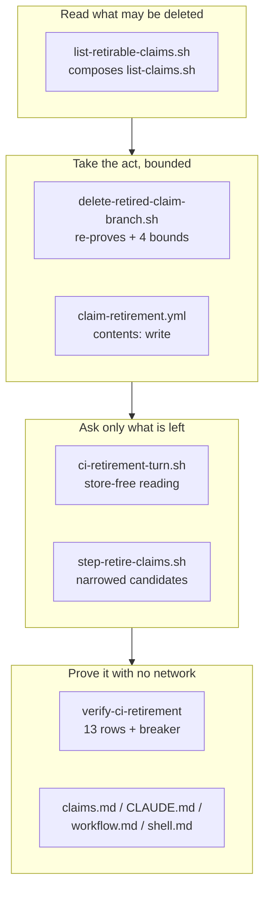

## 1. Overview

The loop proves a claim `superseded`, closes its pull request, and is refused the branch delete by
a session-type 403 both transports agree on — so the claim never leaves the table. This branch
moves that act to where the write is permitted: a workflow running the same REST seam.

**Highlights:**

1. A different **executor** takes Act 2 — not a second transport; the measured 403 finding stays.
2. The proof is **re-taken at the act** and bounded four ways, by two independent guards.
3. `retire-blocked:` fires only once CI has also refused, on a **store-free** reading.

## 2. Motivation

The retirement built on that proof shipped complete — close the pull request, delete the branch,
reap the worktree — and Act 2 then failed on every tick. Measured 2026-08-27 in a routine-fired
container: `git push origin --delete` answers `RPC failed; HTTP 403`, the REST ref-delete answers
*"Write access to this GitHub API path is not permitted through this proxy"*, and an ordinary push
of the same branch succeeds.

The previous mission closed that question honestly and inside the box, naming the blocked act and
asking its holder. But unmerged remote branches *are* the claim oracle, so the table went on
growing and the step reported `0 retired` hour after hour. This repository had answered the same
shape once, when the release-note write moved to `release-note-draft.yml`: the act did not need a
new transport, it needed a different executor.

## 3. Changes

The candidate set came first, because nothing could act without one that stayed the oracle's. The
bounded act followed, then the workflow that calls both. Only then could the question narrow —
it had to be able to read whether CI had had its turn. The rendering fix and the drill closed the
loop, and the documentation was corrected last, including one correction its own ticket predicted
would not be needed.

### 3-1. Derive the CI retirement candidate set ([5bd6ddfb](https://github.com/qmu/workaholic/commit/5bd6ddfb))

`list-retirable-claims.sh` composes `list-claims.sh` — one walk of the refs, never a second
oracle — and answers only units whose every claim reads `superseded`, resolved through the
library's live-row rule over a TSV projection of the reader's own rows. A degraded scan yields no
candidates **and its reason**, in `step-retire-claims.sh`'s existing vocabulary.

### 3-2. Re-prove the verdict inside CI and bound the act ([8d722586](https://github.com/qmu/workaholic/commit/8d722586))

`delete-retired-claim-branch.sh` re-runs the scan and re-derives the verdict immediately before
the delete, refusing every other verdict by its own word and `ambiguous_claim` / `unanswerable`
as their own. Four bounds sit on top of the proof — `release_branch`, `not_a_work_branch`,
`not_on_base`, `pull_request_open` — and every path exits 0.

### 3-3. Add the workflow that deletes retired branches ([e394f10c](https://github.com/qmu/workaholic/commit/e394f10c))

`claim-retirement.yml` holds `permissions: contents: write` and nothing wider, triggers on push to
`main` plus `workflow_dispatch` (the container cannot dispatch one either), defines its own
full-history checkout with every remote head, and owns no proof logic — it calls the reader and
the bounded act.

### 3-4. Narrow the blocked question to what CI refused ([b82670e8](https://github.com/qmu/workaholic/commit/b82670e8))

`ci-retirement-turn.sh` answers `taken` / `pending` / `unavailable` from a completed workflow run
at the base tip — store-free, because a successful CI turn deletes the branch and so removes the
claim row itself. Only the candidate set narrows; the key, gate, addressee, cap, holds and summary
stability are byte-identical.

### 3-5. Report which executor took the branch delete ([95937a55](https://github.com/qmu/workaholic/commit/95937a55))

A delete this tick performed renders as *branch deleted here* and one it found already done as
*branch removed elsewhere*, derived from two states already on the row. `retire-claim.sh` is
byte-identical and a `deleted_by:` field is refused.

### 3-6. Drill the CI retirement with no network ([cfcd2359](https://github.com/qmu/workaholic/commit/cfcd2359))

`verify-ci-retirement` runs thirteen load-bearing rows over a local bare origin whose `update`
hook refuses the container's push-delete while the stubbed REST transport performs CI's for real —
the two executors told apart by transport, which the header states is the fixture's distinction
rather than GitHub's.

### 3-7. Document which act of the retirement runs where ([fc7e7725](https://github.com/qmu/workaholic/commit/fc7e7725))

`claims.md` gains a *Which act runs where* section with the per-act executor table; `CLAUDE.md`,
`moderate/reference/workflow.md` and two script headers follow. The measured 403 table is
preserved verbatim with its scope made explicit.

## 4. Outcome

A claim the loop proves empty leaves the table with nobody touching anything: the pull request
closes in the container, CI deletes the branch, the worktree is reaped. The operator is asked only
when CI was refused too — and `superseded` stays a proof, no verdict word was added, and
`retire-claim.sh` is unchanged.

## 5. Concerns

### The workflow's own clean-no-op run is unverified until this merges

- **Severity:** moderate
- **Description:** the ticket's gate asked for one `workflow_dispatch` run over a branch with no superseded claim; a dispatch is refused through the same proxy that refuses the delete, so it is runnable only after merge (see [e394f10c](https://github.com/qmu/workaholic/commit/e394f10c) in `.github/workflows/claim-retirement.yml`)
- **How to Fix:** after merge, watch the first `push: main` run — or dispatch one — and confirm it exits clean over an empty candidate set; the drill covers the empty and degraded paths but not the runner

### The concern this branch answers is left open on purpose

- **Severity:** low
- **Description:** `20260827115923-a-superseded-claim-is-closed-but-its-branch-cannot-be-deleted...` is what this work repairs, but its own measurement is a real container tick, which cannot be taken here (see [fc7e7725](https://github.com/qmu/workaholic/commit/fc7e7725) in `plugins/workaholic/skills/drive/reference/claims.md`)
- **How to Fix:** let the next story judge it against a tick that ran after this merged — a false `resolved` loses the memory, a false `still_active` merely re-surfaces

### One archive commit exceeds the per-commit size ceiling

- **Severity:** low
- **Description:** `too-large-commit` — 1195 added lines against a 500 ceiling on the first archive commit, which carried three new scripts, the drill and the documentation together (see [5bd6ddfb](https://github.com/qmu/workaholic/commit/5bd6ddfb))
- **How to Fix:** nothing here; an `override`-tier finding is a granularity nudge and the line count is the shape of the work — the ticket-per-commit seam bundles a new script with the tree it lands in

## 6. Successful Development Patterns

- Writing the breaker row *first* found a real property: it did not break against the verdict gate alone, which is how the two halves of the re-proof were discovered to be independent guards rather than one rule written twice.
- Treating "confirm document X needs no change" as a prediction to test rather than a step to tick caught a stale sentence in `rules/shell.md` — the measurement stayed true while the consequence drawn from it did not.
- Choosing `head_sha` over a timestamp for "has CI had its turn" removed a clock, a timezone and date parsing, and answered the question actually being asked rather than a proxy for it.

## 7. Release Preparation

**Verdict**: Ready for release

- **After release:** confirm the first `Claim Retirement` run on `main` is a clean no-op, and that the next `/moderate` tick's `retire-claims` line reflects it.
