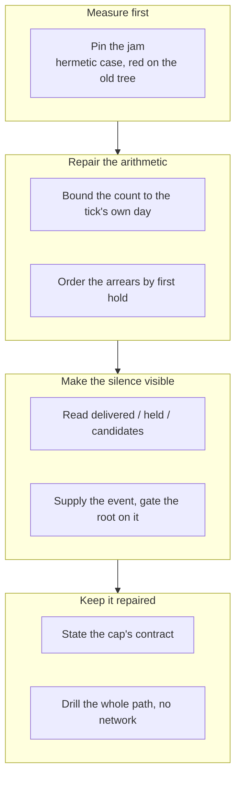

## 1. Overview

The loop's one path from a machine finding to a person was jammed: `ask-question.sh` named its
all-time count `asked_today`, so every question was refused `day_cap` once the total crossed the
cap while the tick reported `ok` and posted nothing. The count is now bounded to the tick's own
quiet-hours day, the arrears come back oldest-held first, and a tick that reached nobody supplies
its own event.

**Highlights:**

1. `day_cap` counts the current `WORKAHOLIC_QUIET_TZ` day — one derivation, no new reader, no cursor.
2. `held` drains by the day each key was first held, deterministically.
3. A `cap_spent` or `cap_unbounded` tick is the root's third gate, beside the question gate and the morning digest.

## 2. Motivation

The `/moderate` tick is the only surface here that names a person, and its budget rested on one
expression: `count_log_prefix human-checkin-ask ""`, which asks `log-read.sh` for every day file
it has. The log is append-only and never pruned, so that number only ever grew — measured at 12
across 5 days against a cap of 10, the same reader bounded to the current Asia/Tokyo day
answering 0.

Two further faults made the jam invisible rather than merely costly: the held set was collected
alphabetically, in an order with no relation to age, and the step supplied no `event` at all, so
a tick with 22 candidates and zero delivered posted nothing — byte-identical to a quiet hour, for
eight consecutive ticks, with a red base, a 31-hour declared handoff, three undeletable branches
and seven undrivable units held behind it.

## 3. Changes

The branch reproduced the reported failure before touching it, repaired the arithmetic and then
the ordering that arithmetic had been hiding, made the tick able to say it had delivered nothing,
and closed with the contract written down and a drill that walks the whole path offline.

### 3-1. Pin the day-cap jam with a failing test ([311590c6](https://github.com/qmu/workaholic/commit/311590c6))

A hermetic case builds a fixture through `log-append.sh` — twelve asks across five earlier days,
none on the tick's own day — and expects a fresh key to be asked. It was committed **red**, with
`reason: "day_cap"` and `asked_today: 12` in its output, so the repair is measured rather than
asserted.

### 3-2. Bound the day count to the quiet-hours day ([48772bc5](https://github.com/qmu/workaholic/commit/48772bc5))

`ask-question.sh` derives the day once, beside the gates that already derive the hour and the
weekday, and passes it to `log-read.sh`'s existing `--since`. The `outstanding` re-ask branch
printed the same unbounded number into both `asked_this_tick` and `asked_today`; those are now
the tick count and the day-bounded count.

### 3-3. Drain a held backlog oldest-held first ([59cc9f37](https://github.com/qmu/workaholic/commit/59cc9f37))

`held` is ordered by the day each key was **first** held, tie-broken on tick id then key under
`LC_ALL=C`, so the order is total and a re-entered tick is byte-identical. The step orders; it
caps nothing and asks nothing.

### 3-4. Read what the check-in delivered and held ([829a2ab3](https://github.com/qmu/workaholic/commit/829a2ab3))

The step reports `delivered`, `held_count` and `candidates`, and names why it delivered nothing —
`cap_spent`, `cap_unbounded`, `all_held`, `all_asked_before`, `no_candidates`. Whether it could
deliver is asked of the gate through one probe recorded nowhere, so the day's arithmetic keeps
one home.

### 3-5. Make a tick that reached nobody an event ([64f8b8b8](https://github.com/qmu/workaholic/commit/64f8b8b8))

`cap_spent` and `cap_unbounded` supply an `event`, and `render-tick-post.sh` gains a third gate
beside the morning digest — set inside the diff loop, so an unchanged reason is said once and the
line stops entirely once the channel is delivering.

### 3-6. State the day cap's contract where it is read ([0a1d7ff2](https://github.com/qmu/workaholic/commit/0a1d7ff2))

The moderate SKILL, its workflow reference, the notify catalog and `CLAUDE.md` state which day the
cap counts, whose zone, that a spent cap holds, and that a held question is re-offered
oldest-first — with the measured failure, the repair and the rejected alternatives recorded.

### 3-7. Drill the check-in delivery path with no network ([20909a08](https://github.com/qmu/workaholic/commit/20909a08))

`verify-checkin-delivery` walks gate → ordering → step → event → root over one fixture log, with
no network, no `gh` and no Slack post, and carries a breaker row written against the **count** so
a refactor that keeps the gate's output shape and loses the bound still fires it.

## 4. Outcome

The check-in delivers again: a held question is asked, the arrears drain in the order they went
stale, a genuinely spent day still holds, and a tick that reaches nobody says so once. The cap
was kept, not raised.

## 5. Concerns

### `render-tick-post.sh` was modified against ticket 3's stated Gate

- **Severity:** moderate
- **Description:** the ticket's Gate said `render-tick-post.sh` and the question gate are unmodified, but its by-name `human-checkin` skip and the zero-question post gate together made the acceptance unreachable (see [64f8b8b8](https://github.com/qmu/workaholic/commit/64f8b8b8) in `plugins/workaholic/skills/moderate/scripts/render-tick-post.sh`)
- **How to Fix:** nothing to fix in the code — the deviation is recorded in that ticket's Final Report, the question gate's own expression is byte-identical, and the retired changed-step half is not reintroduced; a reviewer should confirm the third gate is the shape they want

### `cap_spent` renders a line on a day the budget worked

- **Severity:** low
- **Description:** the event fires on `cap_spent` as well as `cap_unbounded`, so a genuinely spent day posts one line saying the cap worked — close to a status line, which this repository has retired twice (see [64f8b8b8](https://github.com/qmu/workaholic/commit/64f8b8b8) in `plugins/workaholic/skills/moderate/scripts/step-human-checkin.sh`)
- **How to Fix:** it is kept because a reader must be able to tell `cap_spent` from `cap_unbounded`, and the diff means it is said at most once a day; if it proves noisy, narrow the event to the non-`cap_spent` reasons

### `cap_unbounded` is unreachable on the repaired tree

- **Severity:** low
- **Description:** with the day bound in place the reason is only reachable when `ask-question.sh` is missing outright, so it is exercised by the suite against a scripts copy with the gate removed (see [829a2ab3](https://github.com/qmu/workaholic/commit/829a2ab3) in `plugins/workaholic/skills/moderate/scripts/step-human-checkin.sh`)
- **How to Fix:** keep it — a reason that exists only while a bug does is the reason that gets dropped and then silently reintroduced; the pinned case is what stops that

## 6. Successful Development Patterns

- Committing the reproduction **red** before the repair proved the fix against the reported failure rather than against the fix's own shape — and caught two fixture faults (a per-tick ceiling reached first, a malformed tick id writing nothing) that would have made later rows pass for the wrong reason.
- Asking the gate what it would do, instead of re-deriving its arithmetic in the reading, kept one home for the day bound — the two cannot disagree, and the suite pins that the step never recomputes it.
- Setting the root's new gate flag **inside** the existing diff loop made "do not restate" free: it can only be set for a reading that already survived the hour-to-hour diff.

## 7. Notes

Two documentation defects predating this mission were fixed in passing: the workflow reference
and the notify catalog both still described the root gate's changed-step half, retired 2026-08-22.
