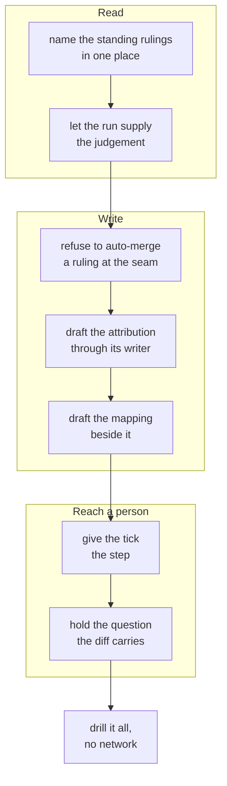

## 1. Overview

Two rulings the loop cannot make itself — which direction an unattributed mission answers, and which account an unmapped address belongs to — were surfaced as hourly questions whose repair was a hand edit of `main`. They now arrive as one pull request carrying the proposed diff and its evidence: merging is the ruling, closing is the refusal.

**Highlights:**

1. `list-standing-rulings.sh` composes both readings into one candidate set and **judges nothing** — the run hands in one answer per subject.
2. `publish-tree-pr.sh` derives `ruling_touching` from the tree and refuses to merge a ruling whatever `WORKAHOLIC_AUTO_MERGE` says.
3. The tick drafts at most one open ruling at a time and holds exactly the question that diff already carries.

## 2. Motivation

`unattributed-work.sh` has named the active missions no direction claims since 2026-08-28, and `audit-identity-coverage.sh` has named the addresses no mapping entry covers since 2026-08-26. Both findings reached a person as a question — `direction-arrived:<slug>` and `undrivable-unit:<path>` — and both questions named a repair the operator had to perform **by hand on `main`**: editing a mission's `feedback:` line, completing a line in `.claude/git-identities`. That was the one act this repository still left to a person editing the base directly, and it is exactly what `amend.sh` was admitted to remove for the strategy artifact.

The cost was measurable rather than theoretical: five tickets stamped an unmapped address had been undrivable by every runner since 2026-08-21, and four active missions read `attributed: false` while the direction they answer read `quiescent`. An hourly question about a repair nobody performs is a question that stops being read.

## 3. Changes

The branch runs read → write → reach, with the seam's refusal deliberately landed **before** the first writer: a drafting caller that existed while a machine could still merge its output would be the one failure this work cannot tolerate. The two readings are composed first and left unjudged; the judgement enters as an input the run supplies; only then does anything write, and it writes through the single writer that already owned each line. The last ticket makes the whole path provable on demand rather than by waiting for a tick.

### 3-1. Name the standing rulings in one place ([17f4c9cb](https://github.com/qmu/workaholic/commit/17f4c9cb))

`moderate/scripts/list-standing-rulings.sh` composes `unattributed-work.sh` and `audit-identity-coverage.sh` into one candidate set, each entry carrying its kind, subject, the evidence its own reader already stated, and the exact one-line repair. It walks nothing itself; a degraded source contributes no entries and reports **null** counts rather than zeroed ones.

### 3-2. Let the run supply the judgement per candidate ([1e005b13](https://github.com/qmu/workaholic/commit/1e005b13))

The reader gained `--judgement <subject>=<answer>` in `survey-strategies.sh --aim-kind`'s shape: it stores an answer it was handed and derives none. Absent the flag the output is byte-identical to what the previous ticket shipped. An unjudged candidate reads `undecided` and reaches no writer; a subject the reader did not surface is refused `subject_not_surfaced`.

### 3-3. Refuse to auto-merge a ruling at the seam ([53dae4a3](https://github.com/qmu/workaholic/commit/53dae4a3))

`publish-tree-pr.sh` derives `ruling_touching` from the tree it is publishing — a mission **already on the base** whose diff moves its `feedback:` line, or any touch of `.claude/git-identities` — and leaves the pull request open whatever the caller asked for. The test is on the shape of the change rather than the directory, because a brand-new mission is what every `/specificate` proposal writes.

### 3-4. Draft the attribution rulings through their writer ([4d0f3be4](https://github.com/qmu/workaholic/commit/4d0f3be4))

`draft-standing-rulings.sh` opens a publish tree, reads the candidates inside it, and runs `carry-attribution.sh` once per judged mission. That writer is unmodified: it still appends only refs the named strategy already cites, touches no strategy file, and writes nothing on any refusal — each of which is reported by name.

### 3-5. Draft the mapping ruling beside them ([875c5158](https://github.com/qmu/workaholic/commit/875c5158))

A judged address is appended to `.claude/git-identities` as a **live** line, with the git history that supports the judgement stated in the pull-request body. A login the mapping already names gains the address as another of its own, because `identity.sh` takes the first matching row and a second one would resolve the address to itself. Every write is asserted append-only and reverted from the pre-image otherwise.

### 3-6. Give the tick the standing-rulings step ([c62ee2be](https://github.com/qmu/workaholic/commit/c62ee2be))

`step-standing-rulings.sh` joins `run.sh`'s `STEPS` beside the two steps whose findings it settles. `list-open-rulings.sh` is the brake — at most one open ruling at a time, read off the open pull requests with no cursor — and an unreadable brake drafts nothing. The step writes nothing and never reaches `plan-units.sh`.

### 3-7. Suppress the question the ruling diff carries ([1f47e97e](https://github.com/qmu/workaholic/commit/1f47e97e))

`ruling-suppression.sh` is the one reader both steps consult. `undrivable-units` holds and counts a candidate whose address a ruling names; `direction-health` holds an `arrived` reading only when a ruling names **every** mission in its residue. `ask-question.sh` is unmodified, and a subject still asked says the loop could not judge it.

### 3-8. Drill the ruling path with no network ([a0461e8f](https://github.com/qmu/workaholic/commit/a0461e8f))

`sh scripts/e2e/loop-drill.sh verify-rulings` walks the whole path over a bare local origin with `gh` stubbed. Its breaker has two halves — one active direction beside one unattributed mission fires the first if any inference is wired in; `WORKAHOLIC_AUTO_MERGE=1` set fires the second if the seam's refusal is deleted — and both were run deliberately broken and both fired.

## 4. Outcome

An operator ruling that used to require editing `main` by hand now arrives as a diff with its evidence beside it. Nothing is proposed twice while one is open, a degraded read proposes nothing, and no machine can merge a ruling: the seam refuses it from the tree rather than trusting a caller to leave a variable unset.

## 5. Concerns

### A ruling's judgement is unrecorded, so an undecided subject cannot say why

- **Severity:** low
- **Description:** The run's judgement is an input and is stored nowhere, so a question that survives an open ruling can say only that a ruling exists and does not name this subject — not *why* the loop could not judge it (see [1f47e97e](https://github.com/qmu/workaholic/commit/1f47e97e) in `plugins/workaholic/skills/moderate/scripts/step-undrivable-units.sh`)
- **How to Fix:** Leave it unrecorded unless the vaguer wording proves unhelpful in practice; a stored reason would be the cursor this design refuses at every equivalent seam.

### The mapping ruling extends an existing entry, which the ticket's wording did not anticipate

- **Severity:** moderate
- **Description:** "No existing entry is rewritten or removed" is honoured as *no existing address is replaced, dropped or reordered*, because a second line for a login the mapping already names would resolve the address to itself and leave `owns.sh` answering `other` — the defect being repaired (see [875c5158](https://github.com/qmu/workaholic/commit/875c5158) in `plugins/workaholic/skills/moderate/scripts/draft-standing-rulings.sh`)
- **How to Fix:** None needed unless the operator disagrees with the reading; the append-only assertion over the whole file is what bounds it, and `login_ambiguous` refuses the case it cannot resolve.

## 6. Successful Development Patterns

- Landing the seam's refusal **before** the first writer meant no revision of this branch could merge a ruling by accident — ordering a safety gate ahead of the thing it gates is cheaper than remembering to add it later.
- Writing each breaker against the **behaviour** rather than the output shape: the drill's fixture holds exactly one direction beside exactly one orphan, so any inference fires it however it is spelled.
- Three documents asserted "the seam cannot see an attribution carry"; the ticket that made it false found all three by grepping the claim rather than the script name.

## 8. Notes

`version` moved to 1.0.245. `retired-terms.md` is flagged by `area-freshness.sh` for naming retired terms — which is that record's job — and is untouched by this branch.
