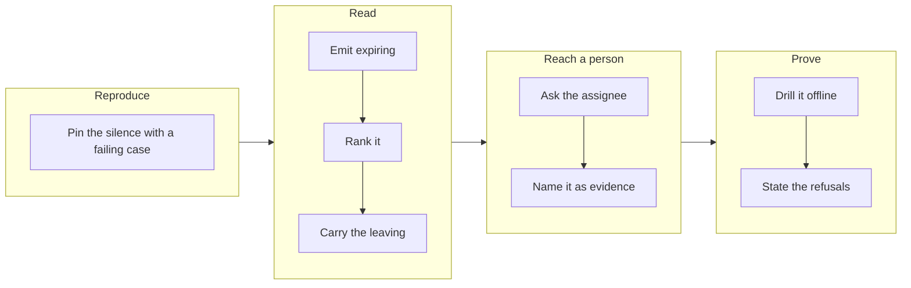

## 1. Overview

Every reading in the direction layer answered backwards, so a direction was silenced by its own
`target_date` with nobody warned. This branch adds **`expiring`** — the one reading that looks
forward — ranks it in the lifecycle precedence, and asks the assignee once, before the date.

**Highlights:**

1. `expiring` rides every surveyed row and introduces no threshold: both its terms were already there.
2. It is ranked between `overdue` and `dormant`, with both neighbours argued rather than asserted.
3. It gates nothing — a hermetic diff proves no refusal, sort, selection or token moves across the boundary.

## 2. Motivation

`past_target_date` is the gate that stops `/propose` originating work, and nothing warned anyone
it was coming. `late` asks whether nothing has landed, `overdue` whether the date has gone,
`dormant` whether anything is answering, `arrived` whether the work is all in — four readings,
all backwards. Measured on `an-autonomous-improvement-loop-run-by-the-routines` at the hour the
ask was written: `days_to_target: 2`, `pace: on_course`, `overdue: false`, `dormant: false` —
every reading healthy, two days from silence, and the only later signal asked in arrears.

## 3. Changes

The mission was driven red-green: the silence was reproduced and pinned before anything was
built for it, the reading was then emitted, ranked and given its evidence, carried to a person,
and finally drilled and documented.

### 3-1. Reproduce the silent expiry and pin it ([3dc26ad0](https://github.com/qmu/workaholic/commit/3dc26ad0))

A git-backed case walks survey → `direction-state.sh` → `step-direction-health.sh` for a
direction one day from its date, and failed on exactly one assertion: no reading named the
approaching date. The arrears half passed from the start and still does.

### 3-2. Emit expiring on every surveyed row ([d5e001fa](https://github.com/qmu/workaholic/commit/d5e001fa))

`survey-strategies.sh` emits `expiring` before `refusal`, on eligible and refused rows alike,
`true` exactly on `0 <= days_to_target <= $window_days`. The refused case is the point: a
direction with a date approaching normally has work in flight.

### 3-3. Rank expiring in the lifecycle reading ([db08748d](https://github.com/qmu/workaholic/commit/db08748d))

`direction-state.sh` places it between `overdue` and `dormant` and argues both neighbours: a
date that has gone is the stronger fact and asks for the same act; a silent direction near its
date is silenced by the date first.

### 3-4. Carry the leaving onto the expiring row ([d67c45cb](https://github.com/qmu/workaholic/commit/d67c45cb))

The attachment was already keyed on nothing, so the row carried the leaving the moment the rung
existed. What landed is the proof: counting shims around both walkers measure the flag costing
zero extra reads of the tree.

### 3-5. Ask the assignee once before the date ([91c14feb](https://github.com/qmu/workaholic/commit/91c14feb))

`direction-expiring:<slug>` names the days left, the date and the leaving in its heading, and
the operator's act in one 24-word sentence. Every existing gate, cap and hold applies unchanged.

### 3-6. Name expiring in the run report ([0f668419](https://github.com/qmu/workaholic/commit/0f668419))

`/propose` names it beside a proposal as evidence, in the voice `pace` and `arrived` use. A
hermetic diff over fixtures differing in exactly `days_to_target` proves nothing else moved.

### 3-7. Drill the expiry warning offline ([148b2bfb](https://github.com/qmu/workaholic/commit/148b2bfb))

`loop-drill.sh verify-expiry` drills the chain with no network over dates taken from the run
clock. Its breaker row reads the same fixture through a narrower window, and was proved able to
fail: wiring the window to a constant turns that row — and only that row — red.

### 3-8. State the expiry reading and its refusals ([71b43532](https://github.com/qmu/workaholic/commit/71b43532))

`workaholic:propose`, `workaholic:strategy`, `workaholic:moderate` and `CLAUDE.md` state the
reading, its boundary and what it refuses, each with its reason; `outputs/` regenerated.

## 4. Outcome

- A live, in-date direction near its date now reads `expiring` and reaches its owner, once.
- No gate, sort, refusal, selection or token moved, and the artifact keeps its three writers.
- Ten deferred concerns were judged resolved and superseded in the feedback stream.

## 5. Concerns

### The wording of an asked question can never be improved

- **Severity:** moderate
- **Description:** The asked-once ledger keys on the step id derived from `key`, so an operator already asked `direction-expiring:<slug>` will never see a later, better wording (see [91c14feb](https://github.com/qmu/workaholic/commit/91c14feb) in `plugins/workaholic/skills/moderate/scripts/step-direction-health.sh`)
- **How to Fix:** Accept it as the cost of the asked-once guarantee, or key the ledger on `(step id, body digest)` and bound re-asks — but only with a measured reason, since unbounded re-asking was deliberately removed

### A reading of a clock is one step from a gate on a clock

- **Severity:** moderate
- **Description:** `expiring` is evidence and gates nothing, but the obvious next requests — propose more urgently against an expiring direction, or skip one to leave the operator room — are both plausible and both make the one routine that originates work a function of the clock (see [0f668419](https://github.com/qmu/workaholic/commit/0f668419) in `plugins/workaholic/skills/propose/SKILL.md`)
- **How to Fix:** The refusal is recorded in `workaholic:propose` and pinned by a byte-identical diff; keep the diff assertion keyed on *every* field that differs, not a fixed list of gate names

### The window moves the reading, and no consumer is told

- **Severity:** low
- **Description:** `$window_days` is derived from the survey's `$WINDOW`, so a caller passing a narrower window silently narrows what counts as expiring — correct by design, but no consumer surfaces which window produced a reading (see [d5e001fa](https://github.com/qmu/workaholic/commit/d5e001fa) in `plugins/workaholic/skills/propose/scripts/survey-strategies.sh`)
- **How to Fix:** The survey already emits `window` at top level; a consumer rendering an expiry warning could name it, if a case is ever measured where the default is not what was used

## 6. Successful Development Patterns

- **Reproduce into a failing case before building**: the first ticket left one assertion red, so every later ticket was measured against a test rather than a description.
- **Prove a cost, do not assert it**: wrapping both walkers in counting shims turned "not one extra read" into a number, where a structural assertion would have passed on a refactor that moved the read.
- **A breaker row must be a second read of the same fixture**: no arrangement of dates separates a constant of 14 from a window of 14 — only reading the same tree through a narrower window does.
