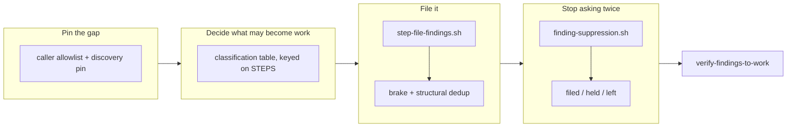

## 1. Overview

`/moderate` had two destinations for a finding — a question to a person, or a feedback record — and neither becomes work, because `[Specificate]`'s unattended entrance reads GitHub **issues**. This branch adds the third destination: a **repairable** finding becomes one `[FB]` issue the loop drives, while a finding needing a human **ruling** still asks, exactly as it did.

**Highlights:**

1. A closed classification table, keyed on `run.sh`'s own `STEPS`, decides which findings may become work — with `needs_ruling` as the default.
2. A brake holds the filing at one open finding issue, and a structural dedup on the shared question id means one finding is filed once, with no cursor anywhere.
3. Once a finding is work, the question it answers is held — keyed on the subject, so no other step's question is silenced.

## 2. Motivation

The tick reads more of the repository every month, and everything it finds ends up in one of two places that no runner surveys. A branch CI could not delete, a diverged channel default, a conflicting pull request: each produced an hourly question or a record, and neither reached `tickets/todo/`. The loop could see its own debt and could not drive it.

The gap is at a seam rather than inside any part: `file-inbound-ask.sh` already opens exactly the issue `[Specificate]` ingests, and `/moderate` already reached it — but from one caller, acting on a *person's* answer. What was missing was a rule for which findings a machine may turn into work on its own, and the machinery to keep that from flooding the inbox.

## 3. Changes

The branch starts by pinning the gap as a test, so the rest is measured against a failing baseline rather than a claim. It then writes the rule (which findings are mechanical), the act (the step that hands them to the filer), and the two bounds that keep an hourly loop from flooding its own inbox. Only once those hold does it quieten the duplicate question and make the three outcomes legible, and it closes with an offline drill whose breaker row fires the moment the safety property is lost.

### 3-1. Pin the gap between a tick finding and the work queue ([0210b5be](https://github.com/qmu/workaholic/commit/0210b5be))

Made the gap a fact a change can lose: an allowlist of every `skills/moderate/` script reaching the one filer, plus a behavioural proof that `[Specificate]`'s discovery derives candidates from the issues endpoint while reading feedback records only to compute `already_captured`.

### 3-2. Classify a finding as repairable or needing a ruling ([8f712e15](https://github.com/qmu/workaholic/commit/8f712e15))

One closed table in `moderate/reference/workflow.md`, keyed on the step id `run.sh` already fixes, with an unclassified step reading `needs_ruling`. The question it asks is **who must act**, never how severe the finding is; a drift pin fails in both directions.

### 3-3. Write the finding-filing step ([7e9003a1](https://github.com/qmu/workaholic/commit/7e9003a1))

`step-file-findings.sh` filters this tick's own step reports to the repairable set and hands them back in `needs_agent`. `run.sh` gained the seam its candidates come from — the accumulated rows, named in `WORKAHOLIC_TICK_REPORTS`, because each step's `event` is the honest finding signal and the tick log does not carry it.

### 3-4. Brake the filing to one open finding issue ([0ebce43b](https://github.com/qmu/workaholic/commit/0ebce43b))

`list-finding-issues.sh` reads the ledger once and answers both halves. `any_open` holds the filing at one in flight, with no cursor; an unreadable ledger files nothing under its own reason, distinct from a held one.

### 3-5. Dedup the filing structurally on the step id ([aba8d48e](https://github.com/qmu/workaholic/commit/aba8d48e))

The key comes from `lib/question-id.sh`, so the filing and the asking cannot disagree about what "the same finding" is. `file-inbound-ask.sh` — still the one writer of a marker — gained `--finding`, mutually exclusive with `--slack-ref` so no issue is claimed by two dedups.

### 3-6. Suppress the question a filing answers ([8c80b0ad](https://github.com/qmu/workaholic/commit/8c80b0ad))

`finding-suppression.sh`, a sibling of `ruling-suppression.sh` under all four of its rules. `retire-claims`, `stuck-prs` and `undelivered-units` consult it; `ask-question.sh` is untouched and never learns what a finding is.

### 3-7. Report what was filed, held and left ([c58d276c](https://github.com/qmu/workaholic/commit/c58d276c))

Three outcomes that must never render alike now do not: `held` names the issue that held each candidate, `already_filed` names the issue that already carries it, and `left` is a count. A tick that filed nothing names which of four reasons applied.

### 3-8. Drill the findings-to-work path offline ([9db572ee](https://github.com/qmu/workaholic/commit/9db572ee))

`verify-findings-to-work` walks classification → brake → filing → dedup → suppression in one offline run, fifteen rows green, with a breaker written against the behaviour rather than a return shape.

## 4. Outcome

The tick's repairable findings now arrive as `[FB]` issues the next `[Specificate]` ingests, at most one in flight, filed once each, with the question they answer held and every other question unchanged. `ask-question.sh`, the caps and the holds did not move; the tick still writes nothing but its own log line, and no artifact gained a field.

## 5. Concerns

### The suppression bites one tick late

- **Severity:** low
- **Description:** `file-findings` runs after the steps whose reports are its candidates, and the agent files after `run.sh` returns — so a finding filed this tick still draws its question in the same tick (see [8c80b0ad](https://github.com/qmu/workaholic/commit/8c80b0ad) in `plugins/workaholic/skills/moderate/reference/workflow.md`)
- **How to Fix:** Nothing, unless it is measured as noise: reordering the run to close the window would put the filing before its own inputs. The contract states the window rather than engineering around it.

### The dedup window is a listing bound, not a date

- **Severity:** low
- **Description:** `list-finding-issues.sh` remembers the most recent `WORKAHOLIC_FINDING_ISSUE_LIMIT` issues, so a finding whose issue has fallen out of that window can be filed again (see [aba8d48e](https://github.com/qmu/workaholic/commit/aba8d48e) in `plugins/workaholic/skills/moderate/scripts/list-finding-issues.sh`)
- **How to Fix:** Raise the bound if it is measured biting. A date window was refused because `date -d` is GNU-only and `date -v` BSD-only, and a reader answering differently on a laptop and in a container is worse than one bounded by a number both can read.

## 6. Successful Development Patterns

- Pinning the gap **first** gave every later ticket a failing baseline to be measured against, and the allowlist it wrote was extended rather than deleted when the filing step landed — a guard written to grow is a guard that survives.
- Two questions about one ledger (*is one in flight* / *has this been filed*) were answered by one reader with two projections, which is what keeps them from drifting; the same shape settled the suppression as a sibling rather than an extension.
- The breaker row was proved able to fail *and* proved able to fail for the **right** reason — its first form went red because the copied tree could not resolve its closure, which looks identical to a working breaker from the outside.

## 8. Notes

Version bumped to v1.0.247; `outputs/` regenerated. `sh scripts/e2e/loop-drill.sh verify-findings-to-work` passes 15/15 with no network, and `node scripts/test-workflow-scripts.mjs` reports 4862 passed, 0 failed.
