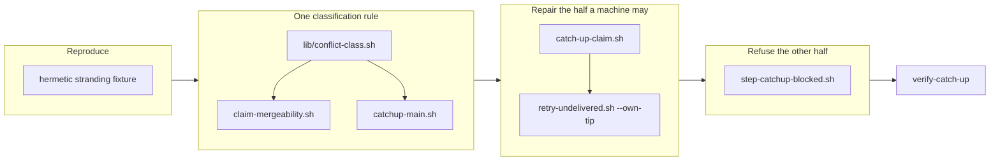

## 1. Overview

`retry-undelivered.sh` re-attempts the **merge** of a unit the loop finished and the transport refused. That is the right act for a refused transport and **no act at all** for a base that has moved: GitHub refuses the same merge every hour, forever. Nothing else looked either — `/moderate`'s `merge-conflicts` step reports a conflicted pull request and says in its own header that it never rebases. This branch adds the reading that tells those apart and the one act that repairs the half a machine may repair.

**Highlights:**

1. One reader answers `clean | mechanical | content | unanswerable` per claim, offline, over a rule shared with the writer that performs the merge — so the two cannot disagree about what a person must decide.
2. One writer merges the base into **this identity's own** claim branch, regenerates, validates and pushes, refusing each of its bounds by its own word with nothing written.
3. The conflict the loop must **not** resolve reaches its claim holder as a question of its own, and the standing no-rebase rule is narrowed with both halves of its reasoning answered rather than dropped.

## 2. Motivation

Measured on this repository on 2026-08-29: **4 of 7 open pull requests conflicting with `main`**, three of them units recorded `report_undelivered` two days earlier, with 4 active missions and 10 queued tickets behind them. Each was finished, green and pushed. Each hour the loop re-attempted its merge, was refused, recorded the refusal and moved on.

The gap is between two vocabularies rather than inside either. The claim protocol answers *whose business is this claim* and had no word for *does the base still accept it*; the maintenance tick answers *which pull requests GitHub calls conflicted* and reports them without ever asking anybody. So a unit could be simultaneously undelivered, unaskable and unrepairable, and the loop's own signal for it — `merge_not_allowed` — is the same word GitHub returns for half a dozen other things.

## 3. Changes

The branch reproduces the stranding first, so everything after is measured against a failing baseline. It then writes the reading and the writer over one shared rule, composes the delivery that follows, refuses the contested case to a person, and closes with the report vocabulary, the narrowing of the standing rule, and an offline drill whose breaker fires the moment the identity bound is lost.

### 3-1. Reproduce the base drift that strands a unit ([eaa1a263](https://github.com/qmu/workaholic/commit/eaa1a263))

A hermetic fixture drives the **real** verdict chain to `report_undelivered`, then pins that the delivery retry attempts the merge and is refused identically every time — and that its refusal is about the merge rather than about the branch being behind, because `merge-reason.sh` has no word for *behind* at all. The absence is pinned as a **closed set** (exactly which scripts may reach `catchup-main.sh`) rather than as "nothing reaches it", so the guard survives the red-to-green transition instead of being deleted by it.

### 3-2. Read whether a claim branch still merges ([18309079](https://github.com/qmu/workaholic/commit/18309079))

`claim-mergeability.sh` answers four values from `git merge-tree --write-tree`, which computes the merge into the object store and touches no worktree, index or ref. All four are **judgements** — a base that moves is exactly a reading that becomes false by looking again — and `unanswerable` never collapses into `content`, because a wrong `clean` pushes a merge nobody proved while a wrong `content` only delays a unit.

The ticket named the one thing to check, and checking it changed the rule. The append-only shape proof does **not** cover the OKF indexes and correctly refuses them: `refresh-index.sh` emits a *sorted* list derived from the tree, so archiving a mission MOVES a line rather than appending one. Measured the same day: all seven live claim branches read `content`, and on the four that were otherwise mechanical the only content paths were `.workaholic/missions/index.md` and `.workaholic/stories/index.md`. So the shared rule gained the three wholly generated index paths by name, and a **proof** for a flat area's half-generated one — mechanical only when neither side changed anything outside the `okf:generated` markers, so nothing a person wrote can be lost.

### 3-3. Catch a claim branch up with the base ([c4b2cc7a](https://github.com/qmu/workaholic/commit/c4b2cc7a))

`catch-up-claim.sh` composes `catchup-main.sh` with the claim protocol's bounds: resolve by the live-row rule, re-derive the verdict at the moment of the act, refuse each bound by its own word writing nothing, attach the worktree through the sanctioned resume mode, merge, regenerate, validate, push. Never a rebase, an amend or a force-push on any path — asserted from the source.

Two things had to change beyond the plan and both are stated rather than absorbed. `catchup-main.sh` gained an opt-in `--resolve-mechanical`, because "routine reconciliation the agent performs itself" was written for a caller with an agent in it; it raises both sides of a version collision to the higher semver and merges normally, rather than taking one side wholesale and silently dropping the other's edits. And `retry-undelivered.sh` gained `--own-tip`, because the fixture proved the catch-up's own push makes the tip fresh and the very next verdict reads `claim_active` — the delivery refused by the act that unblocked it.

### 3-4. Retry the delivery of a caught-up unit ([47c11034](https://github.com/qmu/workaholic/commit/47c11034))

One catch-up, then — **only** on its one success word — one delivery, per undelivered unit per run. A refused catch-up produces no retry, because the refusal is the outcome. The result is reported in §6's **existing** merge vocabulary; no word was invented for *delivered after a catch-up*, which is two facts two vocabularies already report.

### 3-5. Ask about the conflict the loop must not resolve ([4b13a530](https://github.com/qmu/workaholic/commit/4b13a530))

`step-catchup-blocked.sh` asks the **claim holder**, keyed once, naming the branch, the pull request and the files both sides changed. The candidate set is the **reading** rather than a pull request's `mergeable: false`: *nobody has looked yet* and *the loop looked and only you can decide* tell somebody different things. `undelivered-units` filters that reading out of its own candidates and counts it instead — *retry your merge* is the wrong instruction for a branch that no longer merges.

### 3-6. Name the catch-up outcome in the run report ([53600481](https://github.com/qmu/workaholic/commit/53600481))

Three words per undelivered entry, **beside** the merge vocabulary rather than inside it, in `drive/SKILL.md`, `reference/routing.md` and `CLAUDE.md`. A fourth word for *caught up and then delivered* is refused in all three places. The token decision is written down with its reasoning: `catch_up_refused: content_conflict` moves no token, on `claimed_awaiting_verification`'s precedent — a unit waiting on a person's judgement is the gate working.

### 3-7. Drill the catch-up with no network ([2c3db6ac](https://github.com/qmu/workaholic/commit/2c3db6ac))

`verify-catch-up` runs nine load-bearing rows over a bare local origin with `gh` stubbed: the mechanical case delivered with the higher version winning, the content case refused with the branch byte-identical, a scan-held pull request never caught up, a second run a no-op, and the question asked exactly once. The breaker is written against the **behaviour** — a colleague's claim handed straight to the writer, asserted on the branch tip — and was proved able to fail by widening the identity bound.

### 3-8. State the catch-up and its refusals ([b78a6822](https://github.com/qmu/workaholic/commit/b78a6822))

Every copy of the standing rule was found before any was edited, and all five are updated in one change. `step-merge-conflicts.sh`'s header — the fullest statement — has both halves of its reasoning **answered by name** rather than deleted: not a third party (this identity's own claim, a live one refused `claim_active`) and not a rebase (a merge commit keeps the holder's checkout valid). `claims.md` gains the writer's full contract and a third proofs-and-judgements sub-table.

## 4. Outcome

A unit the base moved under is now brought back onto it by the loop itself and delivered in the same turn, and a conflict only a person can judge is refused by name — the branch byte-identical — and reaches its claim holder once, naming what collided. The reading is rendered on every claim row, so a consumer never derives it twice.

Nothing about the protocol's shape moved: no verdict word was added, no artifact gained a field, the proofs-and-judgements classification is unchanged for every existing word, `land-unit.sh` still refuses headless, and `catchup-main.sh` without its new flag is byte-for-byte what it was. Quality is still gated at the `release/*` QA window.

## 5. Concerns

### The mechanical resolution trusts its caller to regenerate

- **Severity:** low
- **Description:** `--resolve-mechanical` resolves a generated path by taking a side, which is only correct because the caller regenerates before pushing (see [c4b2cc7a](https://github.com/qmu/workaholic/commit/c4b2cc7a) in `plugins/workaholic/skills/ship/scripts/catchup-main.sh`). A second caller that passed the flag and skipped the regeneration would push one branch's stale copy of a derived file.
- **How to Fix:** The flag has exactly one caller today and its contract is stated in both headers; the repository's `Outputs Freshness` CI is the backstop. If a second caller ever appears, move the regeneration inside the flag rather than restating the obligation.

### `merge-conflicts` still reports a pull request `catchup-blocked` asks about

- **Severity:** low
- **Description:** Filtering it was written and refused on a measurement: the only way to know which units that step asks about is to read the claim oracle, which fetches — a network read inside a step whose whole cost is one bounded REST call, and inside a hermetic suite whose fixture for it carries a real `origin` URL (see [4b13a530](https://github.com/qmu/workaholic/commit/4b13a530) in `plugins/workaholic/skills/moderate/scripts/step-merge-conflicts.sh`).
- **How to Fix:** Nothing, unless the duplication is measured as noise. The step asks nobody anything, so a person receives exactly one question about such a unit; the refusal and its reason are recorded in the step's own header so it is not re-tried blind.

### The version-manifest resolution assumes one semver per file

- **Severity:** low
- **Description:** Both sides are raised to the higher `"version"` on every key, which is correct because this repository's own rule is that every version in those files carries the same value (see [c4b2cc7a](https://github.com/qmu/workaholic/commit/c4b2cc7a) in `plugins/workaholic/skills/ship/scripts/catchup-main.sh`). A manifest that ever carried two different versions deliberately would be flattened.
- **How to Fix:** Nothing now — the rule is stated in `CLAUDE.md` and the allowlist is three named paths. Were a fourth manifest added with per-entry versions, give it its own resolver rather than widening this one; anything the pre-pass cannot make merge cleanly already falls through to `content`.

## 6. Successful Development Patterns

- The reproduction ticket's "pin the absence" was written as a **closed set** rather than a negation, so it stayed meaningful through the very change that made the absence false — and still fails if a third caller of the merge seam appears.
- Checking the ticket's own stated risk changed the design: the append-only proof does not cover the files that actually collide here, and without measuring that the whole mission would have been a no-op on exactly the concurrent pairs it exists for. The measurement is in the shared library's header, not just in a commit message.
- Two seams had to change that the plan said to leave alone, and both were narrowed by **re-asking an existing derivation** rather than by adding a bypass: `--own-tip` re-runs `claims_scan` with one term collapsed, so identity, ancestry, supersession and the recorded refusal stay computed in one place.
- The drill's breaker asserts on the **branch tip** rather than on a return shape, so a refactor that keeps the JSON and loses the identity bound still fires it — verified by deliberately widening the bound and watching exactly that one row go red.

## 8. Notes

Version bumped to v1.0.248; `outputs/` regenerated. `node scripts/test-workflow-scripts.mjs` reports **4949 passed, 0 failed**; `sh scripts/e2e/loop-drill.sh verify-catch-up` passes 9/9 with no network; `verify.mjs`, `validate-metadata.mjs` and `layout-doctor.sh` are clean.

The reader and the writer were also proved to agree **live**, on the real stranded branch `work-20260826-134108`: the reader answered `mechanical` and a real `catchup-main.sh` run resolved all six conflicts, with the manifest converging on the higher semver and the regeneration leaving a clean tree.
