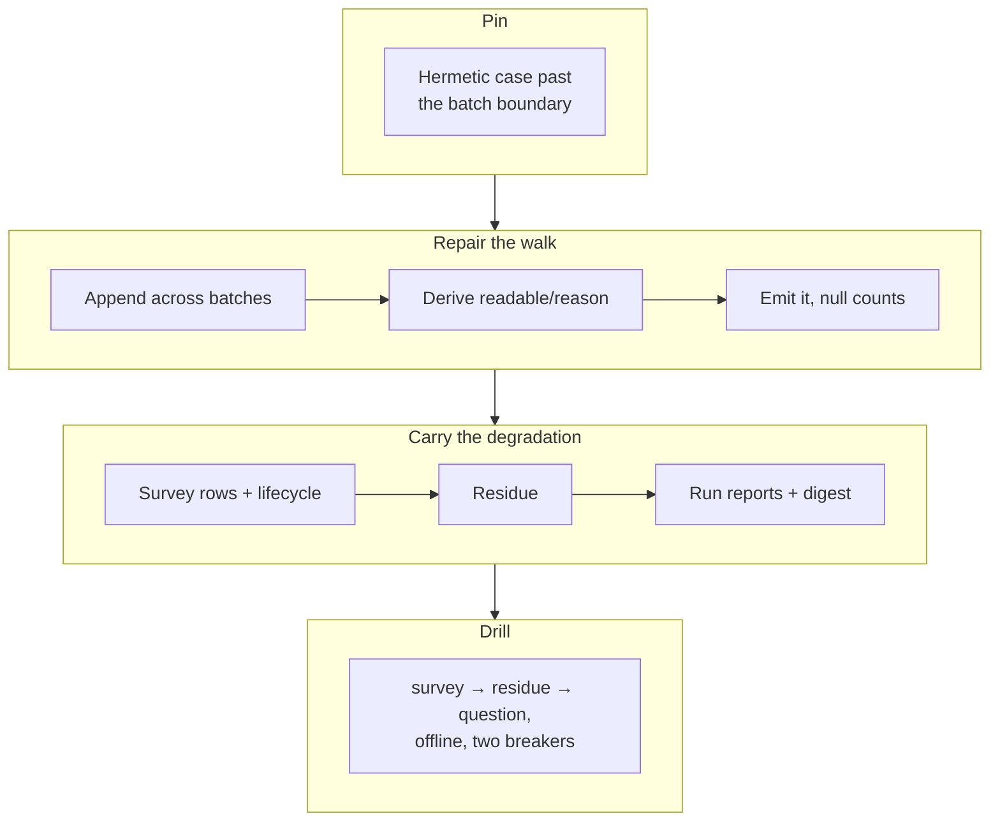

## 1. Overview

The attribution walk went silent once the corpus outgrew one `xargs` batch, and reported that
silence in the vocabulary of an honest zero. It is repaired, given an outcome of its own, and
that outcome carried through every reading composed on it.

**Highlights:**

1. A batch matching nothing no longer discards what earlier ones found: `count: 0` → `230` here.
2. A walk that could not *complete* says so, with null counts and no `no_citing_artifacts`.
3. `work_waiting` can no longer stand open on a blind read.

## 2. Motivation

Both hops prefilter with one `grep` per `xargs` batch, and the shape that shipped —
`xargs grep -lFf … > cand || : > cand` — truncated the candidates whenever a batch matched
nothing. Measured 2026-08-29: 1411 paths / 132292 bytes against a 131072-byte buffer, 0
candidates where an appending walk found 26. It was wrong in the vocabulary meaning the
opposite — `no_citing_artifacts` means *nothing has answered this yet*, which `/propose` treats
as explicitly not a refusal — so a blind walk read as a brand-new direction, `work_waiting` stood
open, and the residue named work the tree already attributed.

## 3. Changes

The failure was pinned before it was touched, then repaired at the one place both hops share,
then given a name of its own, and only then carried outward — one consumer layer per ticket,
so each seam stays reviewable on its own. The order is load-bearing: the walk's outcome had to
exist before any consumer could read it, and the consumers had to land in the same mission,
because a null count reaching code that expects a number is a noisy error rather than a silent
zero. The drill closes it by walking the whole chain offline.

### 3-1. Pin the batching failure before repairing it ([57d2e0f0](https://github.com/qmu/workaholic/commit/57d2e0f0))

Adds a hermetic case that grows a corpus past the `xargs` batching boundary — the boundary
derived by probing `xargs` itself rather than hard-coded — and records it failing against the
unrepaired script, so the repair is measured against a live failure.

### 3-2. Stop the prefilter discarding what it found ([1244c492](https://github.com/qmu/workaholic/commit/1244c492))

Replaces the truncating branch on both hops with one shared `prefilter` helper that appends
across batches and treats a no-match batch as a success, without swallowing a real `grep`
error. The prefilter's job does not widen: it still answers only *worth reading*.

### 3-3. Tell found nothing from could not look ([15f22571](https://github.com/qmu/workaholic/commit/15f22571))

Derives `{readable, reason}` for the walk itself at exactly one site for both hops.
`patterns_unreadable` and `corpus_unreadable` each name what failed; nothing is emitted yet, so
every existing consumer's output stays byte-identical.

### 3-4. Say no citing artifacts only when it completed ([152fd3c4](https://github.com/qmu/workaholic/commit/152fd3c4))

Emits that outcome: a degraded walk reports `readable: false` with its reason, null counts, an
empty artifact list and no `empty_reason` at all. `readable` is absent on a completed walk —
*absent means the walk completed* — so completed readings are byte-identical.

### 3-5. Carry the degradation onto the survey rows ([87699967](https://github.com/qmu/workaholic/commit/87699967))

A degraded row joins the term the condition already had, so it is refused
`attribution_unreadable` before `work_waiting` is evaluated, with `pace: unknown`, no `dormant`
or `quiescent` verdict and null counts. The date-derived terms do not move.

### 3-6. Carry the degradation onto the residue ([d5691b3e](https://github.com/qmu/workaholic/commit/d5691b3e))

`mission-strategy.sh` names a direction whose walk failed instead of answering *no strategy*,
and the residue reports `readable: false` and lists nothing — widened to `strategy_unreadable`
so **one** failed direction is enough, since a mission attributed only to it is named as
residue in exactly the same way.

### 3-7. Name a degraded direction reading in reports ([03146734](https://github.com/qmu/workaholic/commit/03146734))

`/propose`'s run report names the survey's own refusal, and the morning digest renders a
degraded strategy by name with `degraded_count`, a null honesty line and its own
`all_attribution_unreadable` no-op rather than folding into `no_activity`.

### 3-8. Drill the corpus boundary offline ([061088da](https://github.com/qmu/workaholic/commit/061088da))

Adds `verify-corpus-boundary`: twelve load-bearing rows walking survey → residue → question
over a corpus past the boundary and the degraded direction beside it, with no network and two
breaker halves, one per hop, each written against behaviour.

## 4. Outcome

The closing link answers the same for a corpus of 100 artifacts and one of 10 000: here
`attributed-work.sh` went from `count: 0, no_citing_artifacts` to `count: 230` for one
direction. `no_citing_artifacts` is now emitted only when the walk completed, and a walk that
did not is named as degraded at every consumer.

## 5. Concerns

### A degraded walk silences /propose for that direction

- **Severity:** moderate
- **Description:** A row refused `attribution_unreadable` cannot be proposed against, so a persistent corpus fault would stop the loop originating work for that direction while only the run report and the digest say so (see [87699967](https://github.com/qmu/workaholic/commit/87699967) in `plugins/workaholic/skills/propose/scripts/survey-strategies.sh`)
- **How to Fix:** Accepted for the reason `inbox_unreadable` already records — proposing against a reading nobody can trust is worse than not proposing. If it proves to bite, the repair is a `/moderate` question naming the degraded direction, not a loosened gate.

### The digest's honesty line goes null rather than partial

- **Severity:** low
- **Description:** `unattributed` is `{moved: null, waiting: null}` whenever *any* strategy's walk failed, even when most were read fine (see [03146734](https://github.com/qmu/workaholic/commit/03146734) in `plugins/workaholic/skills/standup/scripts/digest.sh`)
- **How to Fix:** The count is derived by subtraction, so a partial figure would over-report for a reason unrelated to attribution. A per-strategy honesty line would be the honest refinement if the null proves to cost a reader something.

### landed stays an empty list on a degraded survey row

- **Severity:** low
- **Description:** `landed` and `landed_count` read `[]` / `0` on a row whose walk did not complete, rather than null like the `waiting_*` grains (see [87699967](https://github.com/qmu/workaholic/commit/87699967) in `plugins/workaholic/skills/propose/scripts/survey-strategies.sh`)
- **How to Fix:** It is never rendered today — such a row reads `state: unreadable` and produces no `arrived` or `overdue` question — so the zero is unreachable. Null it if a consumer ever reads `landed` off a refused row.

## 6. Successful Development Patterns

- Recording the new test's **failure output in its own commit message** shows the assertion had
  teeth, which a green suite alone never can.
- **Probing the running system** for a size boundary (counting `xargs` invocations) keeps such a
  test honest on a machine with a different limit; a hard-coded count silently stops proving it.
- Splitting derive-it from emit-it into two tickets bought a byte-diff against the pre-change
  script as the proof that completed readings did not move.

## 7. Notes

The test is `readable == false`, never `readable // true` — jq's `//` treats `false` itself as
empty, so that spelling reads every degraded walk as healthy. It was written the wrong way first
and the fixture caught it.
