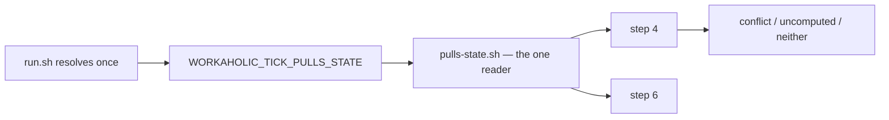

## 1. Overview

`/moderate`'s steps 4 and 6 read the same fact — which open pull requests are blocked, and why — and each resolved it for itself. Because GitHub computes `mergeable` lazily and *requesting* the pull request is what schedules the job, the two rounds could answer differently, and the tick then said two things about one pull request. Step 4 also had no way to say it could not read the answer at all.

**Highlights:**

1. One tick makes **one** round of per-pull reads, held by the one reader rather than by each caller — so both steps are byte-identical and could not have drifted.
2. A mergeability GitHub has not finished computing is named as its own outcome, and a tick that could not look never speaks with the voice of one that found nothing.
3. Both repairs are pinned by hermetic cases written against the *behaviour* — the disagreement, and the absence of the words `none conflicted`.

## 2. Motivation

Measured on tick `20260829-085055` (issue #710): `merge-conflicts` reported `none conflicted` while `stuck-prs` named four conflicted pull requests — #622, #625, #633, #688, the oldest unmergeable since 2026-08-26 — over the same open set, in the same tick. Neither step was wrong about what it read.

`reference/workflow.md` had already said, of step 6, *resolved once per tick, used twice*. The implementation never held it. And the second half of the gap was independent of the first: even with one resolution, `blocked_by: unknown` had no way to reach the log, so the two steps would have agreed on a sentence that was still untrue.

## 3. Changes

### 3-1. Read the tick's conflict state once per tick ([1cbb7468](https://github.com/qmu/workaholic/commit/1cbb7468))

`run.sh` resolves `pulls-state.sh` once before the step loop and names the file in `WORKAHOLIC_TICK_PULLS_STATE` — the seam `WORKAHOLIC_TICK_REPORTS` already established, an environment variable rather than a third flag so the step invocation stays uniform. **The cache lives in the one reader**, so both steps are byte-identical and the property belongs to the reader rather than to each caller's memory.

Three bounds ride with it: the cache is keyed on the `--limit` it was resolved at, so a wider read is never served a truncated answer; a **failed** resolution is never cached, because one transport hiccup must not become the tick's answer for every consumer; and the resolution is gated on the same `--only`/`--skip` arithmetic the loop applies.

### 3-2. Name an uncomputed mergeability as its own ([2cae7f28](https://github.com/qmu/workaholic/commit/2cae7f28))

Step 4 counts `unknown` beside `conflict` and names it: a tick with uncomputed rows says how many it could not read and never says `none conflicted` about them, while a tick with neither keeps the earlier wording byte-identically. It is **`ok`/`mergeability_uncomputed`** — deliberately not `degraded` (which names a transport this step could not read, and the transport answered) and not `blocked` (which asserts a conflict nobody proved, and would send a claim holder after one). No `event` is added, so step 4 still posts nothing and one pull request still draws one Slack line per tick.

## 4. Outcome

A tick now states one thing about each open pull request, and states honestly when it could not state anything. `pulls-state.sh` keeps its single derivation of `blocked_by`, both steps' summaries and the `stuck:<digest>` key are untouched, and no post changes frequency or threading.

## 5. Concerns

### The two steps can still agree on a stale reading

- **Severity:** low
- **Description:** One resolution removes the *disagreement*; it does not make the tick's answer fresher than the moment it read (see [1cbb7468](https://github.com/qmu/workaholic/commit/1cbb7468) in `plugins/workaholic/skills/moderate/scripts/pulls-state.sh`). A tick that resolves while GitHub is still computing reads `unknown` for the whole hour.
- **How to Fix:** Nothing — that is now *reported* rather than hidden, which is the second ticket's whole point. Re-reading inside one tick to chase a fresher answer would reintroduce exactly the drift this removes.

### The limit key is a string match on the reader's own output

- **Severity:** low
- **Description:** The cache is served only when the cached JSON carries `"limit": <n>,` for the caller's `n` (see [1cbb7468](https://github.com/qmu/workaholic/commit/1cbb7468) in `plugins/workaholic/skills/moderate/scripts/pulls-state.sh`). A change to that field's rendering would silently stop the cache from ever matching.
- **How to Fix:** It fails in the safe direction — a missed cache resolves afresh, which is the behaviour that existed before — and the suite's fifth row asserts both the hit and the miss, so a rendering change fails there rather than in production.

## 6. Successful Development Patterns

- Putting the cache in the **reader** rather than in its two callers made "both steps are unchanged" provable rather than asserted: neither script was touched by the first ticket at all.
- The first test asserts **agreement**, not a particular verdict. Which round the tick sees is the transport's business; that both steps see the same one is the contract — and the assertion survived the second ticket landing on top of it, where a verdict-shaped one would not have.
- Landing the sibling first proved the tickets were genuinely independent, exactly as their Considerations claimed: with one resolution and without the second repair, both steps said `none conflicted` together — in one voice instead of two.

## 8. Notes

`node scripts/test-workflow-scripts.mjs` reports **5017 passed, 0 failed**; `verify.mjs` and `validate-metadata.mjs` are clean. Both tickets' hermetic cases fail against the tree they were written on.
