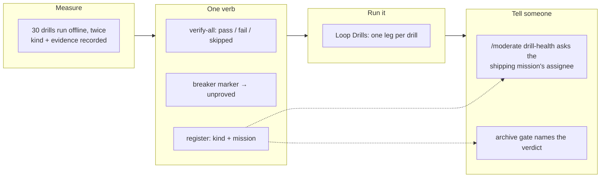

## 1. Overview

Thirty `verify-*` drills, one per mechanism an earlier turn of this loop proved, had never
run anywhere. This branch measures which of them can run with no server, gives the set one
aggregate verb with a machine verdict, runs the hermetic part in CI on every push, and
routes a failing drill to the person whose mission shipped it.

**Highlights:**

1. `verify-planner` had been exiting `1` on the unmodified tree ever since it shipped.
2. A check run is named after its job, so one matrix leg per drill makes the drill's own
   name the thing that goes red — no log parsing, no extra permission.
3. Eight presence assertions give way to one reachability pin.

## 2. Motivation

The loop merges its own work onto `main` every half hour and the archive gate closes a
mission on arithmetic, so a merge that broke a mechanism an earlier turn had proved was
caught by nothing and told to nobody. The drills existed and most carried a breaker row
asserted to fail — the machinery was there and nothing pulled the trigger. Making them run
meant first establishing which of them *could* run: the drill file's header claimed the
whole set assumed the server's full `gh` and `qfs`, and measurement put that at two rows
out of thirty.

## 3. Changes

The measurement came first because every later ticket takes it as input; the register it
produced is the one table three consumers read. The verb composes the register with the
dispatcher's own enumeration, the breaker marker turns "passes" into "passes and can fail",
CI turns the verb into a per-drill check run, and the last two tickets carry that verdict to
a person — once through the tick's question, once as evidence beside a mission's close.

### 3-1. Measure which drills are hermetic, per drill ([f611c74a](https://github.com/qmu/workaholic/commit/f611c74a))

Every `verify-*` command was run twice with no `gh`, no `qfs`, no key and no proxy, and
classified from its exit code into `hermetic` / `reads_checkout` / `needs_server` — 22, 6
and 2 — with the evidence recorded beside each non-obvious row in the runbook's new §9.

### 3-2. Give the drill set one aggregate verb ([a41f95b9](https://github.com/qmu/workaholic/commit/a41f95b9))

`verify-all` runs the classified set and emits one verdict per drill in the drill's own exit
vocabulary, exiting non-zero only when something actually failed. `--only`, `--kind` and
`--list` narrow it; `--list` answers the set CI fans out over without invoking any of it.

### 3-3. Report a drill that can no longer fail ([3f3165fd](https://github.com/qmu/workaholic/commit/3f3165fd))

`bearing` gains a third value, `breaker`, applied to all 45 call sites of the 19 drills that
carry one; a passing drill with no breaker is reported `unproved` and counted outside the
passing total, because a gap in coverage is not a broken mechanism.

### 3-4. Name the mission a failing drill belongs to ([d3c8fac1](https://github.com/qmu/workaholic/commit/d3c8fac1))

Each drill is resolved to the mission that shipped it and validated against the missions
tree, so an unresolvable slug is reported by name rather than guessed. No artifact gained a
field; the slug lives in the register and nowhere else.

### 3-5. Run the hermetic drill set in CI ([3da3d05f](https://github.com/qmu/workaholic/commit/3da3d05f))

`Loop Drills` runs the hermetic set on every push and pull request, one matrix leg per drill
derived from `--list`, with `fetch-depth: 0`, no secret and no permission beyond the default
read.

### 3-6. Ask about a drill that stopped holding ([6b087f10](https://github.com/qmu/workaholic/commit/6b087f10))

`/moderate`'s new `drill-health` step reads the last completed run through
`read-drill-verdicts.sh` and asks the shipping mission's assignee one question per failing
drill, keyed so it is asked exactly once. Green is silent, degraded is named, and a
repository with no such workflow asks nothing.

### 3-7. Name a mission's drill verdict at its close ([9d7b57c5](https://github.com/qmu/workaholic/commit/9d7b57c5))

The archive gate names the closing mission's drill verdict as evidence and gates nothing:
the close is byte-identical whatever the verdict says, and `close.sh` remains the only
writer of an end state.

### 3-8. Pin the drill verdict path offline ([d8f8a603](https://github.com/qmu/workaholic/commit/d8f8a603))

One hermetic test pins reachability, the verdict vocabulary and exit-status rule, the CI
wiring and the tick's four readings — and the eight presence assertions it subsumes are
deleted, with the phrase they were named after now absent from the suite.

## 4. Outcome

The drill set is a gate rather than a folder of scripts an operator might remember. Measured
with no network and no credential: 30 drills, **19 proved, 9 unproved, 0 failed, 2
skipped**, exit 0, ~2m20s; the full suite is 5081 passed, 0 failed. One real regression was
found on the gate's first day, which is the whole argument for it.

## 5. Concerns

### Nine drills have no breaker row

- **Severity:** low
- **Description:** Nine runnable drills have never been shown able to fail, and are reported `unproved` rather than green (see [3f3165fd](https://github.com/qmu/workaholic/commit/3f3165fd) in `scripts/e2e/loop-drill.sh`)
- **How to Fix:** Add a breaker row to each as its mechanism is next touched; the reading already names them

### The CI matrix spends one runner per drill

- **Severity:** low
- **Description:** Twenty-two legs each check out the repository for a drill that runs in seconds; the fan-out buys per-drill check names, not speed (see [3da3d05f](https://github.com/qmu/workaholic/commit/3da3d05f) in `.github/workflows/loop-drills.yml`)
- **How to Fix:** If runner concurrency binds, set `max-parallel` or group legs by kind — never quietly drop rows

## 6. Successful Development Patterns

- Measuring before designing changed the design: wall clock said "one CI step", the
  *naming* requirement said "one job per drill", and the second won.
- A fixture that copies the real script and appends known drills keeps a pin honest about
  the real contract; a hand-written miniature only tests the miniature.
- An assertion over a script's source must strip comments, or writing down why something is
  refused costs you the assertion enforcing it.
