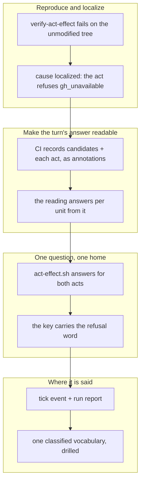

## 1. Overview

Every reading in this repository answered *what did I find*; none answered *did what I did
happen*. The CI retirement turn now records what it attempted and what each act answered, and the
loop's two acts on a proof are read back through one composed reader.

**Highlights:**

1. `ci-retirement-turn.sh` answers per unit from the turn's own record, never from a run's existence
2. `act-effect.sh` answers *did my act take effect* for both acts, owning the assembly and no act's vocabulary
3. `verify-act-effect` fails whenever a green run stands in for an act that did not take

## 2. Motivation

`claim-retirement.yml` was green on every run while three proved-`superseded` claims stood on
origin, and the tick log recorded hourly *"ci_turn: taken so CI could not take the delete
either"* — an assertion about a second executor that nothing established.

The retired premise was reasonable when written: CI deletes the branch on success, so a
successful turn should remove the candidate with it. What it missed is that a turn can complete
without ever reaching its act — and the turn's answer lived only in a job log the loop's
container cannot read.

## 3. Changes

A failure report was reproduced before anything was designed, and the reproduction was written
against the *reading* rather than either hypothesised cause — which mattered, because the cause
the report assumed turned out not to be the live one. The repair then moved outward: record the
turn's answer, read it per unit, unify the question across both of the loop's acts, and say the
result where a person already looks.

### 3-1. Pin the silent retirement act offline ([ef0519a7](https://github.com/qmu/workaholic/commit/ef0519a7))

Landed `verify-act-effect` as a reproduction that fails on the unmodified tree, asserting the
observable — a completed turn that took no act must never read `taken` — over both candidate
causes rather than either one.

### 3-2. Record what the CI retirement turn did ([726e5ba1](https://github.com/qmu/workaholic/commit/726e5ba1))

`claim-retirement.yml` now records its candidate reading and one entry per act as `::notice::`
check-run annotations, chosen against the job log, step summaries, a check run of its own and a
commit to `main`. The degraded branch no longer exits before recording.

### 3-3. Answer the CI turn from what it recorded ([6236550b](https://github.com/qmu/workaholic/commit/6236550b))

`ci-retirement-turn.sh` takes units and answers each from the record: `taken` only on the act's
own success word, `refused:<word>` carrying its refusal verbatim, `pending`, `unavailable`,
`unreadable`. Suppression became per unit, so one degraded reading can no longer silence them all.

### 3-4. Answer did my act take effect in one place ([6ba9b3e2](https://github.com/qmu/workaholic/commit/6ba9b3e2))

`act-effect.sh` answers the question for the retirement's Act 2 and the delivery retry by
composing each act's own outcome source — the recorded CI verdict, and the branch story blob the
claim scan already fetched. It owns the assembly and neither act's vocabulary.

### 3-5. Let a changed refusal reach its holder ([9fc37d7c](https://github.com/qmu/workaholic/commit/9fc37d7c))

The question is keyed `retire-blocked:<unit>:<refusal word>`, so an unchanged block stays held
forever and a changed word draws exactly one more question. `ask-question.sh` gained nothing: the
narrowing lives in what the key is made of.

### 3-6. Name the effect where the tick and run speak ([c4ddcbf5](https://github.com/qmu/workaholic/commit/c4ddcbf5))

The tick's `retire-claims` step supplies an `event` naming the units whose acts did not take, and
`/implement`'s run report names the effect outcome per undelivered entry. No third surface, no new
post shape, and no token moves.

### 3-7. Drill the silent act and register the drill ([785df2fa](https://github.com/qmu/workaholic/commit/785df2fa))

`verify-act-effect` became a registered hermetic drill with a breaker that restores the
run-existence inference on the real script's source and must show the question being dropped —
written against the behaviour, not the return shape.

### 3-8. State an act effect where its vocabulary lives ([b762099f](https://github.com/qmu/workaholic/commit/b762099f))

`claims.md` gains a fourth keyed sub-table classifying every act-effect word as a judgement with
its one consumer named; the retired premise is quoted and corrected in all three homes;
`CLAUDE.md` and the moderation reference state current behaviour.

## 4. Outcome

The loop can tell an act it took from one it merely attempted. A turn that reaches no act says
so, its refusal reaches the claim holder with the word blocking it, and a changed word is a new
question rather than silence. `verify-all` runs 31 drills with none failing.

## 5. Concerns

### The CI-side delete is still refused, by a probe rather than a permission

- **Severity:** moderate
- **Description:** `available` probes `gh api user`, which a `GITHUB_TOKEN` cannot call, so the
  CI act refuses `gh_unavailable` before its proof gate though the job holds `contents: write`
  (see [ef0519a7](https://github.com/qmu/workaholic/commit/ef0519a7) in
  `plugins/workaholic/skills/gather/scripts/gh-rest.sh`). Legible now, not absent.
- **How to Fix:** Drive `20260829160500-let-ci-s-act-reach-the-transport-it-holds-permission-for.md`.

### A standing blocked retirement now has one suppression guard, not two

- **Severity:** low
- **Description:** a blocked retirement now supplies an `event`, so an unchanged block is held
  quiet by the summary diff alone (see
  [c4ddcbf5](https://github.com/qmu/workaholic/commit/c4ddcbf5) in
  `plugins/workaholic/skills/moderate/scripts/step-retire-claims.sh`).
- **How to Fix:** Nothing now — the replacing invariant, *the summary carries no CI term*, is
  asserted by `verify-retire`. Re-check before adding a term to that summary.

## 6. Successful Development Patterns

- Reproducing CI's **credential** locally (stubbing `gh api user` to 403) localized the cause in
  one command, where reading the job log was impossible.
- Writing the reproduction against the **reading** rather than either hypothesised cause kept it
  valid when the report's assumed cause proved not to be live.

## 7. Notes

The mission stays open on purpose: acceptance is 3/3 but its queue holds the ticket minted
mid-run, and promoting that into the definition of done is the developer's call.
