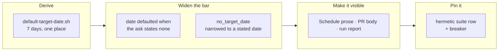

## 1. Overview

`/specificate`'s strategy form needed a date, an owner and an aim *from the ask itself*, so an ask
carrying two of the three was refused `no_target_date` and reached nobody. The operator ruled the
default — one week from the ask — so such an ask now drafts the strategy on it, and says so.

**Highlights:**

1. `strategy/scripts/default-target-date.sh` is the one derivation, and the number 7 lives there alone.
2. `no_target_date` is narrowed, not deleted — it still answers a date the ask **stated** and this run cannot read.
3. A hermetic suite row pins the chain, with a breaker proved able to fail.

## 2. Motivation

Measured 2026-08-30: three announced directions died at `no_target_date`, the refusal traced only
by a parenthetical addressed to nobody, while the loop went on planning from the directions that
already existed. The bar was correct and its outcome was silent — the same shape the repository
has repaired repeatedly elsewhere. What made the repair available is that a date, unlike an owner,
has an answer to default *to*, and the operator supplied it.

## 3. Changes

The arithmetic was built before any caller could reach it, so two sessions could never compute "a
week" from two clocks. Only then did the bar move, and only for the one part with a defaultable
answer. Visibility followed at once: the operator's merge is the authorship, and a merge is an
authorship only if the person merging can see what they are being asked to author. The pin came
last, written against behaviour rather than the prose it guards.

### 3-1. Derive the one-week target-date default in one place ([caf42646](https://github.com/qmu/workaholic/commit/caf42646))

Added `strategy/scripts/default-target-date.sh`, which emits the date, the basis it counted from
and which of the two sources that basis was. It counts from the ask's own date so a tick ingesting
an old issue does not date a direction from its own clock, and refuses a malformed argument with
no date at all rather than falling back to today.

### 3-2. Draft a dateless direction on the default instead of refusing ([71118fb8](https://github.com/qmu/workaholic/commit/71118fb8))

Moved the strategy form's bar: an owner and an aim from the ask, plus a date it either states or
takes from the default. `no_target_date` narrowed to *the ask stated a date this run could not
resolve*. `create.sh` and `publish-tree-pr.sh` are byte-identical — the never-auto-merge rule is
still the seam's, derived from the path.

### 3-3. Say on every surface that the date is a default ([56728a99](https://github.com/qmu/workaholic/commit/56728a99))

The `## Schedule` prose, the pull-request body and the run report each name a defaulted date once,
with the basis it was counted from; a stated date carries none of that wording. No frontmatter key
was added, so every strategy reader stayed byte-identical.

### 3-4. Pin the dateless-ask chain hermetically ([9a23d6f9](https://github.com/qmu/workaholic/commit/9a23d6f9))

One suite row over the arithmetic, the refusal, the bar, the narrowing, the three surfaces and the
four things that must not move. It landed as a suite row rather than a drill because the whole
chain is reachable with no fixture repository.

## 4. Outcome

An aim and an owner with no date now reach a drafted strategy at an open pull request dated a week
out, saying on its face that the date is a default and that editing it is the veto. The mission
closed 3/3, `achieved`, at the archive gate.

## 5. Concerns

### The default lowers the bar on the artifact with no floor and no ceiling

- **Severity:** low
- **Description:** the strategy has neither a floor nor a ceiling, and its three-part bar was the only brake on a run emitting them indefinitely (see [71118fb8](https://github.com/qmu/workaholic/commit/71118fb8) in `plugins/workaholic/skills/specificate/SKILL.md`)
- **How to Fix:** nothing now — the **owner** requirement still holds it. Revisit if directions appear faster than the operator closes them.

## 6. Successful Development Patterns

- Building the derivation **before its first caller existed** made "one place" structural rather than a rule someone remembers at the call site.
- Feeding a clock-dependent script **its own reported basis** back in proves the branches agree without naming a date the row could rot on.

## 7. Notes

`verify-specificate` needs the server (it refuses without an issue number), so this branch's
hermetic proof is the new suite row plus `verify-revision` and `verify-stage`, all green.
