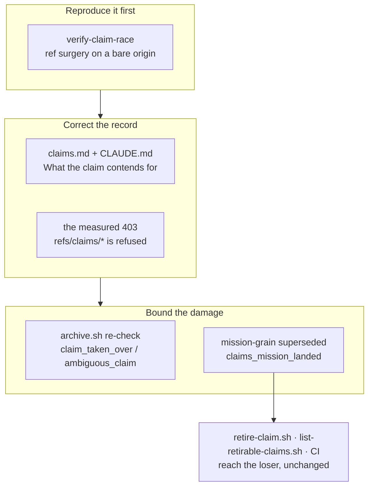

## 1. Overview

Two runs claimed and drove one unit on 2026-08-30, four seconds apart. `claims.md` said in two
places that *the protocol settles a race by the push*, and half of that was false: `resume`
contends on one ref, a **fresh** claim contends on nothing. This branch corrects the record,
reproduces the race in a hermetic drill, stops the loser's first write from reaching the base, and
makes a unit whose content landed through a racing twin readable as `superseded` from the tree.

The repair that would stop the race itself — a claim contending for one ref per unit — is
**blocked on a measurement**, not deferred on a judgement: this container may write no ref outside
`refs/heads/*`.

**Highlights:**

1. The mission grain answers `superseded` from the tree, so the existing retirement path reaches a
   raced loser with no change of its own. Verified on the live claim the mission was written from.
2. A runner that lost its claim between the survey and the first write now refuses, with the tree
   byte-identical — and the sole claim holder's archive is untouched.
3. `verify-claim-race` stages the race with **no timing at all** and carries a breaker proved able
   to fail.

## 2. Motivation

Measured 2026-08-30: `work-20260830-055314` and `work-20260830-055318` were both claimed for
`draft-a-dateless-direction-with-the-operator-s-one-week-default`, four seconds apart, and each
drove the same four tickets for over an hour. Nothing in the suite or the drill set reproduced
that, so any repair would have been judged against prose rather than a red test.

Worse, the loser was then invisible to every consumer that could have cleaned it up. Its four
tickets were all archived on the base under the twin's branch directory — the literal definition of
`superseded` — but the mission grain never asked the tree, so the claim read `report_undelivered`
forever: `retire-claim.sh` refused it, CI's retirement turn found no candidate, and
`catch-up-claim.sh` was left trying to resolve a collision between a unit and itself.

This is the fifth time the loop has met the same shape — a state the protocol reads and nobody can
act on. What is different here is that the *arbitration* half turned out to be unavailable, so the
branch ships the two layers that bound the damage and records the third as a measured finding
rather than as a plan.

## 3. Changes

Diagnosis first: the drill reproduces the defect before anything moves. The record is corrected
next, so the rule and the mechanism stop disagreeing while the rest is written. The two shipped
repairs are downstream of the race rather than a substitute for stopping it — one refuses the
loser's first write, the other makes the loser retirable by machinery that already exists.

### 3-1. Reproduce the claim race offline in a drill ([9075080](https://github.com/qmu/workaholic/commit/90750806))

`verify-claim-race` stages the race with **no sleep deciding the outcome**. The only input
`claim.sh` has about competitors is its own fetched view of origin, so the fixture reproduces the
two views: runner A runs the real `claim.sh` and pushes; A's ref is taken off the bare origin with
`update-ref`; runner B claims and pushes; A's ref is restored. Both runs are the real claim act and
neither is refused anything — the ordering is the fixture's, never the scheduler's, which is what
the ticket's own Consideration required of a race staged by wall clock.

It is registered `hermetic` in `docs/loop-drill-runbook.md` §9, so `verify-all` runs it and CI gives
it its own matrix leg — the check run that goes red is named after the drill.

### 3-2. Correct the settled-by-the-push premise ([1038def](https://github.com/qmu/workaholic/commit/1038def9))

Both occurrences in `claims.md` and the one in `CLAUDE.md` now quote the retired half explicitly.
A new *What the claim contends for* section states what the measurement showed: the premise holds
for `claim.sh resume` (one ref, non-fast-forward arbitration, `resume_race_lost`) and did not hold
for a fresh claim (`work-$(date …)`, pushed `-u`, two refs, both pushes succeeding).
`ambiguous_claim` keeps its behaviour exactly; only its justification moved, and it moved in the
direction that makes the refusal more necessary rather than less.

### 3-3. Re-check the claim before the first write ([5815f61](https://github.com/qmu/workaholic/commit/5815f61a))

`archive.sh` re-derives who holds the unit immediately before the ticket moves, through
`claim-holder.sh` — a pure read composing `lib/claims.sh`, adding no verdict word. It refuses
`claim_taken_over` and `ambiguous_claim` with the tree byte-identical. The bias is the **opposite**
of the claim act's and is implemented literally: only positive evidence refuses, while an unreadable
scan, an unreachable origin or a branch with no claim row all proceed, because a wrong refusal
strands finished work outside the archive.

The gate sits **ahead of the todo-layout migration**, not merely ahead of the `mv`: that migration
stages what it converges, so a re-check after it would refuse with a dirty index.

### 3-4. Answer superseded at the mission grain ([1301e30](https://github.com/qmu/workaholic/commit/1301e300))

`claims_superseded` now asks the tree first at both grains. `claims_mission_landed` reads the unit's
tickets off the claim's own **tip** and applies the same `every`-not-`any` archived-on-the-base
test the batch grain already uses. The 2026-08-26 refusal is answered rather than ignored: the
relation is still walked exactly once, because `claims_remaining_tickets`' mission walk was lifted
out into `claims_tickets_for_mission` and both readings compose it.

The merged-pull-request lookup stays the fallback for every case the tree does not answer `true`,
so the change can only ever **add** a `superseded`, never remove one — the direction that matters
when a proof gates a destructive act.

## 4. Outcome

On the live repository, `work-20260830-055314` read `report_undelivered` before this branch and
reads `superseded` after, with every other claim unchanged — so `retire-claim.sh`,
`list-retirable-claims.sh` and CI's retirement turn reach it with no change of their own. A runner
that loses its claim mid-drive now writes nothing to the base and says which word it lost by. The
race itself is still possible, and the drill says so out loud.

`node scripts/test-workflow-scripts.mjs` passes 5394/0; `sh scripts/e2e/loop-drill.sh verify-all`
reports 35 drills, 0 failed, with `verify-claim-race` in the proved total.

## 5. Concerns

- **Severity**: high
  **Concern**: the race is not fixed. Two runs can still claim and drive one unit; what shipped
  bounds the damage after the fact — the loser's first write is refused, and a loser whose twin
  delivered becomes retirable. The arbitration is blocked on a measured transport refusal
  (`refs/claims/*` → 403 on create **and** delete, while the same `--force-with-lease` against
  `refs/heads/work-*` succeeds), so the only writable namespace is the one the branch-name gate
  holds to two literal patterns, and a ref there could never be released either.
  **Deferred because**: ticket 3's own Considerations instruct that an unavailable mechanism is
  "a finding for the mission, not a workaround to invent here". Three of the mission's eight
  tickets rest on that arbitration and remain queued.

- **Severity**: medium
  **Concern**: `archive.sh` now runs one `git fetch --prune` per archive call. That is one network
  round trip per ticket, on a seam that already pushes per ticket.
  **Deferred because**: the ticket priced the check at "one survey" and bounded it to "one scan per
  archive call at most"; without a fetch the gate would be decorative, because a racing competitor
  pushes seconds after our own claim's fetch.

## 6. Successful Development Patterns

- **The measurement came before the design, and changed it.** Ticket 3 named a mechanism as a
  hypothesis and required its permission to be measured first. Probing `refs/claims/*` (403) and
  then the *same lease flag* against `refs/heads/work-*` (succeeds) is what isolated the refusal to
  the namespace rather than the flag — and turned three tickets from work-in-progress into a
  recorded finding instead of a half-built arbitration.
- **A hermetic race is staged by editing refs, not by racing.** Taking the winner's ref off the
  bare origin reproduces the loser's view exactly, with no timing, which is what makes the drill
  something CI can run on every push.
- **Lifting a walk out beats writing a second one.** The 2026-08-26 scope refusal was about a
  second parser of a many-valued relation, and factoring `claims_tickets_for_mission` answered it
  rather than arguing with it.

## 8. Notes

Four of the mission's eight tickets are implemented; four remain queued and are named in the run
report with the measured blocker beneath them. The mission stays `active` at 1/3 acceptance.

The branch carries one `size` scan finding (`too-large-commit`, 626 added lines against a 500
ceiling) and nothing else — no secret, no leak, no mixed concerns. The generated `outputs/` tree is
21 of the 39 changed files.
