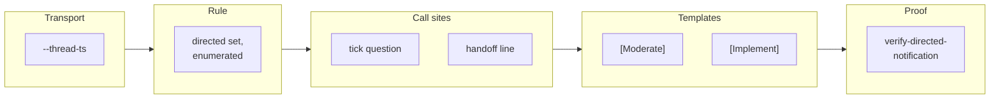

## Handoff

**This branch is complete but unverified here. Someone must verify it before it merges.**

- **Done:** All six implementable tickets. The transport can reply into a thread, the model
  states which transport carries which shape, both call sites and both routine templates name it,
  and an offline drill with two breakers proves the whole path.
- **Not done:** "a Slack bot token with chat:write, installed in the repository's channel and set
  on the routines' cloud environment, plus the operator confirming they received the notification"
- **Next step:** Follow `docs/proposal-loop-runbook.md` §2a — create or reuse the bot with
  `chat:write`, invite it to the channel, set `SLACK_BOT_TOKEN` on the cloud environment the
  routines select — then, after the next `[Moderate]` tick that has a question, confirm the
  notification arrived without rereading the channel, and merge.
- **Attempted:** Not attempted — declared unrunnable in an unattended environment at ticket
  creation (`verification_handoff:` on
  `20260831042313-provision-the-bot-identity-and-confirm-it-notifies.md`).

## 1. Overview

Every post reaches Slack as the operator's own account, and Slack notifies nobody of their own
message — so the two shapes whose entire purpose is to reach a named person were addressed to the
account posting them and paged no one. This branch narrows the transport rule so a *directed* post
takes a bot identity, leaving every other shape on the connector.

**Highlights:**

1. `notify-slack.sh` gains `--thread-ts`, so the bot can reply into a thread the connector resolved.
2. The directed set is **enumerated in one place** — two shapes, extending it a deliberate edit.
3. `verify-directed-notification` proves the whole path offline, with two behavioural breakers.

## 2. Motivation

The 2026-08-23 rule that a post never mentions the identity it is posted as was right, and it left
two shapes carrying a token unconditionally because they address somebody else. In the
single-developer configuration that somebody else *is* the poster, so the `🙋` question and the
`🟡 Handoff` ask reached the operator only when they happened to reread the channel — a silent
failure by construction, since the post exists and the token renders either way.

The structural half: `workaholic:notify` ranked its transports by **availability**, and that
ranking was silently also deciding **identity**. The repair narrows it rather than reversing it —
which account speaks moves, which transport finds a thread does not.

## 3. Changes

The branch was driven strictly in dependency order, and the order is the argument: a capability
first, stated as explicitly *not* a licence; then the rule that licenses it, with its set
enumerated so no session decides at post time; then the two call sites the rule was written for;
then the templates, because *the prompt is the ceiling* and until they name a shape no routine may
emit it; then the drill, because a notification path fails silently and needs a proof that fails
when somebody removes it.

### 3-1. Teach the tokened transport to reply into a thread ([5f0de97a](https://github.com/qmu/workaholic/commit/5f0de97a))

`notify-slack.sh` built `{"channel", "text"}` and took one positional argument, so it could post a
keyed root and nothing else. It gains `--thread-ts`, refusing a malformed value `bad_thread_ts`
rather than dropping it; with no flag the payload is byte-identical to what it always sent.

### 3-2. State which transport carries which shape and why ([c95d52dd](https://github.com/qmu/workaholic/commit/c95d52dd))

`workaholic:notify` gains *Which transport carries which shape, and why*: the connector stays
primary for every post, a **directed** post takes the bot identity when its mention target
resolves to the posting identity, and the directed set is a table of two rows plus everything
else.

### 3-3. Post the moderator's question as the bot identity ([587125ec](https://github.com/qmu/workaholic/commit/587125ec))

`/moderate`'s check-in question is the shape the rule was written for. The root stays the
connector's and returns the `ts` the reply needs, so no query is added; `ask-question.sh` is
byte-identical, proved by `git diff --exit-code`.

### 3-4. Address the handoff ask to the person who must act ([ee3071f1](https://github.com/qmu/workaholic/commit/ee3071f1))

`🟡 Handoff` names the **unit's assignee** again — the token dropped in 2026-08-23 named the
runner, and removing it left the line naming nobody, while the route's own table had said it names
the assignee since 2026-08-14. An unresolved address omits the token rather than guessing one.

### 3-5. Name the bot-carried shapes in the routine templates ([bbe595fd](https://github.com/qmu/workaholic/commit/bbe595fd))

`[Moderate]` needed only its carrier; `[Implement]` was missing the `🟡 Handoff` shape entirely,
so a shape `workaholic:drive` has required since 2026-08-14 was one no session was authorized to
post. Both now name shape and carrier, with six drift pins over them.

### 3-6. Drill the directed notification offline ([6ee901fc](https://github.com/qmu/workaholic/commit/6ee901fc))

`verify-directed-notification` walks transport → rule → call site → template over a `curl` stub,
with no network, no `gh`, no credential and no Slack post — 13 load-bearing rows and two
breakers, registered `hermetic` so CI runs it as its own matrix leg.

## 4. Outcome

The loop can reach the one person a directed post addresses, and reports which surface carried
each and whom it named. The mechanism is proved offline; what remains is a credential and a human
observation, which is why the branch hands off (`docs/proposal-loop-runbook.md` §2a).

## 5. Concerns

### doc-drift.sh reads a stale local base inside a claim worktree

- **Severity:** moderate
- **Description:** `doc-drift.sh` defaults its base to the local `main` ref, which in a claim worktree is never advanced — measured on this branch it reported a removed hook and a changed `README.md` that `git diff origin/main...HEAD` matched neither of (see [6ee901fc](https://github.com/qmu/workaholic/commit/6ee901fc) in `plugins/workaholic/skills/story/scripts/doc-drift.sh`)
- **How to Fix:** Resolve the published base rather than a local ref, keep the positional override, and name an unresolvable base instead of falling back silently — ticket `20260831064500-read-doc-drift-against-the-published-base.md` was minted for it

### The bot's channel membership is provisioning no gate can check

- **Severity:** low
- **Description:** A bot that is not a member of the channel cannot post into it, and nothing in the plugin can verify membership; the transport reports a named refusal and the run reports it rather than retrying (see [5f0de97a](https://github.com/qmu/workaholic/commit/5f0de97a) in `docs/proposal-loop-runbook.md`)
- **How to Fix:** Nothing to fix in code — the runbook's §2a states it as an operator step, and the per-post surface reporting is what makes a failure visible

## 6. Successful Development Patterns

- Splitting *capability* from *licence* across two tickets kept the transport change from reading as permission to use it — the skill says so in as many words, so a later reader cannot mistake one for the other.
- Correcting a pin to the **rule** it was protecting rather than the **effect** it happened to encode: the drift pin read "🟡 Handoff carries no token", which was the 2026-08-23 decision's effect, while its rule was "not yourself, never nobody".
- Comparing a payload against the pre-repair builder **re-run**, not a literal typed into the test — the real builder escapes non-ASCII, and the first drill run failed on exactly that.

## 8. Notes

The version was bumped to v1.0.261 in this branch (Phase 0). `verify-all --kind hermetic` reports
36 drills, 0 failed, with the new drill among the 25 proved.
