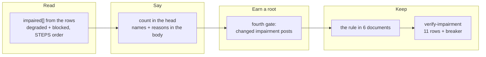

## 1. Overview

`/moderate`'s hourly root now names the steps that could not read, with their reasons, and a
changed impairment earns a root even with no question. A tick where six steps saw nothing had
been byte-identical, to the operator, to one where everything was read.

**Highlights:**

1. `render-tick-post.sh` derives `impaired[]` on every exit path, including the silent ones.
2. Every root names the impairment — outside the change diff, so it is stated until it clears.
3. A changed impairment is the fourth post gate — inside the diff, so it is never restated hourly.

## 2. Motivation

`run.sh` has always classified every step `ok|filed|skipped|degraded|blocked` with a stable
reason. `render-tick-post.sh` parsed each row twice — for `summary`, then for `event` — and read
neither field, so everything needed to say *which steps could not read* was already in the
renderer's stdin and was discarded there. Measured: **24 of 25 consecutive ticks with six steps
impaired**, found four days later because somebody asked.

The rule that a degraded read is reported by name stopped at the tick log — the artifact nobody
opens hourly — so the tick was honest and unheard at once.

## 3. Changes

One derivation feeds two consumers that would otherwise each re-parse the rows. The statement
sits outside the change diff and the gate inside it — the split is what lets a standing
impairment be said every tick without opening a root every hour.

### 3-1. Read the impairment off the tick's rows ([8141dda4](https://github.com/qmu/workaholic/commit/8141dda4))

A third pass over the same tokenised input captures `step`→`status`→`reason`, and `impaired[]` /
`impaired_count` are emitted on every exit path. It changes no output — deliberately, so the
reading could be proved before anything depended on it.

### 3-2. Name the impaired steps on every root ([deb64a23](https://github.com/qmu/workaholic/commit/deb64a23))

The root's head gains `, <K> step(s) could not read` (omitted entirely at zero) and its body one
`⚠️ <step> — <status>: <reason>` line per impaired step, bounded at five with the rest counted.
Composed from the derived set, never from `counts` and never by re-tokenising the rows.

### 3-3. Let a changed impairment earn a root ([4b14620a](https://github.com/qmu/workaholic/commit/4b14620a))

The fourth gate, OR'd beside the question gate, the morning digest and the check-in that reached
nobody, all three left byte-identical. Appearing and clearing break silence; persisting does not.

### 3-4. State the impairment rule where it is read ([3dcd4b1f](https://github.com/qmu/workaholic/commit/3dcd4b1f))

The rule, the split and the `skipped` boundary written into the renderer's header,
`reference/workflow.md`, `SKILL.md` and `CLAUDE.md` — with the measurement attached, and one
clause on why this reverses neither status-root retirement.

### 3-5. Drill the impairment reading offline ([80ffbb38](https://github.com/qmu/workaholic/commit/80ffbb38))

`verify-impairment`: eleven load-bearing rows walking one impairment's whole life across five
logged ticks, plus a breaker written against the behaviour and demonstrated failing on the real
script.

## 4. Outcome

The tick can no longer report a quiet hour it did not have. A standing impairment is named on
every root it posts, a new or cleared one breaks silence exactly once, and a healthy tick renders
byte-identically to before — proved across all eight of the renderer's exit paths.

## 5. Concerns

### A reason that moves under an unchanged status and summary earns no root

- **Severity:** low
- **Description:** `reason` never reaches the tick log, so the gate compares `(step, status, stabilized summary)` (see [4b14620a](https://github.com/qmu/workaholic/commit/4b14620a) in `.../moderate/scripts/render-tick-post.sh`); a step moving `gh_unavailable` → `rate_limited` with status and summary unchanged is named on every root but earns none of its own.
- **How to Fix:** Carry `reason` in the log line — an append-only format change — or accept the bound, which is what this branch does.

## 6. Successful Development Patterns

- Reproducing the silence first is what made byte-identity demonstrable rather than asserted.
- Reading the log's *writer* caught a specification that could not be implemented as written.
- The breaker showed the two production symptoms, so the drill points at the defect, not the code.

## 7. Notes

The version was bumped to `1.0.261`. `check-version-bump.sh` is absent from the resolved plugin
tree (registry 1.0.260), which Phase 0 treats as a degraded read meaning bump.
