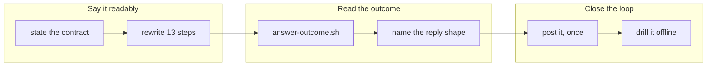

## 1. Overview

Thirteen steps each composed the tick's questions from whatever identifier they held, so the
operator met a unit id, a path or a claim verdict on Slack with nothing else at hand. This
branch says what a question must carry, applies it everywhere, and closes the other half: an
answer now gets one reply saying what came of it.

**Highlights:**

1. One composition contract, applied across thirteen steps and twenty keys, no key moved.
2. `answer-outcome.sh` reads what a recorded answer became — all judgements, one consumer.
3. `🧾 対応結果`, the catalog's sixth shape, posted once and only on a settled outcome.

## 2. Motivation

A question is the only surface where this loop asks a person for something, and it was the one
surface with no rule for its content. The shape fixed the *form* — one sentence, 25 words — so
each step composed from its own question key, and the key's shape leaked into the post.

The gap ran the other way too. An answer typed into the thread reaches `record-answer.sh` and
often becomes an `[FB]` issue, and its writer got `:ballot_box_with_check:` — *received* — and
nothing after. From the thread, an answer that became a merged mission and one that was dropped
looked identical.

## 3. Changes

The branch runs outward from the post and back. It first fixes what the loop *says* — a contract
in the one home for a post shape, then every step's own spec rewritten to it — and then what it
*says next*: a reader for what an answer became, a shape for reporting it, the step that posts
it, and a drill that proves the whole path offline.

### 3-1. State what a tick's question must carry ([4c96b2e1](https://github.com/qmu/workaholic/commit/4c96b2e1))

Five numbered clauses in `notify/reference/notifications.md`, beside the shape they constrain:
lead with what happened, the identifier after it, never a verdict word alone, the body names the
one act, and the named details keep riding the heading. `workaholic:moderate`'s partial copy now
refers to it rather than restating it.

### 3-2. Rewrite each step's question to that contract ([bb857b08](https://github.com/qmu/workaholic/commit/bb857b08))

Every question-asking step's spec now names its heading's lead and its body's act — thirteen
steps, twenty keys, in one change so the operator meets one voice. No script was touched and no
key expression moved, which is what makes a wording sweep safe.

### 3-3. Read what a recorded answer became ([b4b854ce](https://github.com/qmu/workaholic/commit/b4b854ce))

`answer-outcome.sh` answers `settled:nothing_filed` / `settled:issue_closed` / `pending` /
`unreadable:<reason>` per answered question, composing `question-state.sh`, `log-read.sh` and
the one transport, at one bounded read per *filed* candidate and none for the rest.

### 3-4. Give the answer's outcome a reply shape ([19bb82e3](https://github.com/qmu/workaholic/commit/19bb82e3))

`🧾 対応結果` joins the catalog as its sixth shape, with the three bounds that make it a
narrowing of the no-reply rule rather than its removal: once ever per question, after the act,
and carrying facts the thread does not already have.

### 3-5. Reply the answer and its outcome into the thread ([0744ab85](https://github.com/qmu/workaholic/commit/0744ab85))

`step-question-answers.sh` derives a second candidate set in the pass it already makes, so the
answered slugs it was already subtracting become the reply's candidates — no second walk, no
second reader, no cursor. Only a `settled:` reading posts.

### 3-6. Drill the outcome reply offline ([21887b24](https://github.com/qmu/workaholic/commit/21887b24))

`verify-return-path` was widened rather than duplicated — its fixture already reached recording
and filing — with seven load-bearing rows and a second breaker keyed on the answer's *existence*
rather than its outcome. 19 rows, 2 breakers, no network.

## 4. Outcome

The tick speaks in one voice and finishes what it starts: a question leads with what happened
and names one act, and an answer comes back once with its outcome. Both rules are stated where
they are read, and the return path is proved offline end to end.

## 5. Concerns

### The composition contract is prose, and nothing checks conformance

- **Severity:** low
- **Description:** Nothing mechanical tells a self-explanatory question from a cryptic one, so
  wording drifting back toward the key is caught only by a reader (see
  [4c96b2e1](https://github.com/qmu/workaholic/commit/4c96b2e1) in
  `plugins/workaholic/skills/notify/reference/notifications.md`)
- **How to Fix:** Accepted — the connector retry's enforcement shape. If drift is measured, a
  suite row can assert no spec's heading *begins* with its question key.

### `settled:issue_closed` does not prove a merged pull request closed the issue

- **Severity:** low
- **Description:** It settles on the issue's `state` and carries `state_reason` verbatim; proving
  the merge closed it needs the timeline, a second call per candidate (see
  [b4b854ce](https://github.com/qmu/workaholic/commit/b4b854ce) in
  `plugins/workaholic/skills/moderate/scripts/answer-outcome.sh`)
- **How to Fix:** Leave it — no consumer acts on the distinction. Revisit only if a reply must
  say *your answer shipped* rather than *closed out*.

## 6. Successful Development Patterns

- A set a step computes **in order to subtract it** is usually what some other question wants;
  naming it cost no second walk, and no second step or reader.
- A behavioural breaker needs a state where the real code is silent **for the reason the break
  removes** — otherwise it passes vacuously.
- A pin whose meaning shifts is repaired by correcting what its comment claims, never by
  widening the assertion.

## 7. Notes

Phase 1 superseded no deferred concern: 108 are open, none is touched by this diff, so the
verdict set is empty (`still_active` is the default when in doubt). Phase 2 ran as one pass
rather than three subagents, on this session's standing instruction; the result record and the
relations are identical either way by contract.

## Merge Outcome

merge_refused: merge_not_allowed (405 Pull Request has merge conflicts; claim-mergeability.sh class: content, conflicted CLAUDE.md)
