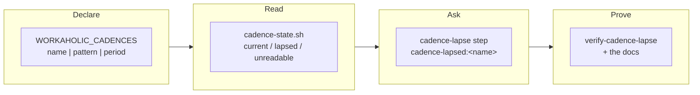

## 1. Overview

Every step of the maintenance tick is driven by an object that exists — an open pull request, a commit, a claim, a ticket, a record — so a producer that dies produces nothing and no step has anything to find. This branch gives the tick its first reading of **absence**: a repository declares what it expects to keep being produced and how often, and one step asks exactly once when the newest one is older than that allows.

**Highlights:**

1. A declaration with three fields and no credential, in the repository's own configuration — absent means nothing is declared, and such a repository is byte-identical to one before this existed.
2. The age is the newest **commit**, not a file's mtime, because a routine's container is a fresh clone and every checked-out file carries the checkout's own time.
3. A read the tick could not make is named `unreadable` with a null age and asked about by nobody — never rendered as a lapse.

## 2. Motivation

Measured on this repository: a daily record stopped for four days while hourly ticks ran throughout, and not one of them reported it. No step could have: `stuck-prs` and `merge-conflicts` read pull requests, `stalled-units` reads a claim tip, `drill-health` reads a check run — each finds something only when there is something to find, and a dead producer leaves nothing. `/implement` may not ask and a run report is read by nobody on the day it matters, so there was no path at all from *something stopped being produced* to *a person is told*.

The tick has repeatedly grown a step for a shape none of its siblings could see — `undrivable-units`, `undelivered-units`, `handoff-units`, `operator-pulls`, `raced-units` — and each time the new step read an existing reader and only decided who hears about it. This is that pattern applied to the one class of finding the whole design had structurally excluded.

## 3. Changes

The declaration settles a home and a shape; one reader turns it into three states; one step turns a `lapsed` state into exactly one question; a hermetic drill and the documentation make both provable and findable.

### 3-1. State where a cadence is declared ([abbc7422](https://github.com/qmu/workaholic/commit/abbc7422))

Chose the repository's own configuration — `WORKAHOLIC_CADENCES` in `.claude/settings.json`'s `env` block — over an area `README.md` and over a new `.workaholic/` area, and recorded why each loses. The shape is a name, a path pattern and a period, and nothing else: no credential, no command, no schedule expression that would copy a routine's `cron_expression`.

### 3-2. Read whether a declared cadence is current ([8dca3b39](https://github.com/qmu/workaholic/commit/8dca3b39))

`cadence-state.sh` answers `current`, `lapsed` with the age and the period, or `unreadable` with a named reason and a **null** age. It reads git rather than mtime — measured, a routine container stamps every checked-out file with the clone time — and writes, stages and fetches nothing.

### 3-3. Ask once when a declared cadence has lapsed ([7bea6c3b](https://github.com/qmu/workaholic/commit/7bea6c3b))

The `cadence-lapse` step composes that reader, derives nothing, and hands each lapse to the check-in keyed `cadence-lapsed:<name>` so the existing gate dedups it. It is addressed to nobody, because the declaration names no person and the step will not stamp an identity nothing verified.

### 3-4. Drill the cadence reading offline ([e9bb2bda](https://github.com/qmu/workaholic/commit/e9bb2bda))

`verify-cadence-lapse` walks declaration → reader → step → question over a throwaway git repository, hermetically, and is registered in the drill register so `verify-all` and CI both run it. Its breaker is written against the behaviour: an unresolvable pattern wired to `lapsed` must make the step ask about a producer that may be fine.

### 3-5. Document the cadence step and its finding ([8e15e653](https://github.com/qmu/workaholic/commit/8e15e653))

The step gained `reference/workflow.md` §30, a named place in the skill's list of what the tick can ask about, and a deliberate `needs_ruling` row in the finding table. The step count moved from twenty-nine to thirty everywhere at once, including the suite's expected `STEPS` array.

## 4. Outcome

The tick now watches absence as well as presence, in one step that asks and does nothing else. A repository that declares no cadence is unchanged in every respect — no candidate, no event, no root line — so the mechanism costs nothing until an operator opts in.

## 5. Concerns

### No repository declares a cadence yet

- **Severity:** moderate
- **Description:** the mechanism ships with zero live coverage: `WORKAHOLIC_CADENCES` is unset everywhere, so the step reports `skipped` on every tick — including for `.workaholic/moderations/`, the very area whose four-day silence measured this mission (see [abbc7422](https://github.com/qmu/workaholic/commit/abbc7422) in `plugins/workaholic/skills/moderate/SKILL.md`)
- **How to Fix:** the operator adds `"WORKAHOLIC_CADENCES": "moderation-log|.workaholic/moderations/*.md|2d"` to `.claude/settings.json`'s `env` block; which artifacts matter and at what period is their judgement, which is why this branch declares none

## 6. Successful Development Patterns

- Measuring the environment before building on it: `ls -l` over the container's own checkout showed 1843 files at one timestamp and 481 at another, which killed the obvious mtime design before a line of it was written and turned the ticket's own stated approach into a recorded deviation rather than a shipped defect.
- Registering the new step in `run.sh` first and letting `test-workflow-scripts.mjs` fail: four assertions named every place the step count is written down, which no amount of grepping for a numeral would have.
