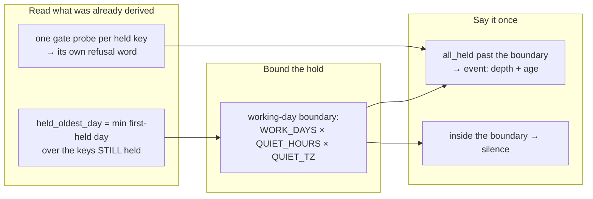

## 1. Overview

`/moderate`'s check-in step is the loop's one path from a machine finding to a person, and it
was the one step whose failure that person could not see. An `all_held` tick whose arrears have
outlived the window that was supposed to explain them now earns a root line naming their depth
and age, and every held question carries the gate's own word for why it is held.

**Highlights:**

1. `held_oldest_day` / `held_days`, off the first-held day the drain ordering already derived.
2. Each `held` entry carries the gate's refusal word — `all_held` was one token over four.
3. An outlived hold is an event; a hold inside the working-day boundary still says nothing.

## 2. Motivation

The step supplied an `event` only for `cap_spent` and `cap_unbounded`, on its own reasoning that
quiet hours and an off day are the **designed** hold and are already named in the log. That is
right for one tick and wrong across days: measured, **24 consecutive ticks** logged
`0 delivered, 13 held (all_held)` while the roots read `1 question(s)`.

Two readings the step already had were being thrown away. It derives the first-held day per key
to order the arrears oldest-first, then kept only `held_count` — so it knew how **old** its
backlog was and reported only how **large** it is. And it asked the gate once, with a key unique
to the tick, so `all_held` collapsed `quiet_hours`, `off_day`, `tick_cap` and `day_cap` into one
word, though the four call for four different acts: wait until morning, wait until Monday, wait
an hour, the budget is spent.

## 3. Changes

Nothing was added to the log, no cursor, no store, no field on any artifact, and
`ask-question.sh` and `log-read.sh` are both unmodified — every new answer is a reading the step
was already making and discarding.

### 3-1. Read how deep and how old the arrears are ([245615e0](https://github.com/qmu/workaholic/commit/245615e0))

The ordered key list carries `day:key` instead of the key alone, and the **minimum** day over the
keys still held becomes `held_oldest_day`; `held_days` is the whole-day distance to the tick's
own day, derived from the tick id on `ask-question.sh`'s axis. A degraded read reports **null**
for both, never `0` — a zero reads as *this just started* for a reading nobody made.

### 3-2. Say why each held question is held ([20b81545](https://github.com/qmu/workaholic/commit/20b81545))

The gate is probed per held candidate rather than once, and each `held` entry became
`{"key", "reason"}` carrying its word **verbatim**. The tick-level `delivery` word is read off
those same probes, so there is still one gate and one derivation. The probe is `ask-question.sh`'s
read-only mode: no key, cap, hold or ledger line moves.

### 3-3. Let an outlived hold earn a root line ([c4fd8c28](https://github.com/qmu/workaholic/commit/c4fd8c28))

The boundary is composed from the gate's own three variables — the first hour inside
`WORKAHOLIC_WORK_DAYS` at the end of `WORKAHOLIC_QUIET_HOURS`, in `WORKAHOLIC_QUIET_TZ` — as the
number of days back to the most recent working-window opening. **No constant is introduced**; the
refused alternative was an escalation after N ticks. `cap_spent`, `cap_unbounded`,
`all_asked_before`, `no_candidates` and the degraded branch are byte-identical.

### 3-4. Drill the arrears reading offline ([efb6b388](https://github.com/qmu/workaholic/commit/efb6b388))

`verify-checkin-delivery` gained seven rows over its existing fixture — depth and age, the
per-entry word, the outlived line, the silent hold inside the boundary, the null degraded read,
and the root's diff rule — plus a **second breaker** written against the behaviour: the real
script with the boundary wired at a constant, changing no field and no key.

### 3-5. State the hold's bound where the voice is defined ([774065a4](https://github.com/qmu/workaholic/commit/774065a4))

`reference/workflow.md`, `SKILL.md`, `CLAUDE.md` and the step's own header (corrected **in place**,
not appended to) state the boundary, say what did **not** move, and record the refused alternative
once rather than four times.

## 4. Outcome

An operator learns questions are stacking up before the queue is days deep. An `all_held` tick
past the working-day boundary names how many wait and how long the oldest has, once; a hold
inside the window is unchanged and silent; and when the queue does move, each held question says
which of the four refusals is holding it.

## 5. Concerns

### `all_held` is unreachable on the step's `ok` branch

- **Severity:** low
- **Description:** On the `ok` branch `quiet_hours` and `off_day` cannot be the gate's answer (the step has already exited) and `tick_cap` requires five asks on the tick — which makes `delivered` non-zero, and the `all_held` derivation only runs at `delivered == 0`. So the event fires from the `off_day` and `quiet_hours` branches in practice, which is where the measured 24 ticks sat.
- **How to Fix:** Nothing here; it is a property of the pre-existing derivation, recorded so a later reader does not take the `ok`-branch arm for dead code. Narrowing `all_held` to the two branches that can produce it would be a separate ask.

### The per-candidate probe costs one script call per held key

- **Severity:** low
- **Description:** The step now runs `ask-question.sh` once per held candidate, on top of the one `log-read.sh` call per candidate it already made. The set is what the drain already orders, so it is bounded by the arrears' own depth — but a very deep queue pays linearly for a word that is tick-wide in two of its four cases.
- **How to Fix:** Probe once for the tick-wide words and per candidate only for the cap words, if a measured tick ever makes the cost visible.

### A size finding holds this branch at `override` tier

- **Severity:** low
- **Description:** `scan-branch-safety.sh` reports one `size` / `large-file` finding — `scripts/e2e/loop-drill.sh` at 527,547 bytes against a 524,288 ceiling — crossed by this branch's 90 added drill lines. `gate-decision.sh` answers `override_only: true`, so the branch stays releasable; nothing else is flagged.
- **How to Fix:** The drill dispatcher is one file by design (one reader per reading); splitting it, or raising the per-file ceiling, is an owner's call and not this branch's.

## 6. Successful Development Patterns

- The two new answers were readings the step already made and discarded — looking for those first is cheaper than adding a store, and it is why no cursor, ledger or artifact field was needed.
- Deriving *how many days back* the boundary is, rather than the boundary's date, kept the comparison in integers and meant no inverse day-to-date conversion had to exist anywhere.
- Writing the breaker against the behaviour (a constant boundary, identical JSON shape) rather than the return shape follows this drill's own recorded lesson about its first breaker.

## 7. Notes

The version was bumped to `1.0.262`; `check-version-bump.sh` answered `already_bumped: false`.
`node scripts/build-plugins/build.mjs` produced no diff under `outputs/` for the moderate
changes — that skill is internal and reaches no cross-agent bundle — only the version manifest.

## Merge Outcome

merge_refused: merge_not_allowed
