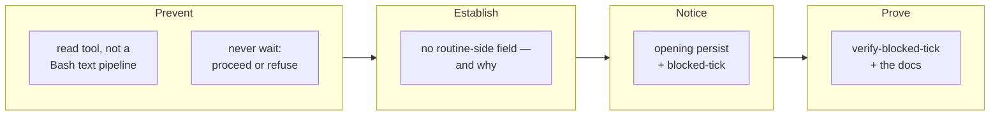

## 1. Overview

Three consecutive `[Moderate]` ticks sat at `requires_action`, each waiting on a permission prompt raised by a **read** of a plugin script, and the base carried no trace of any of them — the record that would show a tick stopped is the record the stop prevents. This branch removes the reach that raised the prompt, states the policy that forbids waiting at all, and makes a tick that stops anyway leave a record the next tick reads.

**Highlights:**

1. An unattended run never blocks on a prompt of any kind — two admitted outcomes, and waiting is neither, because it produces no record at all.
2. The tick persists its opening **before** any step, so a dead tick is visible; `blocked-tick` reads the tick before last for an opening with no closing.
3. The routine model documents no permission-mode field because it promises no approval prompts — so the measured behaviour is a **divergence**, recorded rather than left as a missing setting.

## 2. Motivation

The measured prompts were `sed -n '/^# Usage/,/^$/p' … | head -30` and `grep -n … ask-question.sh` — two reads that write nothing, classified as an edit of a sensitive file. A routine has nobody to answer one, so the run waits forever and never reaches `persist-log`. Approving one produced another, because nothing bounds how many a run can raise.

Two rules already existed and neither reached this. `rules/interaction.md` governed whether to raise an `AskUserQuestion`; every unattended contract repeated *no `AskUserQuestion` anywhere*. A permission prompt is the same act by a different mechanism, and it was named nowhere — a parenthetical in a general rule is not a policy the specific contracts inherit.

## 3. Changes

The reach that raised the prompt is removed and the policy behind it is written once; where the policy would be configured is established from the product's own documentation; a tick that stops anyway now leaves an opening the next tick reads; a hermetic drill and the documentation make both provable and findable.

### 3-1. Read a plugin script with a read tool ([9e45c000](https://github.com/qmu/workaholic/commit/9e45c000))

`rules/shell.md` states that an unattended run reads a file to find something out with a read tool, never a Bash text pipeline — scoped to the agent's own inspection reads, with a script's own text processing explicitly untouched. The sweep found no markdown modelling the habit, and the mechanical row is refused with its reason.

### 3-2. State that a run with no human never waits ([5ffe4e02](https://github.com/qmu/workaholic/commit/5ffe4e02))

`rules/interaction.md` gains the policy once, for every unattended run: proceed under a declared policy, or refuse the single action and carry on recording what and why. Waiting is named as the third option and refused, with the notification/prompt distinction written down beside it.

### 3-3. Establish where a prompt policy is configured ([7581c422](https://github.com/qmu/workaholic/commit/7581c422))

The routines documentation says the creation form sets prompt, repositories, environment, connectors and triggers, and that there is "no permission-mode picker and no approval prompts during a run". So no field is missing — the model has no place for one, and the measured behaviour is a divergence from it. Three levers are named, the repository's own `settings.json` is chosen, and the allowlist is deliberately not widened.

### 3-4. Put the tick's opening on the base ([b1a9cfda](https://github.com/qmu/workaholic/commit/b1a9cfda))

`run.sh` persists once immediately after `open-log`, reported under its own `opening_persist` key and logged under `persist-log-opening`. The writer's contract is untouched: it already unions by `(tick, step)`, so the closing persist adds the rest without rewriting the opening.

### 3-5. Notice a tick that never closed ([da6ed12f](https://github.com/qmu/workaholic/commit/da6ed12f))

`step-blocked-tick.sh` composes `log-read.sh` and asks once, keyed on the tick id, when the **tick before last** opened and never closed. *Closed* means a `human-checkin` line, not the persist's — that one never reaches the base on the tick that wrote it.

### 3-6. Record what an unattended run refused ([fbc0f38c](https://github.com/qmu/workaholic/commit/fbc0f38c))

A refusal carries three facts — the action, the reason, and that the run continued — and reports `blocked`, a status the vocabulary already had and no step had ever emitted. No new status, store or artifact field: the mechanism existed and the contract did not.

### 3-7. Drill the blocked-tick reading offline ([a00b3648](https://github.com/qmu/workaholic/commit/a00b3648))

`verify-blocked-tick` proves both halves over a bare local origin, hermetically, with the tick "killed" at a step boundary rather than by a timeout. Its breaker disables the opening persist, and the base must then carry nothing to notice.

### 3-8. Document the step and three persists ([38fe064d](https://github.com/qmu/workaholic/commit/38fe064d))

The persist account is corrected to **three** with the reason for each, the step is documented and classified `needs_ruling`, and the step count moves from thirty to thirty-one in the skill and `CLAUDE.md` together.

## 4. Outcome

The tick no longer reaches for the shape that hung it, the policy that forbids waiting is stated once for every unattended run, and a tick that stops for any other reason leaves an opening the next tick names — exactly once, to the point.

## 5. Concerns

### The measured prompt behaviour contradicts the documented routine model

- **Severity:** moderate
- **Description:** the routines documentation states there is "no permission-mode picker and no approval prompts during a run", and three ticks were nevertheless stopped by one (see [7581c422](https://github.com/qmu/workaholic/commit/7581c422) in `plugins/workaholic/skills/workaholify/SKILL.md`)
- **How to Fix:** nothing in this repository can close that gap; it is a report to Anthropic. What ships here is the reach removed, the policy stated, and the stop made visible — and the divergence is recorded so a later session does not hunt for a setting that does not exist

### `loop-drill.sh` has crossed the per-file size ceiling

- **Severity:** low
- **Description:** the file is 542415 bytes against a 524288 ceiling, an `override`-tier scan finding and the branch's only one (see [a00b3648](https://github.com/qmu/workaholic/commit/a00b3648) in `scripts/e2e/loop-drill.sh`)
- **How to Fix:** the ceiling is a granularity nudge and the file is one dispatcher plus thirty-nine drills, each self-contained; splitting it per drill is a real option and is a change of its own, not something to fold into a mission about unattended runs

## 6. Successful Development Patterns

- Establishing an **absence** from the product's own documentation rather than guessing at a field name — it turned up a contradiction with observed behaviour, which is a more valuable finding than the field name would have been, and one no write-and-read-back could have produced.
- Grepping for the **claim** rather than the document when correcting a fact: the two-persist account lived in two files and only one was named in the ticket, so an edit made where the ticket pointed would have left the tree self-contradicting.
