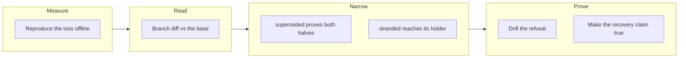

## 1. Overview

`superseded` proved a unit's **tickets** reached the base and every consumer read it as *this
branch holds no work*, so a branch whose tickets landed elsewhere while still carrying files
reachable from no other ref was offered for deletion. It now proves both halves, and a branch
still holding work is named and routed to its holder.
**Highlights:**

1. A branch-diff term in `claims_superseded`, composed last, that can only ever **remove** a `superseded`.
2. `stranded` — a new verdict, classified a judgement, asked of the claim holder with its files named.
3. A drill asserting **surviving content** rather than a return word, proved able to fail.

## 2. Motivation

Two branches on this repository were carrying ~300 lines and a doc section that exist in no
other ref, and both were being offered to the retirement as finished. Only a 403 refusing the
delete in the container the loop runs in has kept that work alive — so the day that transport is
repaired is the day the same reading becomes silent loss rather than a reported nuisance. The
retirement's own header hid it: it offered as recovery that a deleted branch is retrievable
*because its content is on the base — that is what `superseded` means*, the load-bearing half,
false for exactly the branches that needed it. `superseded` is one of only two proofs in the
protocol and it gates a destructive act, so anything making it harder to establish is safe.

## 3. Changes

The mission measured before it repaired: the reproduction ran the destructive act for real and
recorded what every layer answered, which is what turned two design questions — where to compare
from, and what may be subtracted — into decisions with evidence behind them. Only then did the
reading, the narrowing, the new verdict, the drill and the document repair follow, each judged
against that fixture.

### 3-1. Reproduce a stranded superseded claim branch ([8c7a5f25](https://github.com/qmu/workaholic/commit/8c7a5f25))

Built `seed_stranded_claims` — three claims whose tickets are all archived on the base under
another branch, two still holding files of their own — and recorded every layer's answer with the
`gh` stub's ref DELETE actually deleting. All three read `superseded`, all three were offered as
retirable, and afterwards the origin carried `main` alone.

### 3-2. Read a claim branch's own diff against the base ([a9044dcb](https://github.com/qmu/workaholic/commit/a9044dcb))

Added `claims_branch_diff_reading`: three-valued (`empty` / `non_empty` with the files bounded /
`unanswerable` with its reason), offline, touching no ref, index or worktree. Recorded in
`claims.md` as the ninth vocabulary with its own sub-table and its consumers named.

### 3-3. Refuse to retire a branch holding work ([c2d9adfb](https://github.com/qmu/workaholic/commit/c2d9adfb))

Composed the diff term into `claims_superseded` at both grains, last, as an extra conjunct — so
it can only remove a `superseded`. Both destructive consumers inherit it where they already
re-derive the proof, and every consumer's behaviour under the narrowing is recorded.

### 3-4. Tell a person about a stranded claim branch ([23174634](https://github.com/qmu/workaholic/commit/23174634))

Split the proof into `claims_delivered` and `claims_delivery`, giving the delivered-but-holding
case its own word. `/moderate`'s `stranded-branches` step asks the claim holder once per unit,
naming the files; `stalled-units` and `retire-claims` count it instead of asking.

### 3-5. Drill the stranded-branch refusal offline ([46d36047](https://github.com/qmu/workaholic/commit/46d36047))

`verify-stranded-branch` reuses the reproduction's seeder, lets the delete run for real, and
asserts that the files that would have been lost are still reachable. Registered `hermetic` with
a breaker row, which is what puts it in the CI matrix.

### 3-6. Make the retirement's stated recovery true ([e1f96fa5](https://github.com/qmu/workaholic/commit/e1f96fa5))

Rewrote the safety argument in `retire-claim.sh`, `claims.md` and `CLAUDE.md` to state the two
proofs separately, each naming what it establishes, and to record the 403's role: the loss is a
near miss, not a history.

## 4. Outcome

A claim branch is finished only once its own diff against the base is empty. One that still
holds work is named `stranded`, reaches its holder once with its files named, and is reachable
by neither destructive act; one that really is empty retires as before.
## 5. Concerns

### The diff term subtracts the loop's own bookkeeping, and two of those subtractions can lose a write

- **Severity:** moderate
- **Description:** At the mission grain the stamped artifact is `mission.md`, which the archive test does not prove is on the base, and a ticket under `archive/<branch>/` carries this run's own `## Final Report`, which a twin's delivery does not reproduce (see [c2d9adfb](https://github.com/qmu/workaholic/commit/c2d9adfb) in `plugins/workaholic/skills/drive/scripts/lib/claims.sh`). Both are the racing-twin semantics `superseded` already carried, stated rather than hidden.
- **How to Fix:** If either is ever measured as a real loss, narrow the subtraction to paths whose blob content is reachable anywhere on the base rather than by path — a strictly stronger test at the cost of one tree listing per claim.

### A stranded branch has no recovery path, by design

- **Severity:** low
- **Description:** Nothing ports, opens or discards the work on a stranded branch; the holder is asked once and the branch stands until they act (see [23174634](https://github.com/qmu/workaholic/commit/23174634) in `plugins/workaholic/skills/moderate/scripts/step-stranded-branches.sh`). A branch stranded for weeks with nobody answering stays stranded.
- **How to Fix:** Nothing yet — which of porting, opening a pull request, or discarding is right is exactly what the step exists to ask. Revisit only if the answer turns out to be the same one every time.

## 6. Successful Development Patterns

- Measure before repairing, with the destructive act allowed to happen: the reproduction turned "where should the diff be taken from" into a decision with a counter-example behind it, and the counter-example was already sitting in the suite's own squash-merged fixture.
- Prove the breaker against the code path, not the name: neutering the one-word helper changed nothing because the scan reads the three-valued reading directly, so a breaker "proved" that way would have been proved against nothing.
- Let a drill continue past a wrong fixture when the wrong fixture *is* the regression — bailing out means the breaker never measures what the regression costs.

## 7. Release Preparation

**Verdict**: Ready for release

- **Concern:** The branch-safety scan reports two `size` findings — `scripts/e2e/loop-drill.sh` is over the per-file ceiling and one commit is over the per-commit changed-lines ceiling. Both are `override` tier; the line count is the shape of the work (a drill arm plus its runbook section), not mixed concerns.
- **Before release:** Nothing. `override`-only findings keep the branch releasable.

## 8. Notes

Commit `23174634`'s `Changes:` line lost one word to an unescaped backtick in the calling
shell. Its ticket's Final Report carries the full account.
